# 마이크로 프론트엔드(MFE) 아키텍처

**Micro Frontend**는 독립적으로 배포 가능한 여러 개의 프론트엔드 앱의 조합으로 서비스를 구성할 수 있는 아키텍처입니다. **마이크로서비스** 접근 방식과 유사하지만 **JavaScript**로 작성된 **클라이언트 측** 단일 페이지 애플리케이션에 적용한 것입니다.

:::info 정보
**MFE**는 웹 애플리케이션을 독립적으로 배포 가능한 작은 모듈 모음으로 구성하는 방법입니다. 마이크로 프론트엔드라는 용어는 과거 여러 기사와 프로젝트에서 사용되었지만, Zack Jackson이 2020년에 **Module Federation**이라는 마스터 플러그인을 출시한 후에야 이 개념에 대한 캠페인이 실제로 널리 채택되고 관심을 끌기 시작했습니다.
:::
:::tip 공통 공유 라이브러리 적용 관련
**Micro Frontend**에서는 코드 중복 및 관리를 위하여여 **공통 라이브러리(Utils, UI컴포넌트, 공통스타일, 설정)** 를 따로 구성하여 사용해야 합니다.
  
#### ◉ 멀티레포 환경의 공유 라이브러리
멀티레포 환경의 공유 라이브러리는 다음과 같은 비용이 발생합니다:

- **버전 관리 오버헤드**: 공유 라이브러리 수정 시 배포 → 각 MFE 업데이트 필요
- **느린 피드백 루프**: 변경사항 확인까지 npm 배포 과정 필요
- **Cross-repo 리팩토링**: API 변경 시 여러 레포에 걸친 순차적 PR 필요
- **의존성 버전 불일치**: 각 MFE가 다른 버전 사용 시 런타임 충돌 가능
- **Breaking Change 관리**: 공유 라이브러리 major 업데이트 시 모든 MFE 동시 업데이트 어려움

**결론은**: 멀티레포에서 공유 라이브러리는 "통합 비용"이 크고 모노레포는 통합 비용이 줄어든다는 것입니다.  
단, 모노레포 방식에도 단점은 존재합니다.

#### ◉ 모노레포 환경의 공유 라이브러리
모노레포 환경의 공유 라이브러리는 다음과 같은 비용이 발생합니다:

- **초기 설정 복잡도**: Nx, Turborepo 등 모노레포 툴링 학습 및 설정 비용 발생
- **빌드 시간 증가**: 프로젝트 규모가 커질수록 전체 빌드·테스트 시간이 길어질 수 있음 (캐싱 전략 필요)
- **레포 접근 권한 분리 어려움**: 팀/프로젝트별 세밀한 코드 접근 권한 제어가 멀티레포보다 까다로움
- **거대한 Git 히스토리**: 모든 팀의 커밋이 하나의 레포에 쌓여 히스토리 관리가 복잡해질 수 있음

:::

#### ◉ MFE 설계 방식 (마틴 파울러의 글에 소개된 방식)

- Build-time integration (npm을 통한 Build-time 통합)
- Server-side template composition (Server-side-Template Routing)
- Run-time integration via iframes (iframe을 이용한 Run-time 통합)
- Run-time integration via Web Components (Web-Component Run-time 통합)
- **Run-time integration via JavaScript (Javascript Run-time 통합)** ⭐
  - Javascript, CSS Run-time 통합 방식이 가장 널리 사용되며 유용합니다. 이 방식의 핵심은 코드를 유연하게 통합하는 원리입니다.
  - 이 방안은 Webpack5의 Module Federation로 해결하는데 Vite에서도 플러그인을 통해 가능합니다.

#### ◉ 장점

- **독립적인 개발 및 배포**: 각 마이크로 프론트엔드는 독립적으로 개발, 테스트 및 배포될 수 있습니다.
- **기술 다양성**: 각 마이크로 프론트엔드에 다른 기술 스택을 사용할 수도 있습니다.
- **재사용성**: 공통 컴포넌트 및 모듈을 재사용할 수 있습니다.
- **유연성**: 각 마이크로 프론트엔드는 독립적으로 확장되거나 축소될 수 있습니다.
- **성능 개선**: 필요한 경우 특정 부분만 로드하여 초기 로딩 시간을 최소화할 수 있습니다.
- **독립적인 배포 및 롤백**: 문제가 발생했을 때 전체 애플리케이션을 중단시키지 않고도 문제를 해결할 수 있습니다.

#### ◉ 단점

- **초기 설정 및 복잡성**: MFE 아키텍처를 구현하려면 초기 설정이 복잡할 수 있습니다.
- **일관성 유지의 어려움**: 각 마이크로 프론트엔드가 독립적으로 개발되므로 일관된 디자인, 스타일 및 사용자 경험을 유지하기 어려울 수 있습니다.
- **네트워크 부하**: 여러 마이크로 프론트엔드를 로드하고 통합하는 데 필요한 추가 네트워크 요청으로 인해 네트워크 부하가 증가할 수 있습니다.
- **보안 취약성**: 각 마이크로 프론트엔드가 독립적으로 배포되므로 보안 취약점이 발생할 수 있습니다.
- **종속성 관리**: 여러 마이크로 프론트엔드 간의 종속성 관리가 복잡할 수 있습니다.
- **성능 문제**: 너무 많은 마이크로 프론트엔드를 사용할 경우 성능 문제가 발생할 수 있습니다.

#### ◉ MFE 사용 시 고려사항

- 당연히 일반적인 방법보다 복잡합니다.
- 메인(호스트 모듈)에서 **remoteEntry.js(각 서비스의 진입파일(빌드된 파일))** 를 이용하여 각 서비스별로 참조해야 하는데 그러면 결국 로컬에서 테스트할 때 모든 서비스를 빌드해야 합니다.
- 서비스 단위로 쪼개어 배포하므로 주로 Docker를 이용하여 배포하면 간편합니다. 이럴 때 **CORS** 이슈가 생길 수 있습니다.
- 각 개별 서비스를 빌드해야 하므로 즉각적으로 변화를 확인할 수 없습니다.
- **캐싱 문제**가 있을 수 있습니다. **HTML** 캐시를 각 모듈별로 어떻게 관리해야 할지 방법을 고려해야 합니다.

:::tip
초기에 기본 boilerplate 코드와 공통 코드 스타일을 미리 만들어 놓으면 초기 설정의 복잡성과 일관성 유지의 어려움을 해결할 수 있습니다.
:::

---