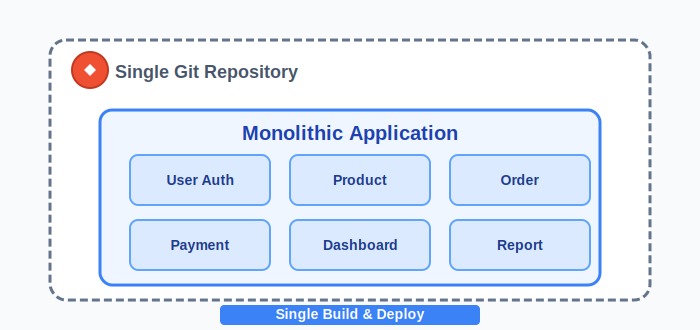
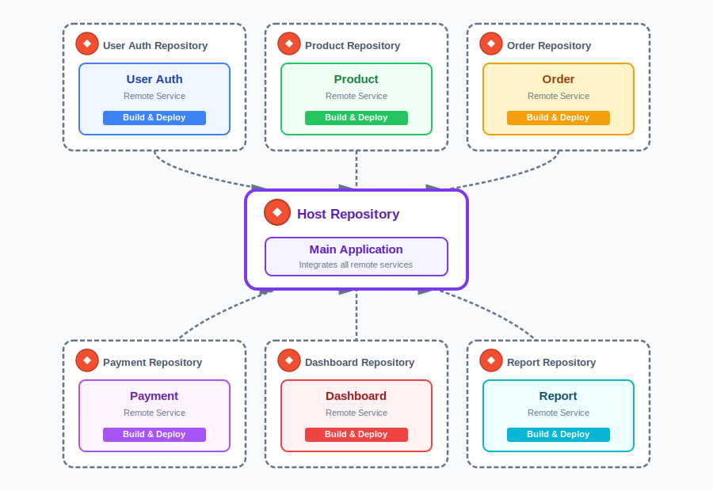
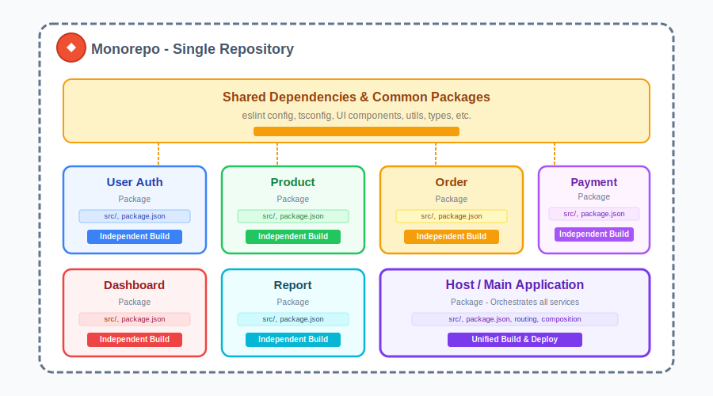

# Repository 설정 전략

프론트엔드 프로젝트의 Repository 구성 전략은 크게 **모놀리식**, **모노레포**, **멀티레포** 세 가지 방식으로 나눌 수 있습니다.

## 모놀리식 (Monolithic Application)

---

'모놀리식'이라는 용어는 사용 가능한 모듈성이 없는 **거대한 메인프레임 애플리케이션**을 의미합니다.  
**모놀리식 애플리케이션**은 전통적/일반적인 방식으로 단독 배포 가능한 프로그램에 **모든 기능**을 포함한, 독립적이지만 유연성이 부족한 **단일 통합 애플리케이션**입니다.

* Create React App(CRA), Vite, Next.js 등으로 시작하는 대부분의 React 프로젝트, 그리고 Vue CLI, Vite 등으로 시작하는 Vue.js 프로젝트 역시 단일 애플리케이션(모놀리식) 구조입니다
* 하나의 번들로 빌드되어 하나의 도메인에서 배포됩니다
* 중소규모 프로젝트나 초기 단계 스타트업에서 가장 많이 사용됩니다

#### ◉ 장점

- **단순화된 개발**: 전체 애플리케이션 코드베이스가 단일 리포지토리 내에서 관리되어 간단한 개발 프로세스를 보장합니다.
- **더 쉬운 배포**: 애플리케이션이 단일 단위로 패키징되므로 마이크로서비스보다 배포 단계가 적습니다.
- **통합 코드 구성**: 모든 구성 요소는 긴밀하게 통합되어 애플리케이션 전체에서 코드와 라이브러리를 쉽게 공유할 수 있습니다.
- **더 나은 성능**: 서비스 간 통신 오버헤드가 없기 때문에 상황에 따라 더 나은 성능을 제공할 수 있습니다.

#### ◉ 단점

- **제한된 확장성**: 필요한 부분만 확장하는 것이 아니라 전체 애플리케이션을 함께 확장해야 합니다.
- **유지 관리의 어려움**: 애플리케이션의 복잡성과 크기가 커짐에 따라 모놀리식 코드베이스를 유지 관리하는 것이 더 어려워집니다.
- **융통성 없는 기술 스택**: 단일 기술 스택으로 구축되므로 새로운 기술을 채택하거나 다른 도구로 전환하기가 어렵습니다.
- **단일 오류 지점의 위험성**: 하나의 구성 요소에 오류가 생기면 전체 애플리케이션이 작동하지 않을 수 있습니다.

#### ◉ 한계점

- **대형 시스템 개발 시 문제 발생**: 프로젝트가 커질수록 빌드, 배포 시간이 오래 걸리고, 특정 서비스의 수정으로 인한 다른 서비스들까지 영향을 줄 수 있습니다.
- **개발 생산성 저하**: 각각의 서비스가 요구하는 요건이 조금씩 다름으로 인한 공통요소의 복잡도가 올라가면서 생산성이 떨어지고 레거시하게 됩니다.

:::tip
모놀리스(Monolith) 구조가 잘못된 것은 아닙니다. 애플리케이션 복잡성이 낮고 소규모 서비스 구조에서는 빠르게 대응하고 리팩토링할 수 있는 모놀리식(Monolithic) 구조가 더 적합할 수 있습니다.
:::

---

## 멀티레포 (Multirepo) - 다중 저장소
---
각 서비스 프로젝트마다 **별도의 독립적인 repository**를 구성하는 방식을 말합니다. 멀티레포 구조는 폴리레포(polyrepo) 구조라고도 부르며, 프로젝트를 분리하여 관리할 때 일반적으로 채택되는 방식입니다. 각각의 프로젝트는 자율성이 높으며 독립적인 개발, 린트, 테스트, 빌드, 배포 파이프라인을 가지고 있고, 서로 다른 기술 스택을 사용할 수 있습니다.

:::info 멀티레포가 적합한 상황
* **조직 구조가 완전히 분리된 경우**
  * 각 팀이 완전히 독립적으로 운영되는 대기업
  * 팀 간 코드 공유 필요성이 거의 없는 경우
  * 예: A팀은 전자상거래, B팀은 CRM, C팀은 내부 관리 시스템을 담당
* **서로 다른 기술 스택을 사용하는 경우**
  * 프로젝트 A는 React, 프로젝트 B는 Vue, 프로젝트 C는 Angular
  * 각 프로젝트가 완전히 다른 빌드 도구와 의존성을 가진 경우
  * 레거시 시스템과 신규 시스템이 공존하는 경우
* **보안과 접근 권한이 중요한 경우**
  * 특정 프로젝트를 특정 팀에게만 공개해야 하는 경우
  * 외부 협력사가 일부 프로젝트에만 접근해야 하는 경우
  * 민감한 정보를 포함한 프로젝트를 격리해야 하는 경우
* **배포 주기가 완전히 다른 경우**
  * 프로젝트 A는 매일 배포, 프로젝트 B는 월 1회 배포
  * 각 프로젝트의 릴리스 프로세스가 독립적이어야 하는 경우
  * CI/CD 파이프라인을 완전히 별도로 운영하고 싶은 경우
* **프로젝트 규모가 매우 큰 경우**
  * 각 프로젝트가 수만 줄 이상의 대규모 코드베이스인 경우
  * Git 저장소 크기와 성능이 문제가 될 수 있는 경우
  * 클론, 풀 등의 작업 속도가 중요한 경우
* **오픈소스 프로젝트**
  * 커뮤니티 기여를 독립적으로 관리하고 싶은 경우
  * 각 프로젝트가 독립적인 라이센스를 가져야 하는 경우
  * Star, Fork 등을 프로젝트별로 관리하고 싶은 경우

* **실무 예시**
  * **좋은 예시**
    * 넷플릭스처럼 각 서비스(API Gateway, User Service, Billing, Streaming 등)가 완전히 독립된 조직에서 관리
    * 각 자회사가 독립적으로 프로젝트를 운영하는 대기업 그룹
  * **피해야 할 경우** (모노레포가 더 적합)
    * 소규모 팀에서 공통 UI 컴포넌트를 자주 공유해야 하는 경우
    * 빈번한 cross-repo 리팩토링이 필요한 경우
    * 동일한 ESLint, Prettier, TypeScript 설정을 공유해야 하는 경우
:::

#### ◉ 장점

- **독립적 배포**: 각 저장소가 독립적으로 개발되고 배포되므로, 한 저장소의 변경이 다른 저장소에 영향을 미치지 않습니다.
- **협업과 병렬 개발**: 각 서비스별 개발 팀이 동시에 작업할 수 있도록 합니다.
- **스케일링**: 각 저장소는 개별적으로 관리되므로 큰 코드베이스 작업에서 분산되어 진행될 수 있습니다.
- **유연성**: 서로 다른 기술 스택을 사용하고 서로 다른 팀이 관리하는 다양한 프로젝트를 효과적으로 조직화할 수 있습니다.
- **장애 격리와 안정성**: 하나의 저장소에 장애가 발생해도 다른 저장소는 영향을 받지 않습니다.

#### ◉ 단점

- **번거로운 프로젝트 생성**: 새로운 저장소 패키지를 생성할 때마다 각 개별 생성 프로세스 과정을 거쳐야 합니다.
- **코드 중복**: 여러 저장소에 걸쳐 중복 코드가 발생할 수 있습니다.
- **교차 저장소 리팩토링 비용**: 관련 패키지의 변화나 공통 요소의 변화로 인하여 여러 저장소에 변화된 내용을 반영하는 비용이 많이 듭니다.
- **의존성 관리의 복잡성**: 각 저장소가 서로 다른 의존성을 가질 수 있으므로 프로젝트의 의존성 관리의 복잡성을 증가시킵니다.
- **통합의 어려움**: 여러 개의 저장소를 통합할 때 복잡한 통합 작업과 충돌 해결을 유발합니다.
- **일관성 유지의 어려움**: 여러 저장소를 관리하므로 개발 규칙, 코드 스타일 및 품질 표준 유지가 어렵습니다.
- **관리 포인트 증가**: 늘어난 프로젝트 저장소의 수만큼 관리 포인트가 늘어납니다.

---

## 모노레포 (Monorepo) - 단일 저장소
---

**Monorepo**는 하나의 저장소에서 두 개 이상의 프로젝트를 관리하는 소프트웨어 개발 전략을 뜻합니다. 여러 프로젝트가 하나의 저장소를 사용한다고 무조건 모노레포라고 할 수는 없고 각 프로젝트 사이 의존성 등의 관계가 존재할 때 모노레포라고 합니다.

:::info 모노레포 관련
* 이 개념은 비교적 오래되었으며 약 10년 전에 나타났다. **Google**은 코드베이스 관리를 모노레포 방식으로 채택한 최초의 회사중 하나이다.
* 최근에는 작은 앱 대신 수많은 기능 영역으로 구성된 거대한 플랫폼을 유지하는 앱 개발 요건이 많이 생겨 납니다. 그로인해 코드 중복을 피하고 관심 분리(separation of concerns) 하고자 하는 생각이 들기 시작 합니다.
* 자체적으로 모든 구성이 포함된 각각의 저장소를 만드는 대신 단일 저장소에 기능, 서비스별로 나눈 **패키지(독자 프로젝트)** 를 생성하여 확장성 및 관심 분리(separation of concerns)를 할 수 있으며 공통 패키지와의 코드 공유도 할 수 있습니다.
:::
:::tip 모노레포를 도와주는 도구
* **Lerna**: [Lerna: https://github.com/lerna/lerna](https://github.com/lerna/lerna)  
  → Monorepo 관리를 위한 전통적 도구였으나, 2022년 Nrwl 인수 후 현대적 기능(로컬/원격 캐싱, 태스크 파이프라인, 분산 실행)을 갖추고 활발히 업데이트 중입니다. Nx와 통합되어 사용 가능합니다.  
  **단점:** Nx나 Turborepo에 비해 독자적인 고급 기능이 상대적으로 적으며, 대부분의 현대적 기능은 Nx 통합을 통해 제공됩니다.

* **Nx**: [Nx: https://nx.dev/](https://nx.dev/)  
  → 고급 캐싱 및 빠른 빌드, lint/테스트 실행을 지원하며 팀 기반의 대형 프로젝트 관리에 강점이 있습니다.  
  **단점:** 러닝커브가 존재하며, 복잡한 설정이 필요할 수 있습니다. 자체적인 설정 방식이 있어서 기존 Trivial/전통적인 monorepo에만 익숙하다면 적응에 시간이 소요될 수 있습니다.

* **Turborepo**: [Turborepo: https://turbo.build/](https://turbo.build/)  
  → 빌드, 캐시, 파이프라인 최적화에 특화되어 있어 빠른 작업 처리와 효율적 의존성 관리를 제공합니다. 원격 캐싱이 모든 플랜에서 무료로 제공됩니다.  
  **단점:** monorepo 외 추가적인 기능(프로젝트 생성, 코드 생성 등)은 Nx에 비해 제한적일 수 있습니다.

* **Pnpm**: [Pnpm: https://pnpm.io/](https://pnpm.io/)  
  → 디스크 공간 절약 및 빠른 의존성 설치가 특징이며 workspaces를 통한 monorepo를 간편하게 운영할 수 있습니다.  
  **단점:** npm, yarn에 비해 서드파티 툴링/에코시스템 호환성에서 이슈가 있을 수 있고, 일부 레거시 패키지와의 호환성 문제가 발생할 수 있습니다.

* **Yarn**: [Yarn: https://yarnpkg.com/](https://yarnpkg.com/)  
  → 빠르고 일관된 패키지 설치, workspaces 지원으로 monorepo 프로젝트에서 사용이 편리합니다.  
  **단점:** 버전 1(클래식)과 버전 2(berry) 간의 차이가 커서 마이그레이션 이슈가 있고, v2에서만 지원하는 기능들이 있어 혼선이 생길 수 있습니다.

* **Bun**: [Bun: https://bun.sh/](https://bun.sh/)  
  → 자바스크립트 런타임, 빌드, 패키지 매니저 올인원 도구로 매우 빠른 실행 속도가 장점입니다. 2025년 Anthropic 인수 후 안정성이 크게 향상되었습니다.  
  **단점:** Production-ready로 평가받고 있으나, 일부 프로젝트(약 34%)에서 호환성 문제가 발생할 수 있습니다. 신규 프로젝트에 적합하며, 레거시 시스템 마이그레이션 시 충분한 테스트가 필요합니다.
* **npm**: [npm: https://www.npmjs.com/](https://www.npmjs.com/)  
  → Node.js의 기본 패키지 매니저로 널리 사용되며, `workspaces` 기능을 통해 monorepo 구성이 가능합니다.  
  **단점:** 작은 규모에서는 무난하게 사용 가능하지만, 대규모/복잡한 monorepo에서 속도 및 동시성, 고급 캐싱 등에서는 기능적 한계가 있습니다.
:::

#### ◉ 장점

- **쉬운 프로젝트 생성**: 멀티레포에 비해 프로젝트 생성 과정이 좀 더 단순하기 때문에 프로젝트 생성에 대한 오버헤드가 없습니다.
- **더 쉬운 의존성 관리**: 의존성 패키지가 같은 저장소에 있으므로 관리가 쉬워집니다.
- **코드 공유와 재사용성**: 하나의 저장소에 모든 코드가 포함되므로 코드 공유 및 재사용이 용이합니다.
- **일관성 유지**: 하나의 저장소에 모든 코드가 포함되므로 일관된 개발 규칙, 코드 스타일 및 품질 표준 유지가 가능합니다.
- **통합 및 테스트의 용이성**: 단일 저장소이기 때문에 변경 사항을 통합하고 테스트하는 프로세스가 단순화됩니다.
- **작업 흐름의 단순화**: 단일 저장소이기 때문에 변경 사항을 쉽게 추적하고 관리할 수 있습니다.
- **배포의 단순화**: 단일 저장소에 모든 코드가 존재하기 때문에 배포 프로세스가 단순하고 모든 변경 사항을 관리 배포할 수 있습니다.
- **단일화된 관리 포인트**: 개발환경 및 DevOps에 대한 업데이트를 한 번에 반영할 수 있습니다.

#### ◉ 단점

- **저장소 크기**: 모든 코드가 하나의 저장소에 포함되므로 저장소의 크기가 커질 수 있습니다.
- **빌드 시간**: 저장소 크기가 커지면 전체 코드베이스를 빌드하는 시간이 증가할 수 있습니다.
- **의존성 충돌**: 하나의 저장소에 모든 코드가 존재하기 때문에 다양한 모듈 또는 패키지 간의 의존성 충돌이 발생할 수 있습니다.
- **작업 흐름의 복잡성**: 다양한 팀이나 개발자들이 동시에 작업하는 경우 충돌이 발생할 수 있으며, 이를 관리하는 것이 복잡할 수 있습니다.

---
