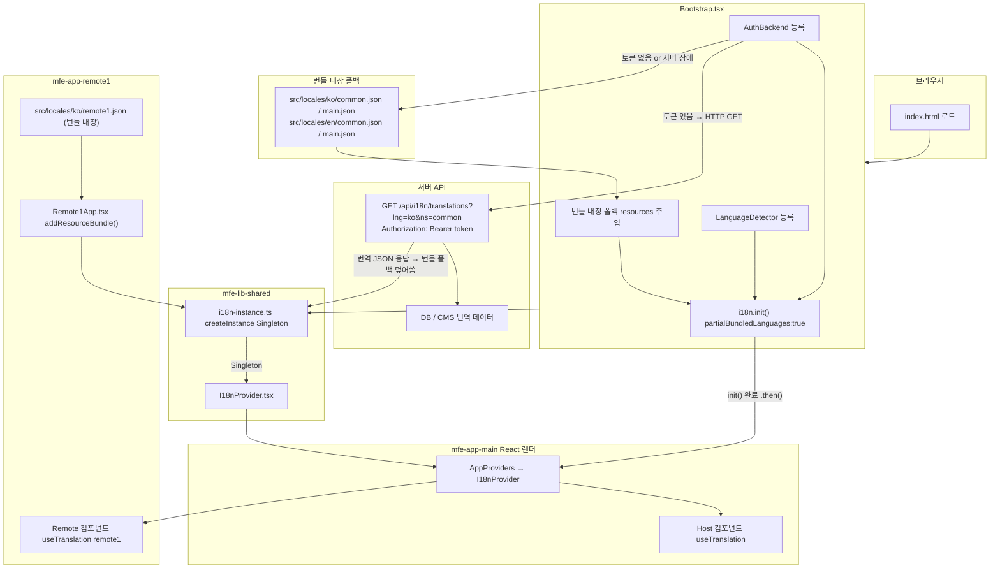

# MFE i18n 최종 플랜 (번들 폴백 + 서버 API 통합)

## 전체 아키텍처




## 동작 흐름 요약

1. 앱 시작 시 `resources`(번들 내장)를 먼저 주입 → 토큰 없어도 로그인 화면 즉시 표시
2. 토큰 획득 후 `AuthBackend`가 `/api/i18n/translations` 호출 → 서버 최신 번역으로 덮어씀
3. 서버 장애 or 401 시 번들 내장 폴백으로 자동 유지
4. remote1은 번들 내장 JSON을 `addResourceBundle()`로 주입 (CORS 회피)

---

## 적용 순서

1. `mfe-lib-shared` — i18n 폴더 신규 생성, package.json/vite.config.ts 수정 후 빌드
2. `mfe-app-main` — 패키지 설치, AuthBackend/locales 신규 생성, Bootstrap.tsx 수정
3. `mfe-app-remote1` — 패키지 설치, locales 신규 생성, Remote1App.tsx 수정

---

## 변경 파일 전체 코드

---

### [A] mfe-lib-shared/package.json

peerDependencies에 i18next/react-i18next 추가, exports에 `./i18n` 서브패스 추가.

```json
{
  "name": "@axiom/mfe-lib-shared",
  "private": true,
  "version": "0.0.0",
  "type": "module",
  "main": "./dist/index.cjs",
  "module": "./dist/index.js",
  "types": "./dist/index.d.ts",
  "exports": {
    ".": {
      "import": "./dist/index.js",
      "require": "./dist/index.cjs",
      "types": "./dist/index.d.ts"
    },
    "./config/eslint": {
      "types": "./dist/config/eslint/index.d.ts",
      "import": "./dist/config/eslint/index.js",
      "require": "./dist/config/eslint/index.cjs"
    },
    "./config/prettier": {
      "types": "./dist/config/prettier/index.d.ts",
      "import": "./dist/config/prettier/index.js",
      "require": "./dist/config/prettier/index.cjs"
    },
    "./config/eslint/base": {
      "types": "./dist/config/eslint/base.d.ts",
      "import": "./dist/config/eslint/base.js",
      "require": "./dist/config/eslint/base.cjs"
    },
    "./config/eslint/react": {
      "types": "./dist/config/eslint/react.d.ts",
      "import": "./dist/config/eslint/react.js",
      "require": "./dist/config/eslint/react.cjs"
    },
    "./styles": "./dist/styles/src/styles/index.css",
    "./styles/base": "./dist/styles/src/styles/base.css",
    "./styles/tokens": "./dist/styles/src/styles/tokens.css",
    "./styles/micro-frontend": "./dist/styles/src/styles/micro-frontend.css",
    "./styles/layout": "./dist/styles/src/styles/layout/layout.css",
    "./styles/components": "./dist/styles/components.css",
    "./components": {
      "import": "./dist/components/index.js",
      "require": "./dist/components/index.cjs",
      "types": "./dist/components/index.d.ts"
    },
    "./components/ui": {
      "import": "./dist/components/ui/index.js",
      "require": "./dist/components/ui/index.cjs",
      "types": "./dist/components/ui/index.d.ts"
    },
    "./types": {
      "import": "./dist/types/index.js",
      "require": "./dist/types/index.cjs",
      "types": "./dist/types/index.d.ts"
    },
    "./context": {
      "import": "./dist/context/index.js",
      "require": "./dist/context/index.cjs",
      "types": "./dist/context/index.d.ts"
    },
    "./utils": {
      "import": "./dist/utils/index.js",
      "require": "./dist/utils/index.cjs",
      "types": "./dist/utils/index.d.ts"
    },
    "./hooks": {
      "import": "./dist/hooks/index.js",
      "require": "./dist/hooks/index.cjs",
      "types": "./dist/hooks/index.d.ts"
    },
    "./api": {
      "import": "./dist/api/index.js",
      "require": "./dist/api/index.cjs",
      "types": "./dist/api/index.d.ts"
    },
    "./query": {
      "import": "./dist/query/index.js",
      "require": "./dist/query/index.cjs",
      "types": "./dist/query/index.d.ts"
    },
    "./i18n": {
      "import": "./dist/i18n/index.js",
      "require": "./dist/i18n/index.cjs",
      "types": "./dist/i18n/index.d.ts"
    }
  },
  "peerDependencies": {
    "@tanstack/react-query": "^5.95.2",
    "@tanstack/react-query-devtools": "^5.95.2",
    "i18next": "^24.0.0",
    "react": ">=19.0.0",
    "react-dom": ">=19.0.0",
    "react-helmet-async": "^3.0.0",
    "react-i18next": "^15.0.0",
    "react-router": ">=7.0.0"
  },
  "peerDependenciesMeta": {
    "@tanstack/react-query-devtools": { "optional": true }
  }
}
```

> 나머지 `dependencies`, `devDependencies`, `scripts` 등은 기존 그대로 유지.

---

### [B] mfe-lib-shared/vite.config.ts

external에 i18next/react-i18next 추가, entry에 i18n/index 추가.

```typescript
import { defineConfig } from 'vite';
import react from '@vitejs/plugin-react';
import tailwindcss from '@tailwindcss/vite';
import { resolve } from 'path';
import dts from 'vite-plugin-dts';
import { viteStaticCopy } from 'vite-plugin-static-copy';

export default defineConfig({
  plugins: [
    react(),
    tailwindcss(),
    dts({
      include: ['src'],
      insertTypesEntry: true,
      tsconfigPath: './tsconfig.app.json',
    }),
    viteStaticCopy({
      targets: [{ src: 'src/styles/**/*.css', dest: 'styles' }],
    }),
  ],
  build: {
    lib: {
      entry: {
        index: resolve(__dirname, 'src/index.ts'),
        'config/eslint/index': resolve(__dirname, 'src/config/eslint/index.ts'),
        'config/eslint/base': resolve(__dirname, 'src/config/eslint/base.ts'),
        'config/eslint/react': resolve(__dirname, 'src/config/eslint/react.ts'),
        'config/prettier/index': resolve(__dirname, 'src/config/prettier/index.ts'),
        'components/index': resolve(__dirname, 'src/components/index.ts'),
        'components/ui/index': resolve(__dirname, 'src/components/shadcn/ui/index.ts'),
        'types/index': resolve(__dirname, 'src/types/index.ts'),
        'context/index': resolve(__dirname, 'src/context/index.ts'),
        'utils/index': resolve(__dirname, 'src/utils/index.ts'),
        'hooks/index': resolve(__dirname, 'src/hooks/index.ts'),
        'api/index': resolve(__dirname, 'src/api/index.ts'),
        'query/index': resolve(__dirname, 'src/query/index.ts'),
        // ↓ 신규 추가
        'i18n/index': resolve(__dirname, 'src/i18n/index.ts'),
      },
      formats: ['es', 'cjs'],
      fileName: (format, entryName) => `${entryName}.${format === 'es' ? 'js' : 'cjs'}`,
    },
    rollupOptions: {
      preserveEntrySignatures: 'strict',
      external: [
        'react',
        'react-dom',
        'react/jsx-runtime',
        'react-router',
        'eslint',
        '@eslint/js',
        'globals',
        'typescript-eslint',
        'eslint-config-prettier',
        'eslint-plugin-react',
        'eslint-plugin-react-hooks',
        'eslint-plugin-react-refresh',
        'eslint-plugin-import-x',
        'prettier',
        'axios',
        '@tanstack/react-query',
        'react-helmet-async',
        '@tanstack/react-query-devtools',
        // ↓ 신규 추가
        'i18next',
        'react-i18next',
      ],
    },
    cssCodeSplit: false,
  },
  resolve: {
    alias: { '@': resolve(__dirname, 'src') },
  },
});
```

---

### [C] mfe-lib-shared/src/i18n/i18n-instance.ts (신규)

MFE 전체에서 공유되는 i18next Singleton 인스턴스.

```typescript
import i18next from 'i18next';

// createInstance()로 전역 i18next 인스턴스와 분리된 독립 인스턴스 생성.
// Module Federation singleton: true 설정과 함께 Host/Remote가 동일 객체를 참조한다.
const i18n = i18next.createInstance();

export default i18n;
```

---

### [D] mfe-lib-shared/src/i18n/I18nProvider.tsx (신규)

I18nextProvider를 래핑하여 AppProviders에서 주입할 수 있게 하는 컴포넌트.

```tsx
import { type ReactNode } from 'react';
import { I18nextProvider } from 'react-i18next';
import type { i18n as I18nInstance } from 'i18next';
import i18nDefault from './i18n-instance';

interface I18nProviderProps {
  children: ReactNode;
  // 테스트 등에서 커스텀 인스턴스 주입 가능, 기본값은 공유 Singleton
  i18n?: I18nInstance;
}

export function I18nProvider({ children, i18n = i18nDefault }: I18nProviderProps) {
  return <I18nextProvider i18n={i18n}>{children}</I18nextProvider>;
}
```

---

### [E] mfe-lib-shared/src/i18n/index.ts (신규)

i18n 서브패스(`@axiom/mfe-lib-shared/i18n`)의 공개 API.

```typescript
export { default as i18n } from './i18n-instance';
export { I18nProvider } from './I18nProvider';
// react-i18next의 useTranslation을 re-export하여 각 앱이 직접 의존성 없이 사용 가능
export { useTranslation } from 'react-i18next';
export type { TFunction } from 'i18next';
```

---

### [F] mfe-lib-shared/src/components/providers/AppProviders.tsx (수정)

I18nProvider를 ThemeProvider 바로 안쪽에 추가.

```tsx
import { type ReactNode, useState, useEffect } from 'react';
import { HelmetProvider } from 'react-helmet-async';
import { ThemeProvider } from '../../context';
import { I18nProvider } from '../../i18n/I18nProvider';
import type { i18n as I18nInstance } from 'i18next';

import { QueryClientProvider, type QueryClientConfig } from '@tanstack/react-query';
import { ReactQueryDevtools } from '@tanstack/react-query-devtools';
import { getQueryClient } from '../../config/tanstack-query/query-client';

interface AppProvidersProps {
  children: ReactNode;
  queryConfig?: QueryClientConfig;
  // 테스트 등에서 별도 인스턴스 주입 가능, 기본값은 공유 Singleton 사용
  i18nInstance?: I18nInstance;
}

export function AppProviders({ children, queryConfig, i18nInstance }: AppProvidersProps) {
  const [queryClient] = useState(() => getQueryClient(queryConfig));

  useEffect(() => {
    window.__TANSTACK_QUERY_CLIENT__ = queryClient;
  }, [queryClient]);

  return (
    <ThemeProvider>
      {/* I18nProvider: ThemeProvider 안, HelmetProvider 밖에 위치 */}
      <I18nProvider i18n={i18nInstance}>
        <HelmetProvider>
          <QueryClientProvider client={queryClient}>
            {children}
            {process.env.NODE_ENV === 'development' && (
              <ReactQueryDevtools initialIsOpen={false} />
            )}
          </QueryClientProvider>
        </HelmetProvider>
      </I18nProvider>
    </ThemeProvider>
  );
}
```

---

### [G] mfe-lib-shared/src/index.ts (수정)

i18n 관련 exports 추가.

```typescript
// ── Shadcn 컴포넌트 ──
export { Button, buttonVariants } from './components/shadcn/ui/button';
// ── Providers ──
export { AppProviders } from './components/providers/AppProviders';
// ── 기타 컴포넌트 추가 ──
export { default as CodeBlockClient } from './components/code-block/CodeBlockClient';
// ── 유틸리티 ──
export { cn } from './components/shadcn/lib/utils';
// ── 컨텍스트 ──
export { ThemeProvider, useTheme } from './context';
// ── 라우터 ──
export { createWindowRouter, registerWindowRouter } from './utils/router';
// ── API 훅 ──
export { useApi } from './hooks';
export type { IUseApiQueryOptions, IUseApiMutationOptions, UseApiMutationResult } from './hooks';
// ── API 설정 ──
export { initApiConfig, getApiConfig, callApi, ApiError } from './api';
// ── TanStack Query 유틸 ──
export { makeQueryClient, getQueryClient, createQueryKey } from './query';
// ── i18n ──
export { i18n, I18nProvider, useTranslation } from './i18n/index';
export type { TFunction } from 'i18next';
```

---

### [H] mfe-app-main/package.json (수정)

dependencies에 i18next 관련 패키지 3개 추가.

```json
{
  "name": "@axiom/mfe-app-main",
  "private": true,
  "version": "0.0.0",
  "type": "module",
  "scripts": {
    "dev": "vite --port 5173",
    "build": "tsc -b && vite build",
    "preview": "vite preview",
    "lint": "eslint src/**/*.tsx",
    "lint:fix": "eslint src/**/*.tsx --fix",
    "format": "prettier --write \"src/**/*.{ts,tsx,js,jsx,json,css,md}\"",
    "format:check": "prettier --check \"src/**/*.{ts,tsx,js,jsx,json,css,md}\""
  },
  "dependencies": {
    "@tanstack/react-query": "^5.95.2",
    "i18next": "^24.0.0",
    "i18next-browser-languagedetector": "^8.0.0",
    "lucide-react": "^1.7.0",
    "react": "^19.2.4",
    "react-dom": "^19.2.4",
    "react-helmet-async": "^3.0.0",
    "react-i18next": "^15.0.0",
    "react-router": "^7.13.2"
  },
  "devDependencies": {
    "@eslint/js": "^9.39.4",
    "@module-federation/vite": "^1.13.5",
    "@axiom/mfe-lib-shared": "file:../mfe-lib-shared",
    "@tailwindcss/vite": "^4.2.2",
    "@types/node": "^24.12.0",
    "@types/react": "^19.2.14",
    "@types/react-dom": "^19.2.3",
    "@vitejs/plugin-react": "^6.0.1",
    "eslint": "^9.39.4",
    "eslint-config-prettier": "^10.1.8",
    "eslint-plugin-import-x": "^4.16.2",
    "eslint-plugin-react": "^7.37.5",
    "eslint-plugin-react-hooks": "^7.0.1",
    "eslint-plugin-react-refresh": "^0.5.2",
    "globals": "^17.4.0",
    "prettier": "^3.8.1",
    "tailwindcss": "^4.2.2",
    "tw-animate-css": "^1.4.0",
    "typescript": "~5.9.3",
    "typescript-eslint": "^8.57.0",
    "vite": "^8.0.1"
  }
}
```

---

### [I] mfe-app-main/vite.config.ts (수정)

Module Federation shared에 i18next/react-i18next singleton 추가.

```typescript
import { defineConfig, loadEnv } from 'vite';
import react from '@vitejs/plugin-react';
import tailwindcss from '@tailwindcss/vite';
import { federation } from '@module-federation/vite';
import { resolve } from 'path';

export default defineConfig(({ mode }) => {
  const env = loadEnv(mode, process.cwd(), '');
  const baseUrl = env.VITE_BASE_URL || '/';

  return {
    base: baseUrl,
    plugins: [
      react(),
      tailwindcss(),
      federation({
        name: 'mainApp',
        dev: { disableDynamicRemoteTypeHints: true },
        remotes: {
          remote1App: {
            name: 'remote1App',
            entry: env.VITE_REMOTE_REMOTE1_URL || 'http://localhost:5174/remote1Entry.js',
            type: 'module',
          },
        },
        shared: {
          react: { singleton: true, requiredVersion: '^19.0.0' },
          'react-dom': { singleton: true, requiredVersion: '^19.0.0' },
          'react-router': { singleton: true, requiredVersion: '^7.0.0' },
          '@tanstack/react-query': { singleton: true, requiredVersion: '^5.95.2' },
          'react-helmet-async': { singleton: true, requiredVersion: '^3.0.0' },
          '@axiom/mfe-lib-shared': { singleton: true, requiredVersion: '^0.0.0' },
          // ↓ 신규 추가: 동일 i18n 인스턴스를 Host/Remote가 공유하기 위한 singleton 선언
          'i18next': { singleton: true, requiredVersion: '^24.0.0' },
          'react-i18next': { singleton: true, requiredVersion: '^15.0.0' },
        },
      }),
    ],
    resolve: {
      dedupe: ['react', 'react-dom', 'react-router'],
      alias: { '@': resolve(__dirname, 'src') },
    },
    server: { port: 5173 },
  };
});
```

---

### [J] mfe-app-main/src/i18n/AuthBackend.ts (신규)

인증 토큰 기반 서버 API 번역 로딩 커스텀 백엔드.

- 메모리 캐시(TTL 5분)로 동일 네임스페이스 중복 요청 방지
- 토큰 없음 / 401 / 서버 장애 시 `callback(err, false)` → i18next가 번들 폴백 자동 사용
- `getToken` 함수는 Bootstrap.tsx에서 주입 (실제 auth 스토어와 연결)

```typescript
import type { BackendModule, ReadCallback } from 'i18next';

export interface AuthBackendOptions {
  // 번역 API 경로 템플릿, {{lng}}/{{ns}} 치환자 사용
  loadPath: string;
  // 현재 액세스 토큰을 반환하는 함수 — Bootstrap에서 실제 auth 스토어와 연결
  getToken: () => string | null;
  // 메모리 캐시 유지 시간(ms), 기본 5분
  cacheTTL?: number;
}

interface CacheEntry {
  data: Record<string, unknown>;
  expiredAt: number;
}

const DEFAULT_CACHE_TTL = 5 * 60 * 1000;

export class AuthBackend implements BackendModule<AuthBackendOptions> {
  static type = 'backend' as const;
  type = 'backend' as const;

  private opts: AuthBackendOptions = {
    loadPath: '/api/i18n/translations?lng={{lng}}&ns={{ns}}',
    getToken: () => null,
    cacheTTL: DEFAULT_CACHE_TTL,
  };

  // 인스턴스별 캐시: MF singleton이므로 실질적으로 앱 전체에서 하나
  private cache = new Map<string, CacheEntry>();

  init(_services: unknown, backendOptions: AuthBackendOptions): void {
    this.opts = { ...this.opts, ...backendOptions };
  }

  read(language: string, namespace: string, callback: ReadCallback): void {
    const { loadPath, getToken, cacheTTL = DEFAULT_CACHE_TTL } = this.opts;
    const cacheKey = `${language}:${namespace}`;
    const cached = this.cache.get(cacheKey);

    // 유효한 캐시가 있으면 서버 요청 없이 즉시 반환
    if (cached && Date.now() < cached.expiredAt) {
      callback(null, cached.data);
      return;
    }

    const token = getToken();

    // 토큰이 없으면 번들 폴백 사용 (로그인 전 상태)
    if (!token) {
      callback(new Error('[AuthBackend] No token - using bundle fallback'), false);
      return;
    }

    const url = loadPath
      .replace('{{lng}}', encodeURIComponent(language))
      .replace('{{ns}}', encodeURIComponent(namespace));

    fetch(url, {
      headers: {
        Authorization: `Bearer ${token}`,
        'Cache-Control': 'no-cache',
      },
    })
      .then(async (res) => {
        // 401: 토큰 만료 — 번들 폴백 유지 (갱신 로직은 axios interceptor 등에서 처리)
        if (res.status === 401) {
          callback(new Error('[AuthBackend] 401 Unauthorized - using bundle fallback'), false);
          return;
        }
        if (!res.ok) {
          throw new Error(`[AuthBackend] HTTP ${res.status}`);
        }
        const data = (await res.json()) as Record<string, unknown>;
        this.cache.set(cacheKey, { data, expiredAt: Date.now() + cacheTTL });
        callback(null, data);
      })
      .catch((err: Error) => {
        // 서버 장애, 네트워크 오류 → false 반환 시 i18next가 번들 폴백 유지
        callback(err, false);
      });
  }

  // 긴급 공지 / 약관 변경 시 외부에서 캐시 무효화 호출 가능
  invalidateCache(language?: string, namespace?: string): void {
    if (language && namespace) {
      this.cache.delete(`${language}:${namespace}`);
    } else {
      this.cache.clear();
    }
  }
}
```

---

### [K] mfe-app-main/src/locales/ko/common.json (신규)

공통 UI 문자열 한국어 번들 폴백.

```json
{
  "btn.confirm": "확인",
  "btn.cancel": "취소",
  "btn.close": "닫기",
  "btn.save": "저장",
  "btn.edit": "수정",
  "btn.delete": "삭제",
  "btn.back": "뒤로",
  "btn.login": "로그인",
  "btn.logout": "로그아웃",
  "error.network": "네트워크 오류가 발생했습니다.",
  "error.timeout": "요청 시간이 초과되었습니다.",
  "error.unauthorized": "인증이 필요합니다.",
  "error.unknown": "알 수 없는 오류가 발생했습니다.",
  "label.loading": "로딩 중...",
  "label.noData": "데이터가 없습니다."
}
```

---

### [L] mfe-app-main/src/locales/ko/main.json (신규)

Host 전용 문자열 한국어 번들 폴백.

```json
{
  "nav.home": "홈",
  "nav.dashboard": "대시보드",
  "nav.settings": "설정",
  "page.home.title": "메인 홈",
  "page.home.welcome": "환영합니다"
}
```

---

### [M] mfe-app-main/src/locales/en/common.json (신규)

공통 UI 문자열 영어 번들 폴백.

```json
{
  "btn.confirm": "Confirm",
  "btn.cancel": "Cancel",
  "btn.close": "Close",
  "btn.save": "Save",
  "btn.edit": "Edit",
  "btn.delete": "Delete",
  "btn.back": "Back",
  "btn.login": "Login",
  "btn.logout": "Logout",
  "error.network": "A network error occurred.",
  "error.timeout": "The request timed out.",
  "error.unauthorized": "Authentication required.",
  "error.unknown": "An unknown error occurred.",
  "label.loading": "Loading...",
  "label.noData": "No data available."
}
```

---

### [N] mfe-app-main/src/locales/en/main.json (신규)

Host 전용 문자열 영어 번들 폴백.

```json
{
  "nav.home": "Home",
  "nav.dashboard": "Dashboard",
  "nav.settings": "Settings",
  "page.home.title": "Main Home",
  "page.home.welcome": "Welcome"
}
```

---

### [O] mfe-app-main/src/Bootstrap.tsx (수정)

i18n init 완료 후 React 렌더링. 번들 폴백 + AuthBackend + LanguageDetector 통합.

```tsx
import { StrictMode } from 'react';
import { createRoot } from 'react-dom/client';
import { type QueryClientConfig } from '@tanstack/react-query';
import { AppProviders } from '@axiom/mfe-lib-shared/components';
import { initApiConfig } from '@axiom/mfe-lib-shared/api';
import { i18n } from '@axiom/mfe-lib-shared/i18n';
import LanguageDetector from 'i18next-browser-languagedetector';
import { AuthBackend } from './i18n/AuthBackend';
import './assets/styles/app.css';
import App from './App.tsx';

// 번들 내장 폴백 번역 — 토큰 없음/서버 장애 시 사용 (src/ 내부 import → JS 번들에 포함)
import koCommon from './locales/ko/common.json';
import koMain from './locales/ko/main.json';
import enCommon from './locales/en/common.json';
import enMain from './locales/en/main.json';

const queryConfig: QueryClientConfig = {
  defaultOptions: {
    queries: {
      retry: 0,
      refetchOnWindowFocus: true,
      refetchOnReconnect: true,
      staleTime: 0,
      gcTime: 0,
    },
    mutations: { retry: 0 },
  },
};

const apiConfig = { baseURL: import.meta.env.VITE_EXTERNAL_API_BASE_URL2 };
initApiConfig(apiConfig);

// 액세스 토큰 getter — 실제 프로젝트의 auth 스토어(zustand, redux 등)와 연결
// 현재는 localStorage 기준 예시
const getToken = (): string | null => {
  return localStorage.getItem('access_token');
};

i18n
  .use(AuthBackend)      // 인증 기반 서버 번역 로딩
  .use(LanguageDetector) // 브라우저 언어 자동 감지
  .init({
    // 번들 내장(resources) + 서버 로딩(backend) 동시 사용 허용하는 핵심 옵션
    partialBundledLanguages: true,
    // 번들 내장 폴백: 서버 응답 전 / 장애 시 사용
    resources: {
      ko: { common: koCommon, main: koMain },
      en: { common: enCommon, main: enMain },
    },
    ns: ['common', 'main'],
    defaultNS: 'common',
    fallbackLng: 'ko',
    interpolation: {
      escapeValue: false, // React는 XSS를 자체 처리하므로 불필요
    },
    // AuthBackend에 전달되는 옵션
    backend: {
      loadPath: '/api/i18n/translations?lng={{lng}}&ns={{ns}}',
      getToken,
      cacheTTL: 5 * 60 * 1000, // 5분
    },
    // LanguageDetector 옵션
    detection: {
      order: ['localStorage', 'navigator'],
      caches: ['localStorage'],
      lookupLocalStorage: 'i18n_language', // localStorage 키명
    },
  })
  .then(() => {
    // i18n 초기화 완료 후 렌더링 — 첫 화면부터 번역 텍스트 정상 표시 보장
    createRoot(document.getElementById('root')!).render(
      <StrictMode>
        <AppProviders queryConfig={queryConfig}>
          <App />
        </AppProviders>
      </StrictMode>,
    );
  });
```

---

### [P] mfe-app-remote1 관련 (별도 레포 — 패턴 참고용)

#### mfe-app-remote1/package.json (수정)

```json
{
  "dependencies": {
    "i18next": "^24.0.0",
    "react-i18next": "^15.0.0"
  }
}
```

#### mfe-app-remote1/vite.config.ts (수정)

federation shared에 추가:

```typescript
shared: {
  // ...기존 항목 유지...
  'i18next': { singleton: true, requiredVersion: '^24.0.0' },
  'react-i18next': { singleton: true, requiredVersion: '^15.0.0' },
},
```

#### mfe-app-remote1/src/locales/ko/remote1.json (신규)

```json
{
  "page.title": "Remote1 페이지",
  "page.description": "Remote1 앱의 콘텐츠입니다.",
  "btn.action": "실행"
}
```

#### mfe-app-remote1/src/locales/en/remote1.json (신규)

```json
{
  "page.title": "Remote1 Page",
  "page.description": "This is Remote1 app content.",
  "btn.action": "Execute"
}
```

#### mfe-app-remote1/src/Remote1App.tsx (수정)

```tsx
import { useEffect } from 'react';
import { i18n, useTranslation } from '@axiom/mfe-lib-shared/i18n';
import koRemote1 from './locales/ko/remote1.json';
import enRemote1 from './locales/en/remote1.json';

export function Remote1App() {
  useEffect(() => {
    // Host의 i18n singleton에 remote1 네임스페이스 주입
    // 이미 추가된 경우 덮어쓰기 방지 (3번째 인자: deep merge, 4번째: overwrite)
    if (!i18n.hasResourceBundle('ko', 'remote1')) {
      i18n.addResourceBundle('ko', 'remote1', koRemote1, true, false);
    }
    if (!i18n.hasResourceBundle('en', 'remote1')) {
      i18n.addResourceBundle('en', 'remote1', enRemote1, true, false);
    }
  }, []);

  const { t } = useTranslation('remote1');

  return (
    <div>
      <h1>{t('page.title')}</h1>
      <p>{t('page.description')}</p>
    </div>
  );
}
```

---

## AuthBackend 동작 요약

```
앱 시작
  → 번들 내장 폴백(resources) 즉시 사용 가능
  → LanguageDetector: localStorage 또는 navigator.language 감지

getToken() 호출 결과에 따라:
  ├── null (미인증)  → callback(err, false) → 번들 폴백 유지
  └── 토큰 있음      → GET /api/i18n/translations?lng={{lng}}&ns={{ns}}
                          Authorization: Bearer {token}
                         ├── 200 OK  → 서버 번역 캐시 저장(TTL 5분) → 번들 폴백 덮어씀
                         ├── 401    → callback(err, false) → 번들 폴백 유지
                         └── 장애   → callback(err, false) → 번들 폴백 유지

언어 전환: i18n.changeLanguage('en')
  → MF singleton 전파 → Host + Remote 동시 갱신
  → 미캐시 네임스페이스는 서버 재요청
```

