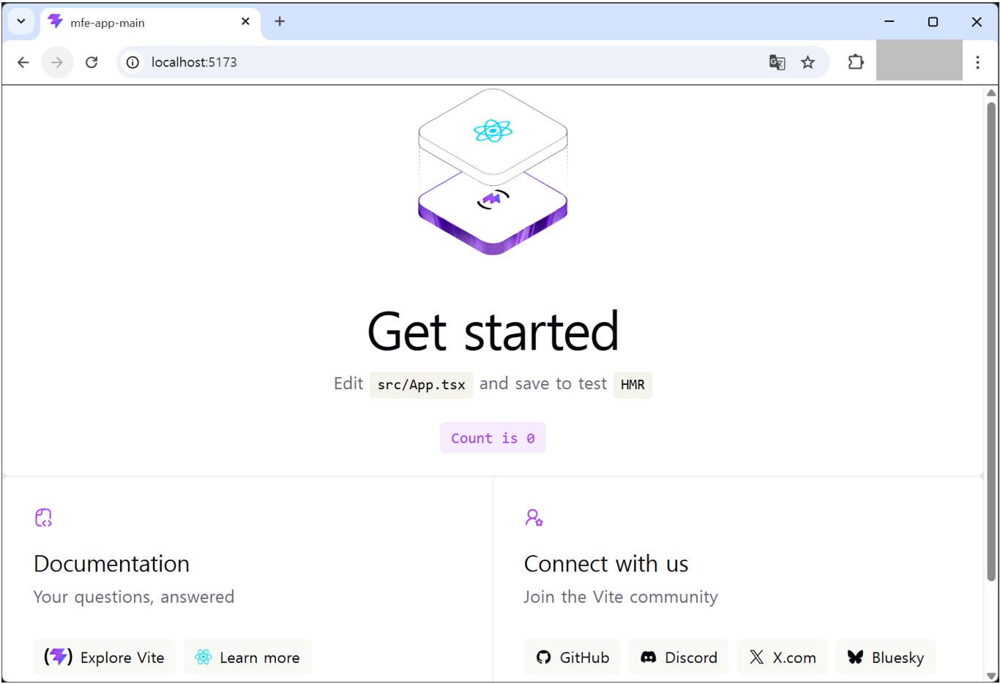

# React 초기 프로젝트 세팅

<span class="react-color">Frontend (React)</span> 개발을 위해 처음부터 기본 React 프로젝트를 세팅하는 방법을 안내합니다.


## React 프로젝트 생성하기
---
:::info <span class="admonition-title">Vite</span>를 통해 프로젝트를 생성합니다.
  * [Vite공식문서: https://ko.vitejs.dev/](https://ko.vitejs.dev/)
:::
:::tip <span class="admonition-title">Micro Frontend</span> 패키지 이름 명명 규칙
* 모든 패키지 이름 예시
    - **Host 앱**: @company/mfe-app-main
    - **Remote 앱**: @company/mfe-app-\{업무명\} (예: @company/mf-app-shop)
    - **공통 라이브러리**: @company/mfe-lib-shared
* 네이밍 규칙
    - **@company**: 조직 스코프 (프로젝트에 맞게 변경)
    - **mfe**: micro frontend 약자
    - **app-**: Application 앱 접두사
    - **lib-**: Library 라이브러리 접두사
    - **\{업무명\}**: 해당 업무 도메인 명 (kebab-case)
:::

* **mfe-app-boilerplate** 전체 프로젝트는 **Vite React** 프로젝트로 생성합니다.  
워크스페이스 **루트**(multirepo-mf-boilerplate/)에서 실행
    ```sh
    npm create vite@latest mfe-app-main -- --template react-ts
    ```
* 생성 후 폴더 이동:
    ```sh
    cd mfe-app-main
    ```


## 생성된 폴더 구조
---
* 최초 생성된 폴더 구조는 다음과 같습니다.
    ```sh
    mfe-app-main/
    ├── public/
    ├── src/
    ├── .gitignore
    ├── eslint.config.js
    ├── index.html
    ├── package.json
    ├── README.md
    ├── tsconfig.app.json
    ├── tsconfig.json
    ├── tsconfig.node.json
    └── vite.config.ts
    ```


## 패키지 명 변경
---
* `package.json` 파일에 **프로젝트 명**을 프로젝트 명명 규칙에 맞게 변경합니다.
    - `@회사및조직/mfe-app-{업무명}`
    - 예시
    ```json
    {
        "name": "@company/mfe-app-main",
    }
    ```


## 생성한 프로젝트 확인하기
---
* 최초 생성된 프로젝트에는 **의존성 라이브러리**가 설치되어 있지 않아서 **node_modules** 폴더가 없습니다. 따라서 생성한 `@company/mfe-app-main` 프로젝트의 루트 디렉토리에서 `npm install` 명령어를 실행하여 의존성 라이브러리를 설치합니다.
    ```sh
    npm install
    ```
* 의존성 라이브러리 설치 후 폴더 구조는 다음과 같습니다.
    ```sh
    @company/mfe-app-main/
    // highlight-start
    ├── node_modules/    # 의존성 라이브러리 설치 후 생성됨
    // highlight-end
    ├── public/
    ├── src/
    ├── .gitignore
    ├── eslint.config.js
    ├── index.html
    ├── package.json
    ├── README.md
    ├── tsconfig.app.json
    ├── tsconfig.json
    ├── tsconfig.node.json
    └── vite.config.ts
    ```
* 로컬 서버를 띄우기 위해 `npm run dev` 명령어를 실행하여 로컬 서버를 띄웁니다.
    ```sh
    npm run dev
    ```
* 로컬 서버가 띄워지면 브라우저에서 `http://localhost:5173` 접속하여 확인합니다.



## 공유 라이브러리 의존성 추가
---
* `package.json` 파일에 **공유 라이브러리** 패키지 `@company/mfe-lib-shared` **의존성을 연결**합니다. **공유 라이브러리**는 마이크로 프론트엔드 프로젝트 전체 애플리케이션에서 공통으로 사용되는 라이브러리를 제공하는 패키지 입니다.
    - 의존성 연결을 하기전에 **공유 라이브러리** 패키지를 `git clone` 받아야 합니다. 추후 **공유 라이브러리** 패키지가 **npm 레지스트리**에 배포되면 의존성 연결 방식을 `npm install 패키지명` 으로 설치하여 사용합니다.
    ```json
    {
        "dependencies": {
            "@company/mfe-lib-shared": "file:../mfe-lib-shared" // 공유 라이브러리 패키지 경로
        }
    }
    ```


## Tailwind CSS 설치
---
* `@company/mfe-app-main` 프로젝트와 함께 사용할 `@company/mfe-lib-shared` 공유 라이브러리 패키지는 모두 **Tailwind CSS**를 사용합니다. 따라서 `@company/mfe-app-main` 프로젝트에도 **Tailwind CSS**를 설치해야 합니다.
    ```sh
    npm install -D tailwindcss @tailwindcss/vite tw-animate-css
    ```
:::info 왜 각 앱에서도 <span class="admonition-title">Tailwind CSS</span>를 설치해야 하는가?
* Tailwind CSS의 동작 원리
    - Tailwind는 런타임 CSS-in-JS 라이브러리가 아니라, **빌드 타임**에 소스코드를 **스캔**해서 실제로 사용된 유틸리티 클래스만 CSS 파일로 생성하는 방식입니다.
    ```
    소스코드 스캔 → 사용된 클래스 추출 → CSS 파일 생성
    ```
:::


* `vite.config.ts` 파일에 **Tailwind 플러그인** 추가 및 **@ alias 구성**
    ```ts
    import { defineConfig } from 'vite'
    import react from '@vitejs/plugin-react'
    // highlight-start
    import tailwindcss from '@tailwindcss/vite'
    import { resolve } from 'path'
    // highlight-end
    export default defineConfig({
        plugins: [
            react(),
            // highlight-start
            tailwindcss(),   // ← 추가
            // highlight-end
        ],
        // highlight-start
        resolve: {
            alias: {
            '@': resolve(__dirname, 'src'),
            },
        },
        // highlight-end
        server: {
            port: 5173,
        },
    })
    ```
* CSS 파일 재구성
    - 기존 `src/index.css`와 `src/App.css`를 삭제하고, `src/assets/styles/app.css`로 통합합니다.
    - `src/assets/styles/app.css` 신규 생성
        - **핵심 포인트**: Tailwind v4는 tailwind.config.js 없이 CSS 파일의 @import 'tailwindcss' 한 줄로 동작합니다. content 경로 설정도 CSS 파일 내 @source 디렉티브로 처리합니다.
    ```css
    /* Tailwind 엔진 (v4 방식) */
    @import 'tailwindcss';
    /* tw-animate-css 사용 시 */
    @import 'tw-animate-css';
    /* 공유 라이브러리 스타일 (나중에 추가) */
    /* @import '@company/mfe-lib-shared/styles'; */
    /* 공유 라이브러리 컴포넌트의 Tailwind 클래스 스캔 (나중에 추가) */
    /* @source "../node_modules/@company/mfe-lib-shared/src"; */
    ```
* `src/main.tsx` CSS 파일 import 경로 수정
    ```tsx
    import { StrictMode } from 'react'
    import { createRoot } from 'react-dom/client'
    // highlight-start
    import './assets/styles/app.css'   // ← index.css → assets/styles/app.css로 변경
    // highlight-end
    import App from './App.tsx'

    createRoot(document.getElementById('root')!).render(
    <StrictMode>
        <App />
    </StrictMode>,
    )
    ```
* `src/App.tsx` 파일 내 CSS 삭제
    ```tsx
    import { useState } from 'react'
    import reactLogo from './assets/react.svg'
    import viteLogo from './assets/vite.svg'
    import heroImg from './assets/hero.png'
    // highlight-start
    // import './App.css'
    // highlight-end

    // ...
    ```


## Visual Studio Code (VSCode) 코드편집기 설정
---
* **"개발자 개인 설정에 의존하지 않고, 프로젝트 코드베이스 자체가 코드 품질 기준을 강제하도록 만들기 위하여"** 다음과 같이 **VSCode** 설정을 합니다.
* 특히 Micro Frontend(MFE) 멀티레포 구조에서는 여러 앱/라이브러리 레포가 존재하므로, 각 레포마다 동일한 `.vscode/settings.json`을 두면 어떤 레포를 열더라도 일관된 포맷팅 & 린팅 규칙이 자동 적용됩니다. 이는 코드 리뷰 시 불필요한 포맷 변경 diff를 줄이는 데도 매우 효과적입니다.


### settings.json 셋팅 (VSCode 설정)

<span class="react-color">Frontend (React)</span> 개발을 위해 **VSCode**를 활용할 것입니다. 따라서 개발자의 통일된 코드 작성을 위하여 **VSCode**의 환경설정을 **settings.json**파일에 적용합니다.

#### settings.json 설정

> - **settings.json 파일열기** : f1 ⤍ settings 입력 ⤍ Preferences: Open Workspace Settings (JSON) 클릭.  
>   위와같이 열면 프로젝트 루트에 **.vscode** 디렉토리가 생성되고 **settings.json**파일이 생성됩니다.
> - **settings(설정)가 적용되는 우선 순위** : .vscode settings.json ⤇ settings.json ⤇ defaultSetting.json(<span class="text-color-red">수정하지 않는 파일.</span>)  
>   <span class="text-color-red">defaultSetting.json은 모든 설정내용이 다 들어있는 기본 설정 파일입니다. 수정은 하지 않는 파일입니다.</span>
> - **.vscode** 디렉토리에 생성된 **settings.json** 파일에 아래 내용 입력합니다.

```json
{
  "editor.formatOnSave": true,
  "editor.codeActionsOnSave": {
    "source.fixAll.eslint": "explicit"
  },
  "editor.tabSize": 2,
  "editor.detectIndentation": false,
  "editor.insertSpaces": false,
  "editor.renderWhitespace": "all",
  "editor.comments.insertSpace": false,
  "files.associations": {
    "*.json": "jsonc"
  },
  "eslint.validate": [
    "javascript",
    "javascriptreact",
    "typescript",
    "typescriptreact"
  ],
  "eslint.workingDirectories": [{ "mode": "auto" }],
  "editor.defaultFormatter": "esbenp.prettier-vscode",
  "eslint.useFlatConfig": true,
  "css.lint.unknownAtRules": "ignore",
  "scss.lint.unknownAtRules": "ignore",
  "less.lint.unknownAtRules": "ignore",
  "[markdown]": {
    "editor.formatOnSave": false,
    "editor.codeActionsOnSave": {
      "source.fixAll.eslint": "never"
    }
  },
  "[mdx]": {
    "editor.formatOnSave": false,
    "editor.defaultFormatter": null
  }
}
```

:star: 이렇게 `settings.json` 파일로 **VSCode** 설정을 하면 **메뉴(File ⤍ Preferences ⤍ Settings)** 로 설정한것 보다 우선순위가 높게 적용됩니다.


:::info 설명
- **"editor.formatOnSave"** : 파일 저장 시 자동으로 코드 서식을 정리합니다.
- **"editor.codeActionsOnSave" ⤍ "source.fixAll.eslint"** : 파일 저장 시 ESLint가 감지한 모든 문제를 자동으로 수정합니다.
- **"editor.tabSize"** : 탭 크기를 몇칸으로 설정할지 지정합니다.
- **"editor.detectIndentation"** : VSCode가 파일의 들여쓰기를 자동으로 감지하는 기능을 활용할지 여부 입니다.
- **"editor.insertSpaces"** : 탭 키를 누를 때 공백 대신 탭 문자를 삽입합니다.
- **"editor.renderWhitespace"** : 공백 문자를 시각적으로 표시합니다.
- **"editor.comments.insertSpace"** : 주석 기호(//, /\*) 뒤에 자동으로 공백을 삽입할지 여부 입니다.
- **"files.associations" ⤍ "\*.json": "jsonc"** : .json 파일을 jsonc(주석이 있는 JSON) 형식으로 인식하도록 설정합니다.
- **"eslint.validate": \["javascript", "javascriptreact", "typescript", "typescriptreact"\]** : ESLint가 TypeScript, React, JavaScript 파일을 검사하도록 설정합니다.
- **"eslint.workingDirectories"** : \[\{"mode":"auto"\}\] : ESLint 작업 디렉토리를 자동으로 감지하도록 설정합니다.
- **"editor.defaultFormatter": "esbenp.prettier-vscode"** : VSCode의 기본 코드 포맷터로 Prettier를 사용합니다.
- **"eslint.useFlatConfig"** : ESLint의 설정방식이 `v8.21.0` 부터 **Flat Config**를 지원하면서, 구성 형식을 **Flat Config**으로 할지 여부 설정.

- **"css.lint.unknownAtRules": "ignore"** : VSCode에서 CSS의 "Unknown At Rules" 경고를 무시하도록 설정.
- **"scss.lint.unknownAtRules": "ignore"** : VSCode에서 scss의 "Unknown At Rules" 경고를 무시하도록 설정.
- **"less.lint.unknownAtRules": "ignore"** : VSCode에서 less의 "Unknown At Rules" 경고를 무시하도록 설정.
- **"[markdown]":** : Markdown 파일을 편집할 때 자동으로 코드 서식을 정리하지 않도록 설정.
- **"[mdx]":** : MDX 파일을 편집할 때 자동으로 코드 서식을 정리하지 않도록 설정.
:::


## ESLint, Prettier 설정
---


### 1. **@company/mfe-app-main**에 **@company/mfe-lib-shared** 의존성 추가
* `@company/mfe-app-main/package.json`의 **devDependencies**에 로컬 경로로 공유 라이브러리 패키지를 추가합니다. 이미 되어있다면 생략합니다.
* **공유 라이브러리**는 마이크로 프론트엔드 프로젝트 전체 애플리케이션에서 공통으로 사용되는 라이브러리를 제공하는 패키지 입니다.
    - 의존성 연결을 하기전에 **공유 라이브러리** 패키지를 `git clone` 받아야 합니다. 추후 **공유 라이브러리** 패키지가 **npm 레지스트리**에 배포되면 의존성 연결 방식을 `npm install 패키지명` 으로 설치하여 사용합니다.
    ```json
    {
        "dependencies": {
            "@company/mfe-lib-shared": "file:../mfe-lib-shared" // 공유 라이브러리 패키지 경로
        }
    }
    ```


### 2. ESLint, Prettier 관련 라이브러리 설치
```sh
# mfe-app-main 디렉토리에서
npm install --save-dev prettier eslint-config-prettier eslint-plugin-react eslint-plugin-import-x
```


### 3. `eslint.config.js` 파일 수정
* 이미 프로젝트에 `eslint.config.js` 파일이 존재하므로 설정 내용을 공유 라이브러리에서 가져오도록 수정합니다.
```js
import { defineConfig, globalIgnores } from 'eslint/config';
import reactConfig from '@company/mfe-lib-shared/config/eslint/react';
export default defineConfig([
	globalIgnores(['dist']),
	...reactConfig,
	// 이 프로젝트에만 적용할 추가 규칙이 있으면 여기에 추가
]);
```

### 4. `prettier.config.js` 파일 생성
```js
import sharedConfig from '@company/mfe-lib-shared/config/prettier';
/**
 * @type {import('prettier').Config}
 */
export default {
	...sharedConfig,
	// 이 프로젝트에만 적용할 추가 설정이 있으면 여기에 작성
};
```
:star: 모든 설정을 완료했는데도 ESLint, Prettier 설정이 적용되지 않는다면, VSCode를 재시작 해보세요.
* ESLint, Prettier 를 테스트 및 fix할 수 있는 **scripts**를 `package.json` 파일에 추가하여 테스트 및 fix를 할 수 있습니다.
```json
{
    "scripts": {
        "lint": "eslint src/**/*.tsx",
        "lint:fix": "eslint src/**/*.tsx --fix",
        "format": "prettier --write \"src/**/*.{ts,tsx,js,jsx,json,css,md}\"",
        "format:check": "prettier --check \"src/**/*.{ts,tsx,js,jsx,json,css,md}\""
    }
}
```


## 폴더 및 파일 기본 구조 만들기
---
* 최초 프로젝트 기본 폴더 구조를 생성하기 위해 필요없는 폴더, 파일들을 삭제 또는 수정하고 가장 기본이 되는 아래 폴더 구조로 레이아웃을 만듭니다.
* **react-router, 상태관리라이브러리** 등 기본으로 필요한 라이브러리는 아래쪽 기본 코드 진행 하면서 설치 합니다.
```sh
mfe-app-main/  (각 Remote 앱 레포도 동일한 구조)
├── src/
│   ├── core/                   # 앱 전체 공통 영역 (공통 개발자 관리 영역)
│   ├── assets/                 # 정적 파일 (fonts, images, css)
│   ├── domains/                # 업무 도메인별 분리 (DDD) — 업무 개발자 작업 영역
│   │   ├── home/                 # 홈 도메인
│   │   │   ├── api/                  # REST API URL 및 request/response 타입 정의
│   │   │   ├── components/           # 도메인 전용 컴포넌트
│   │   │   ├── pages/                # 화면 파일 (*.tsx)
│   │   │   ├── router/               # 도메인 라우팅
│   │   │   ├── store/                # 도메인 상태 관리
│   │   │   └── types/                # 도메인 타입 정의
│   │   └── [domain]/             # 업무 도메인 추가·확장
│   ├── shared                  # 전역 공유 코드
│   │   ├── components                # 공유 컴포넌트
│   │   ├── config                    # 앱 설정 (navigation 등)
│   │   ├── context                   # 전역 Context
│   │   └── router                    # 공유 라우터
│   ├── types                   # TypeScript 전역 타입 정의 (.d.ts)
│   ├── App.tsx                 # 루트 App 컴포넌트
│   ├── main.tsx                # 앱 진입점
│   └── vite-env.d.ts           # Vite 환경변수 타입 정의
├── package.json                # 독립 의존성 관리 (pnpm)
├── vite.config.ts              # Vite + Module Federation 설정
└── ...                         # ESLint, Prettier, tsconfig 등 (Shared Library에서 extend)
```

* &#8251; 업무 개발자가 작업할 공간은 각 앱의 `src/domains` 폴더입니다. 그 외 폴더 및 파일들은 설정 파일이므로 `src` 폴더 구조에 대해서만 설명합니다.

:::info 설명
* **각 앱(Host, Remote) 내부 폴더 구조**
	* <span class="text-green-bold">src/assets</span>폴더는 모든 정적 파일들(이미지, CSS 파일 등)을 모아놓은 폴더입니다.
	* <span class="text-green-bold">src/core</span>폴더는 앱 핵심 공통 코어 로직(라우터 설정 등) 폴더입니다. 공통개발자 이 외 업무개발자는 작업하지 않는 공간입니다.
	* <span class="text-green-bold">src/shared</span>폴더는 해당 앱 내 전역 공유 코드 폴더입니다. 상황에 따라 수정이 발생할 수 있고, 다른 업무(domain)개발자와 함께 작업할 수 있는 공통 컴포넌트, 레이아웃, Context, 라우터 등이 위치합니다.
	* <span class="text-green-bold">src/bridge.tsx</span>는 Remote 앱에서 Module Federation으로 노출되는 컴포넌트의 진입점입니다. Host 앱이 Remote 앱을 로드할 때 이 파일을 통해 연결됩니다.(Host 앱에서는 생성하지 않습니다.)
	* <span class="text-green-bold">src/domains</span>폴더에는 각 domain 업무들(domain1, domain2, domain3, ...)이 있고, 그 하위에는 일률적으로 <span class="text-blue-normal">**api, components, common, pages, router, store, types**</span>폴더를 가집니다. 각 개별 폴더는 업무 상황에 따라 생성하여 사용합니다.
		- <span class="text-blue-normal">api</span> : REST API URL과 request, response의 type을 정의합니다.
		- <span class="text-blue-normal">common</span> : 해당 업무에서 사용하는 javascript 공통함수나 공통적인 요소의 모듈을 모아놓은 폴더.
		- <span class="text-blue-normal">components</span> : 업무 화면에서 사용하는 컴포넌트들을 모아놓은 폴더.
		- <span class="text-blue-normal">pages</span> : 해당 도메인 업무의 페이지 컴포넌트 폴더. 화면을 구성하는 React 컴포넌트를 모아놓습니다.
		- <span class="text-blue-normal">router</span> : 해당 도메인 업무의 라우터 설정 폴더. React Router 기반의 라우트를 정의합니다.
		- <span class="text-blue-normal">store</span> : 해당 업무에서 사용하는 상태관리 모듈을 모아놓은 폴더.
		- <span class="text-blue-normal">types</span> : 해당 업무에서 사용하는 type을 모아놓은 폴더.
:::


## react-router 설치
---
:::warning 멀티레포, 마이크로 프론트엔드 환경에서 라우팅을 구현하기 위해 <span class="admonition-title">react-router</span> 관리
* 멀티레포 MFE 환경에서 **react-router**를 각 앱이 따로 설치하면, 런타임에 여러 개의 라우터 인스턴스가 생겨 **useNavigate, useLocation** 등이 동작하지 않는 심각한 문제가 발생할 수 있습니다.
* 따라서 다음과 같이 설정이 되어야 합니다.  
  - **host 앱** : `react-router`를 설치하고, vite.config.ts 파일에 `react-router`를 **federation shared**에 등록합니다.
  - **remote 앱** : `react-router`를 설치하고, vite.config.ts 파일에 `react-router`를 **federation shared**에 등록합니다.
  - **공유 라이브러리** : `react-router`를 설치하고(개발용), peerDependencies 등록합니다.
:::

### 1. react-router 설치
* `react-router`를 설치하고 `@module-federation/vite` 패키지를 설치하여 Vite 프로젝트에서 Module Federation을 사용할 수 있도록 합니다.
* 이 설정은 **호스트 앱, 리모트 앱** 모두 동일하게 적용하면 됩니다.
  ```sh
  npm install react-router
  npm install @module-federation/vite --save-dev
  ```


### 2. `vite.config.ts` 설정
```ts showLineNumbers
import { defineConfig } from 'vite';
import react from '@vitejs/plugin-react';
import tailwindcss from '@tailwindcss/vite';
// highlight-start
import { federation } from '@module-federation/vite';
// highlight-end
import { resolve } from 'path';

export default defineConfig({
  plugins: [
    react(),
    tailwindcss(),
    // highlight-start
    federation({
      name: 'mfe-app-main', // 애플리케이션 이름 설정
      // 리모트 앱은 추후 생성되면 연결하여 사용합니다.
      //remotes: {
      //  mfe_docs: 'http://localhost:5174/mf-manifest.json',
      //},
      shared: {
        react: { singleton: true, requiredVersion: '^19.0.0' },
        'react-dom': { singleton: true, requiredVersion: '^19.0.0' },
        'react-router': { singleton: true, requiredVersion: '^7.0.0' },
      },
    }),
    // highlight-end
  ],
  resolve: {
    alias: {
      '@': resolve(__dirname, 'src'),
    },
  },
  server: {
    port: 5173, // 원하는 포트로 설정
  },
}); 
```


### 3. 라우터 사용 설정
* 설치한 `react-router`를 사용하여 **RouterProvider**에 router를 전달하여 라우팅을 적용합니다.
* `src/App.tsx` 파일 코드를 모두 삭제하고 다음 코드를 추가합니다.
  ```tsx showLineNumbers
  // highlight-start
  import { RouterProvider } from 'react-router';
  import router from '@/core/router';
  // highlight-end

  export function App() {
    return (
      <>
        {/* TODO: 추가 html 요소가 있으면 추가. */}
        // highlight-start
        <RouterProvider router={router} />
        // highlight-end
      </>
    );
  }

  export default App;
  ```
* `src/core/router/index.ts` 파일이 없기 때문에 신규 생성합니다.
  - 이 파일은 공통함수 **createAppRouter** 함수를 통해 **router** 인스턴스를 생성, 설정하고, 각 **개별업무(domain) 라우터**를 통합해서 리턴해주는 core 라우터 파일입니다. 공통 core영역 파일이기 때문에 공통 개발자 외에는 수정할 일이 없습니다.
  - **개별업무(domain) 라우터**는 `src/shared/router/index.ts` 파일에 있습니다.
  ```ts showLineNumbers
  import { createAppRouter } from './app-common-router.ts';
  import routes from '@/shared/router';

  const router = createAppRouter(routes, {
    // .env 파일에 설정된 VITE_ROUTER_BASENAME 값을 사용합니다.
    basename: import.meta.env.VITE_ROUTER_BASENAME,
  });

  export * from './app-common-router.ts';
  export default router;
  ```

* `src/core/router/app-common-router.ts` 파일이 없기 때문에 신규 생성합니다.
  - 이 파일은 **react-router**의 **createHashRouter** 또는 **createBrowserRouter** 함수를 통해 **router** 인스턴스를 생성하고, **$router** 객체를 구현한 파일입니다.
  ```ts showLineNumbers
  import { createHashRouter, type DOMRouterOpts } from 'react-router';
  import type { TAppRoute } from '@company/mfe-lib-shared/types';

  export const createAppRouter = (routes: TAppRoute[], opts?: DOMRouterOpts) => {
    // createBrowserRouter는 서버 설정이 필요 (모든 경로를 index.html로 리다이렉트)하기 때문에 사용하지 않는다.
    //return createBrowserRouter(routes, opts);
    return createHashRouter(routes, opts);
  };

  // $router 객체 구현은 추후 예정
  ```

* `src/shared/router/index.tsx` 파일이 없기 때문에 신규 생성합니다.
  - 현재 파일에서 각 domain 업무가 추가 될 때마다 해당 업무 라우터를 계속 등록합니다.
  - `import MainRouter from '@/domains/main/router';` 이와같이 현재는 **main** 업무가 없기 때문에 다음 스탭의 업무 추가 하면서 생성합니다.
  - `import RootLayout from '@/shared/components/layout/RootLayout';` 이와같이 현재는 **루트 레이아웃**이 없기 때문에 다음 스탭에서 추가합니다.
  ```ts showLineNumbers
  import type { TAppRoute } from '@company/mfe-lib-shared/types';

  // root layout 가져오기 -----------
  import RootLayout from '@/shared/components/layout/RootLayout';

  // main router 가져오기 ----------------
  import MainRouter from '@/domains/main/router';
  // example router 가져오기 -------------
  //import ExampleRouter from '@/domains/example/router';

  const routes: TAppRoute[] = [
    {
      path: '/',
      element: <RootLayout />,
      children: MainRouter,
    },
    // 업무(domain) 라우터 생성될 때 다음과 같이 추가가
    //{
    //	path: '/example',
    //	element: <RootLayout />,
    //	children: ExampleRouter,
    //},
    {
      path: '*',
      element: (
        <RootLayout
        //message="죄송합니다. 현재 시스템에 일시적인 문제가 발생했습니다."
        //subMessage="잠시 후 다시 접속해주세요.
        //           <br />
        //           문제가 지속되면 아래 고객센터로 문의해주세요."
        />
      ),
    },
  ];

  export default routes;
  ```
 


## RootLayout 컴포넌트 생성
---
* **루트 레이아웃**은 모든 페이지의 공통 레이아웃을 정의하는 컴포넌트입니다.
* `src/shared/components/layout/RootLayout.tsx` 파일이 없기 때문에 신규 생성합니다.
  ```tsx showLineNumbers
  import LayoutContent from './LayoutContent';

  interface IRootLayoutProps {
    //
  }

  export default function RootLayout({}: IRootLayoutProps): React.ReactNode {
    return <LayoutContent />;
  }
  ```
* `src/shared/components/layout/LayoutContent.tsx` 파일이 없기 때문에 신규 생성합니다.
  - 우선 간단하게 구현하고 추후 수정 예정입니다.
  ```tsx showLineNumbers
  import { Outlet } from 'react-router';

  export default function LayoutContent(): React.ReactNode {
    return (
      <div className="p-4 mx-auto max-w-(--breakpoint-2xl) md:p-6">
        루트 레이아웃!!
        <Outlet />
      </div>
    );
  }
  ```


## Main 업무 추가
---
* **domains** 폴더에 **main** 업무를 추가하겠습니다.
* 다음과 같이 기본 **main** 업무 폴더 구조를 생성합니다.
  ```sh
  src/domains/main/
  ├── pages/
  |   └── MainIndex.tsx
  ├── router/
  |   └── index.tsx
  ```
* `src/domains/main/pages/MainIndex.tsx` 파일이 없기 때문에 신규 생성합니다.
  ```tsx showLineNumbers
  export default function MainIndex(): React.ReactNode {
    return (
      <div>
        <h1>Main Index</h1>
      </div>
    );
  }
  ```
* `src/domains/main/router/index.tsx` 파일이 없기 때문에 신규 생성합니다.
  ```tsx showLineNumbers
  import type { TAppRoute } from '@company/mfe-lib-shared/types';

  // 메인화면 컴포넌트 가져오기
  import MainIndex from '../pages/MainIndex';

  const routes: TAppRoute[] = [
    {
      path: '/',
      element: <MainIndex />,
      name: 'MainIndex',
    },
  ];

  export default routes;
  ```


## 로컬 서버 띄우기(브라우저 확인)
---
* 현재까지 진행하고 `npm run dev` 명령어를 실행하여 로컬 서버를 띄우면 **Module Federation** 의 **Bootstrap** 관련 에러가 발생합니다. 따라서 다음과 같이 설정을 해야 합니다.
* Module Federation 런타임이 초기화되기 전에 main.tsx가 이미 react를 불러와버리면서, singleton 제어가 제대로 되지 않아 react가 중복 로드되거나 정의되지 않은 상태로 남게 됩니다.

### Bootstrap 패턴 적용
* **1:** `src/main.tsx` 내용을 `src/Bootstrap.tsx`로 옮기기
  ```tsx showLineNumbers
  import { StrictMode } from 'react';
  import { createRoot } from 'react-dom/client';
  import './assets/styles/app.css';
  import App from './App.tsx';
  createRoot(document.getElementById('root')!).render(
    <StrictMode>
      <App />
    </StrictMode>,
  );
  ```
* **2.** `src/main.tsx`를 dynamic import만 하도록 교체
  ```tsx showLineNumbers
  // src/main.tsx
  import('./Bootstrap');
  ```
* **3.** 브라우저에서 확인
  - `http://localhost:5173/` 에 접속하여 확인합니다. port는 해당하는 포트로 변경하여 띄웁니다.
  - 상황에 따라 다음과 같이 port를 변경하여 띄울 수도 있습니다.
    ```json
    {
        "scripts": {
            "dev": "vite --port 5173", // 원하는 포트로 설정
        }
    }
    ```
    


## 환경 변수 파일 구성
---
Remote 앱 URL을 환경 변수로 관리한다.
* `.env` — 환경 변수 파일(default)
* `.env.local` — 로컬 개발용
* `.env.development` — 개발 서버용
* `.env.production` — 프로덕션용
```env
# .env.local 예시
# Host 앱 포트
PORT=5000 # 해당하는 포트로 적용

# Vite Base URL (default: /)
VITE_BASE_URL=/

# Vite Router Base Name (default: /)
VITE_ROUTER_BASENAME=/

# 외부 API 기본 URL (테스트용)
VITE_EXTERNAL_API_BASE_URL1=https://koreanjson.com

# remote1 dev server 직접 연결
VITE_REMOTE_REMOTE1_URL=http://localhost:5001/remote1Entry.js
# corporate dev server 직접 연결
VITE_REMOTE_CORPORATE_URL=http://localhost:5002/corporateEntry.js
# asset dev server 직접 연결
VITE_REMOTE_ASSET_URL=http://localhost:5003/assetManagementEntry.js
# retirement dev server 직접 연결
VITE_REMOTE_RETIREMENT_URL=http://localhost:5004/retirementPensionEntry.js
# 리모트 앱 계속 추가...
```


## 공유 라이브러리(`@company/mfe-lib-shared`) 연동 관련
---
* 공유 라이브러리를 GitHub/GitLab 등에 올린 경우 npm install을 통해 공유 라이브러리 git을 설치할 수 있습니다.  
  ```sh
  # 설치 예시 명령어
  npm install git+https://github.com/nic-company/mf-lib-shared.git
  ```
  ```json
  // package.json
  "dependencies": {
    "@company/mfe-lib-shared": "git+https://github.com/nic-company/mf-lib-shared.git"
  }
  ```
  - host 앱과 remote 앱이 각자 배포 시점에 다른 커밋을 참조할 수 있으므로 좀 더 안정적인 설치 배포 방식은 커밋 해시로 버전 고정하는 것이 권장됩니다.
    ```json
    "dependencies": {
      "@company/mfe-lib-shared": "git+https://github.com/nic-company/mf-lib-shared.git#commit-hash"
      // 또는 "@company/mfe-lib-shared": "git+https://github.com/nic-company/mf-lib-shared.git#v1.0.0"
    }
    ```
* 공유 라이브러리가 아직 npm에 배포되기 전이면, `file:` 경로 또는 git 링크로 연결할 수 있습니다.
  ```json
  "dependencies": {
    "@company/mfe-lib-shared": "file:../mfe-lib-shared"
  }
  ```

  :::tip <span class="admonition-title">공유 라이브러리 배포 방식</span> (중장기 권장 방식)
  * 중장기적으로는 GitHub Package Registry를 사용하는 것이 권장됩니다.
  ```sh
  # mfe-lib-shared에서 배포
  npm publish --registry https://npm.pkg.github.com

  # 각 앱 .npmrc에 추가
  @nic:registry=https://npm.pkg.github.com
  //npm.pkg.github.com/:_authToken=${NPM_TOKEN}
  ```
  ```json
  // package.json
  "@company/mfe-lib-shared": "^1.0.0"  // 진짜 semver 사용 가능
  ```
  &#8251; 인터넷 연결 없는 폐쇄망 환경이라면
  사내 프라이빗 레지스트리 운영(완전 독립)
  :::

* 공유 라이브러리의 UI 컴포넌트 파일에 Tailwind 클래스가 포함되어 있으므로, Tailwind v4가 해당 소스를 스캔하도록 `src/assets/styles/app.css`에 **@source** 지시어를 추가해야한다.
  ```css
  @import "tailwindcss";
  /* 공유 라이브러리의 빌드 결과물로 가져오려면 src를 dist로 변경해야한다. */
  @source "../../node_modules/@company/mfe-lib-shared/src/**/*.{ts,tsx}";
  ```


## layout.tsx - 공통 레이아웃 구성(고민필요)
---
Host 앱의 레이아웃은 Host 앱에서 직접 렌더링되는 페이지에만 적용된다. Remote 앱의 페이지에는 Remote 앱 자체 레이아웃이 적용되므로, 공통 네비게이션/헤더가 필요하다면 공유 라이브러리에 Shell 컴포넌트를 두고 Host/Remote 앱 모두에서 import하는 방식을 권장한다.

