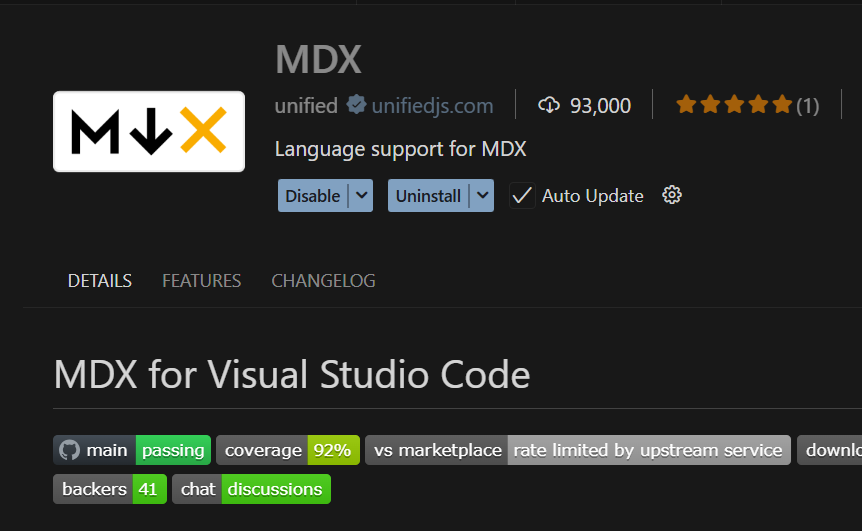

# Storybook 세팅 과정 정리
---


## 세팅 방법
**Storybook**은 크게 두가지 방법으로 세팅할 수 있습니다.

* 튜토리얼용 **스타터 템플릿** 방법
    - storybook을 배우기 위해 미리 세팅된 템플릿을 통째로 복사해오는 방식.
    ```sh
    npx degit chromaui/intro-storybook-react-template taskbox
    ```
* 공식 표준 방법
    - 공식 문서에서 권장하는 방법.
    ```sh
    # 새 프로젝트에 추가하거나 기존 프로젝트에 세팅
    npx storybook@latest init
    ```
    - 또는 새 프로젝트를 처음부터 만들 때
    ```sh
    npm create storybook@latest
    ```
|         | `npx degit` 방식                | `npx storybook@latest init`      |
| :-------| :----------------------------- | :-------------------------------- |
| 목적     | 튜토리얼 따라가기                | 실제 프로젝트 세팅 학습              |
| 구조 이해 | 미리 세팅되어 있어 내부가 블랙박스 | 직접 세팅 과정을 이해 가능            |
| 추천 상황 | learnstorybook.com 튜토리얼 따를 때 | 처음부터 구조를 배우고 싶을 때     |

* **초기 세팅 과정의 스터디 목적** 이라면 공식 방법인 `npx storybook@latest init`을 추천합니다.  
&#8251; 참조 : `npx degit`이란? `npm clone`과 같은 역할을 하는 명령어이지만 속도가 빠르며 **git 히스토리 없이** 파일을 복사할 수 있습니다.

:::tip <span class="admonition-title">초기 세팅 과정의 스터디 목적</span> 진행 순서
* `1.` `npm create vite@latest my-app` (React 프로젝트 세팅) 
* `2.` `cd my-app && npm install`
* `3.` `npx storybook@latest init` → 자동 감지 후 세팅
* `4.` 생성된 `.storybook/main.ts`, `.storybook/preview.ts` 파일 구조 분석
* `5.` 예제 stories 파일 보면서 작성법 학습
:::


### Storybook 별도 세팅
프로젝트 리소스를 최대한 오염시키지 않고 Storybook을 세팅하기 위해서는 별도의 세팅 방법을 사용해야 합니다.

* 별도의 세팅 방법은 **3가지** 정도 있을 수 있습니다.
    - **1.** Storybook을 위한 **별도 레포지토리** 생성하여 세팅하는 방법
        ```sh
        my-app/          ← 기존 프로젝트 (건드리지 않음)
        my-app-docs/     ← Storybook 전용 새 레포지토리
        ```
        - 완전히 분리되어 기존 코드 오염 없음.
        - 단점: 기존 프로젝트 컴포넌트 변경 시 docs레포도 수동 동기화 필요.
    - **2.** **Monorepo** 구조(규모 있는 프로젝트)의 **Storybook 전용 패키지** 생성하여 세팅하는 방법
        ```sh
        my-workspace/
        ├── apps/
        │   └── my-app/          ← 기존 React 프로젝트
        ├── packages/
        │   └── docs/         ← Storybook 전용 패키지
        ├── package.json
        └── pnpm-workspace.yaml (또는 turborepo)
        ```
        - `docs` 패키지에서 `my-app` 프로젝트의 컴포넌트를 import해서 사용.
        - 코드 동기화 문제 없이 실제 컴포넌트를 그대로 문서화 가능.
        - 단점: 초기 세팅이 복잡잡
    - **3.** 프로젝트 리소스와 같은 레포지토리에 **Storybook을 위한 `docs` 폴더**를 생성하여 세팅하는 방법
        ```sh
        my-app/
        ├── src/              ← 기존 소스 (건드리지 않음)
        ├── docs/             ← Storybook 전용 폴더
        │   ├── .storybook/
        │   ├── stories/
        │   └── package.json  ← 독립적인 package.json
        ├── package.json      ← 기존 package.json (건드리지 않음)
        └── ...
        ```
        - 하나의 레포에서 관리하되 완전히 폴더로 격리.
        - `docs/`안에서만 `npm install`, `npm run storybook` 실행.
        - 기존 컴포넌트는 상대경로로 import.


### 멀티레포 프로젝트 Storybook 세팅
멀티레포 구조의 프로젝트에 Storybook을 세팅할 때는 **별도 docs레포 + 공유라이브러리중심** 구조로 Storybook 세팅을 권장한다.
```sh
# 별도 docs레포 생성 예시--------------------------------
[기존 레포들 - 건드리지 않음]
my-host-app/
my-remote-app-a/
my-remote-app-b/
my-shared-lib/        ← npm 패키지로 배포 중이라고 가정

[신규]
my-docs/              ← Storybook 전용 레포 (새로 생성)
├── .storybook/
├── stories/
│   ├── shared/       ← shared-lib 컴포넌트 문서
│   ├── remote-a/     ← remote-a 컴포넌트 문서
│   ├── remote-b/     ← remote-b 컴포넌트 문서
│   └── guides/       ← 아키텍처, 가이드 문서 (MDX)
└── package.json
```
:::info <span class="admonition-title">package.json</span> 컴포넌트 참조 방법
```json
// my-docs/package.json
{
  "dependencies": {
    "my-shared-lib": "^1.0.0",      // npm에서 install
    "my-remote-app-a": "^1.0.0",    // 패키지화 되어있다면
  }
}
```
또는 npm 배포가 안 되어있다면.
```json
// my-docs/package.json
{
  "dependencies": {
    "my-shared-lib": "file:../my-shared-lib",   // 로컬 경로 참조
    "my-remote-app-a": "file:../my-remote-app-a"
  }
}
```
:::
* 가장 좋은 시나리오는 다음과 같습니다.
    ```
    shared-lib → npm 배포 (private registry or npm)
                ↓
    my-docs → npm install로 참조
                ↓
    CI/CD → shared-lib 배포되면 docs 자동 업데이트 트리거
    ```
    - 로드맵
    ```
    1단계: my-docs 레포 생성 + Storybook 세팅
            ↓
    2단계: shared-lib 컴포넌트부터 문서화 시작
        (가장 중요하고 재사용성 높으므로)
            ↓
    3단계: MDX로 아키텍처/가이드 문서 작성
            ↓
    4단계: remote 앱들 컴포넌트 순차 추가
            ↓
    5단계: CI/CD 연결 (각 레포 변경 → docs 자동 배포)
    ```

### Storybook과 Docusaurus 의 차이

|         | Storybook                | Docusaurus                  |
| :-------| :----------------------------- | :-------------------------------- |
| 본질     | 컴포넌트 개발 & 시각화 도구 | 문서 사이트 제작 도구            |
| 주 타겟   | 개발자 (컴포넌트 단위)     | 개발자 + 비개발자 (읽는 문서)    |
| 강점     | 컴포넌트 인터랙티브 미리보기, Props 테이블 자동생성 | MDX 문서, 버저닝, 검색, 사이드바 네비게이션 |
| 약점     | 긴 문서 작성이 불편함       | 컴포넌트 렌더링/인터랙션 표현이 약함 |

* **Storybook이 유리한 경우**
    - 문서화의 핵심이 컴포넌트일 때 (shared-lib 디자인 시스템)
    - 개발자들이 컴포넌트를 직접 조작해보며 확인해야 할 때
    - Props, 상태 변화, 인터랙션을 시각적으로 보여줘야 할 때
    - 디자이너와 협업이 많을 때

* **Docusaurus가 유리한 경우**
    - 아키텍처 설명, 온보딩 가이드 같은 긴 문서가 많을 때
    - MFE 각 앱의 역할/통신 방식/배포 프로세스 등 텍스트 중심 문서
    - 비개발자(기획자, 디자이너)도 읽는 독자일 때
    - 버저닝이 필요할 때 (v1 docs, v2 docs 분리)
* **추천 방법**
    - Docusaurus를 메인으로, Storybook을 서브로 세팅. 이유는 다음과 같습니다.
        - MFE 시스템은 컴포넌트보다 아키텍처/통신구조/각 앱의 역할 설명이 더 중요한 경우가 많고
        - shared-lib 컴포넌트는 Storybook으로 따로 운영하되
        - Docusaurus 문서 안에서 Storybook 페이지를 iframe으로 임베드하면 두 장점을 다 가져갈 수 있습니다.

* 멀티레포, 모노레포 비교

    |         | 멀티레포                | 모노레포                  |
    | :-------| :----------------------------- | :-------------------------------- |
    | 컴포넌트 참조 | npm 배포 or file: 필요 | workspace:* 로 바로 참조 |
    | 빌드 순서 관리 | CI/CD에서 수동 조율 | turbo.json 또는 pnpm workspaces를 통한 workspace dependency graph 자동화 |
    | docs 레포 위치 | 별도 레포 생성 | apps/ 안에 자연스럽게 추가 |
    | 둘 다 운영 | 복잡하고 부담됨 | 충분히 현실적 |
    | 변경사항 즉시 반영 | 버전 올려야 반영 | 소스 직접 참조라 즉시 반영 |


## 공유라이브러리(mfe-lib-shared)의 폴더 구조
---

```sh
mfe-lib-shared/
├── src/                # 공유 라이브러리 소스 코드
└── packages/             # playground, storybook 프로젝트용 폴더더
    ├── playground/         # 공통 공유 라이브러리 playground 프로젝트
    ├── storybook/          # Storybook 프로젝트
    └── ...
```


## Storybook 작업 시 도움을 주는 도구
---

### MDX 파일 작업 시 도움 설정
* Storybook에서 MDX 파일 내부 코드는 오류를 감지하지 못하는 경우가 많이 있습니다. .mdx 파일은 TypeScript가 기본적으로 처리하지 않습니다.
* 그럼에도 불구하고 다음 몇 가지 설정을 통해서 MDX 파일 작업에 도움을 줄 수 있습니다.
    - `1.` : VSCode MDX 확장 설치
        
    - `2.` : `npm install -D eslint-plugin-mdx` eslint mdx 플러그인 설치 (storybook 프로젝트 루트에서 실행)
        ```sh
        npm install -D eslint-plugin-mdx (storybook 프로젝트 루트에서 실행)
        ```
        - `eslint.config.js` 파일을 storybook 프로젝트 루트에 생성하고 다음과 같이 설정합니다.
        ```javascript
        import reactConfig from "@axiom/mfe-lib-shared/config/eslint";
        import mdx from "eslint-plugin-mdx";
        export default [
        ...reactConfig,
        {
            ...mdx.flat,
            processor: mdx.createRemarkProcessor({ lintCodeBlocks: true }),
        },
        {
            files: ["**/*.mdx"],
            rules: {
            "no-undef": "error", // 선언되지 않은 변수 사용 감지
            },
        },
        ];
        ```
    - `3.` : VSCode settings.json 파일에 다음 내용 추가
        ```json
        {
            "mdx.experimentalLanguageServer": true
        }
        ```
    - `4.` : `remark-gfm` 설치
        - **MDX v3 (Storybook 8에서 사용)** 는 CommonMark 기반으로, | 파이프 테이블(GFM 테이블)을 기본적으로 지원하지 않습니다. `remark-gfm` 플러그인이 있어야 GFM 표준의 테이블, 취소선, 체크박스 등이 렌더링됩니다.
        - `remark-gfm` 설치 `npm install -D remark-gfm` (storybook 프로젝트 루트에서 실행)
        - `main.ts` 파일에 `remark-gfm` 플러그인 적용
            ```ts
            import remarkGfm from "remark-gfm";

            const config: StorybookConfig = {
                // ...
                addons: [
                    // ... 생략 ...
                    {
                        name: "@storybook/addon-docs",
                        options: {
                            mdxPluginOptions: {
                                mdxCompileOptions: {
                                    remarkPlugins: [remarkGfm],
                                },
                            },
                        },
                    },
                    // ... 생략 ...
                ],
                // ... 생략 ...
            };
            ```


### 좌측메뉴 구조 설정 방법
* **Storybook** **좌측 메뉴(사이드바)는 다음 3가지 메커니즘**으로 구성됩니다.
    - `1.` `./storybook/main.ts` 파일의 stories 파일 경로 패턴 설정
        ```ts
        const config: StorybookConfig = {
            stories: [
                "../stories/**/*.mdx",
                "../stories/**/*.stories.@(js|jsx|mjs|ts|tsx)",
            ],
            // ...
        };
        ```
    - `2.` 각 스토리(`.stories.tsx` 또는 `.mdx`)의 **title 필드** → 메뉴 계층 구조 결정
        ```tsx
        // .stories.tsx 파일에서
        const meta = {
            title: "Components/Button",
            component: Button,
        };
        ```

        ```jsx
        // .mdx 파일에서
        import { Meta } from "@storybook/blocks";
        <Meta title="Getting Started/소개" />
        ```
        ```sh
        # 결과적으로 다음과 같이 생성됨.
        📁 Getting Started
            └─ 소개
        📁 Components
            ├─ Button
            │   ├─ Primary
            │   ├─ Secondary
            │   └─ ...
            ├─ Badge
            ├─ Input
            └─ ...
        ```
    - `3.` 메뉴 계층 구조 설정 (preview.ts)
        - `preview.ts` 파일에서 메뉴 계층 구조를 설정할 수도 있습니다.
        ```ts
        const preview: Preview = {
            parameters: {
                // ...
                options: {
                    storySort: {
                        order: [
                            "Getting Started",
                            "Components",
                            "*"
                        ],
                    },
                },
            },
        };
        ```
        - storySort.order 배열로 좌측 메뉴 섹션의 출력 순서를 명시적으로 지정합니다.
            - "Getting Started" → 맨 위
            - "Components" → 두 번째
            - "Functions" → 세 번째
            - "*" → 나머지 항목은 알파벳 순으로 정렬


## `*.stories.tsx` 파일 작성 내용 설명
---
* `*.stories.tsx` 파일은 Storybook에서 컴포넌트를 문서화하기 위한 파일입니다. `stories` 폴더 내부에 폴더 별로 구분해서 작업합니다. 
```sh
# 예시 구조
stories/
├── components/
│   ├── Button/
│   │   ├── Button.stories.tsx
│   │   └── index.ts
│   ├── Card.stories.tsx
│   └── ...
├── utils/
└── ...
```

### `*.stories.tsx` 파일 작성 전체 구조
```sh
* [1] import 영역
* [2] meta 객체 (컴포넌트 메타 정보)
* [3] export default meta + Story 타입 선언
* [4] 개별 Story export들
```


### [1] Import 영역
```tsx
import type { Meta, StoryObj } from "@storybook/react";
import { fn } from "@storybook/test";
import { Button } from "@rm/monorepo-mf-shared-library/components/ui";
import React from "react";
```
:::tip 설명
| 임포트 | 설명 |
| :-------| :----------------------------- |
| Meta | meta 객체의 타입. 제네릭으로 컴포넌트 타입을 넣어줌 |
| StoryObj | 개별 Story 객체의 타입 |
| fn | 클릭 이벤트 등을 목(mock) 함수로 추적할 때 사용 (Actions 탭에 표출됨) |
| React | render 함수 내에서 useState 등 훅을 쓸 때 필요 |
:::


### [2] meta 객체 - 핵심 설정
```tsx
const meta = {
  title: "Components/Button",
  component: Button,
  parameters: {
    layout: "centered",
    docs: {
      description: {
        component: `
\`Button\` 컴포넌트는 \`@company/mfe-lib-shared\` 에서 제공하는 기본 버튼 UI입니다.
// ...
        `,
      },
    },
  },
  tags: ["autodocs"],
  argTypes: {
    variant: {
      control: "select",
      options: ["primary", "secondary", "outline"],
      description: "버튼의 시각적 스타일",
      table: {
        type: { summary: "'primary' | 'secondary' | 'outline'" },
        defaultValue: { summary: "primary" },
      },
    },
    // ...
  },
  args: {
    onClick: fn(),
  },
} satisfies Meta<typeof Button>;
```
:::tip <span class="admonition-title">meta</span> 내부 각 필드 설명
* **title** - Storybook 사이드바 경로
    ```tsx
    title: "Components/Button"
    // → 사이드바에서 "Components" 폴더 하위에 "Button" 으로 표출
    // 슬래시(/)로 폴더 계층 구분 가능
    // 예: "Pages/Auth/LoginPage", "Utils/Formatters"
    ```
* **component** - 대상 컴포넌트
    ```tsx
    component: Button
    // 이 파일이 어떤 컴포넌트의 스토리인지 지정
    // argTypes 자동 추론, Docs 탭 자동 생성에 사용됨
    ```
* **parameters** - 스토리 환경 설정
    ```tsx
    parameters: {
        layout: "centered",   // "centered" | "fullscreen" | "padded"
        //  centered  → 컴포넌트를 화면 중앙에 배치
        //  fullscreen → 전체 화면
        //  padded    → 여백 포함 (기본값)
        docs: {
            description: {
                component: `마크다운 텍스트`  // Docs 탭 최상단에 표출되는 컴포넌트 설명 및 코드 블럭 표출
            }
        }
    }
    ```
* **tags** - 특별 동작 태그
    ```tsx
    tags: ["autodocs"]
    // "autodocs": Docs 탭을 자동 생성해줌
    // 이 태그가 없으면 Docs 탭이 자동 생성되지 않음
    ```
* **argTypes** - Props 컨트롤 패널 설정
    ```tsx
    argTypes: {
        variant: {
            control: "select",                          // 컨트롤 UI 종류
            options: ["primary", "secondary", "outline"], // select/radio일 때 선택지
            description: "버튼의 시각적 스타일",           // Controls 탭 설명
            table: {
                type: { summary: "..." },           // 타입 표시 텍스트
                defaultValue: { summary: "primary" } // 기본값 표시 텍스트
            }
        },
        // 다른 props 들도 추가 가능
    }
    ```
    - **control** UI 종류

        | control 값 | UI 형태 | 사용 예 |
        | :-------| :--------- | :-------------------- |
        | "text" | 텍스트 입력창 | string props |
        | "boolean" | 토글 스위치 | boolean props |
        | "number" | 숫자 입력 | number props |
        | "select" | 드롭다운 | 정해진 string 유니온 |
        | "radio" | 라디오 버튼 | 적은 선택지 유니온 |
        | "color" | 컬러 피커 | 색상 값 |
        | "object" | JSON 에디터 | 객체/배열 |
* **args** - 모든 Story의 기본 Props 값
    ```tsx
    args: {
        onClick: fn()
        // fn()으로 감싸면 Actions 탭에서 클릭 이벤트 로그가 찍힘
        // 이 args는 모든 Story에 공통 적용됨
    }
    ```
:::


### [3] export default
```tsx
export default meta;
type Story = StoryObj<typeof meta>;
```
* export default meta - 반드시 있어야 Storybook이 이 파일을 인식
* `type Story = StoryObj<typeof meta>` - 각 Story 객체 작성 시 타입 자동완성 지원


### [4] 개별 Story - 3가지 패턴
`*.stories.tsx` 파일에서 각 Story는 실제 컴포넌트가 다양한 prop 값으로 어떻게 렌더링되는지 예시를 보여주기 위해 각각 Story 객체를 작성합니다.

Story 객체는 아래 3가지 패턴 중 하나로 만들 수 있습니다.

**패턴 1: args 방식 (가장 기본)**
```tsx
export const Primary: Story = {
    args: {
        children: "기본 버튼",
        variant: "primary",
    },
    name: "Primary",
};
```
- args: 컴포넌트에 전달할 props 값
- name: 사이드바에 표출될 이름 (없으면 변수명이 그대로 표출)
- Controls 탭에서 props를 인터랙티브하게 수정 가능

**패턴 2: render 방식 (커스텀 레이아웃)**
```tsx
export const AllVariants: Story = {
  name: "모든 Variant 비교",
  render: () => (
    <div style={{ display: "flex", gap: "12px", alignItems: "center" }}>
      <Button variant="primary">Primary</Button>
      <Button variant="secondary">Secondary</Button>
      <Button variant="outline">Outline</Button>
    </div>
  ),
};
```
- render 함수로 직접 JSX를 반환
- 여러 컴포넌트를 한 화면에 배치하거나 래퍼 UI가 필요할 때 사용
- 단점: Controls 탭이 동작하지 않음 (args와 연결이 안 됨)

**패턴 3: render + 훅 방식 (인터랙티브)**
```tsx
export const InteractiveExample: Story = {
  name: "인터랙티브 예시",
  render: () => {
    const [count, setCount] = React.useState(0);
    return (
      <div ...>
        <p>클릭 횟수: {count}</p>
        <Button onClick={() => setCount((c) => c + 1)}>증가</Button>
      </div>
    );
  },
};
```
- render 함수 내에서 useState 등 훅 사용 가능
- 실제 상태 변화를 시연할 때 사용


### 개별 Story에서 사용할 수 있는 추가 필드들
```tsx
export const MyStory: Story = {
  name: "표출 이름",            // 사이드바 이름
  args: { ... },               // props 값
  render: () => <div />,       // 커스텀 렌더
  parameters: {                // meta의 parameters 오버라이드
    layout: "fullscreen",
    backgrounds: { default: "dark" }
  },
  decorators: [                // 스토리를 감싸는 래퍼
    (Story) => (
      <div style={{ padding: 20 }}>
        <Story />
      </div>
    )
  ],
  play: async ({ canvasElement }) => {  // 자동화 인터랙션 테스트
    const canvas = within(canvasElement);
    await userEvent.click(canvas.getByRole("button"));
    await expect(...).toBeTruthy();
  }
};
```
