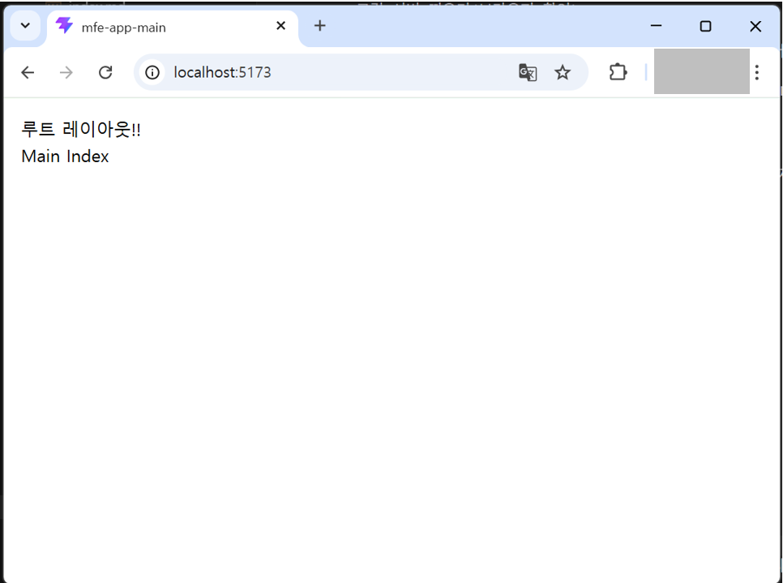
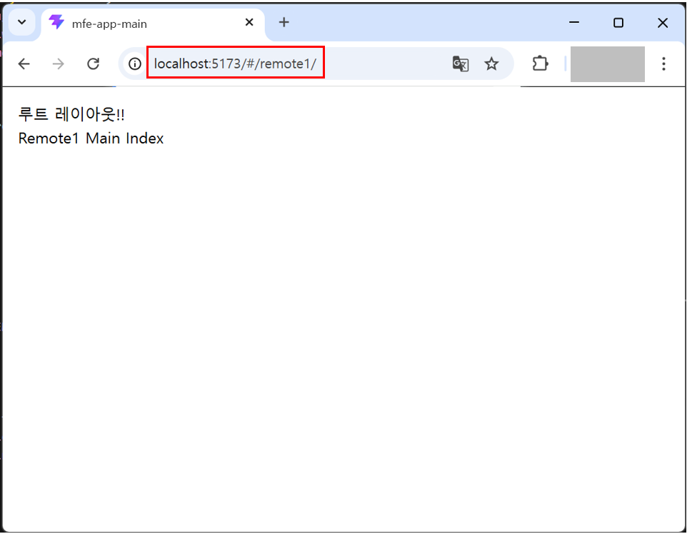

# mfe-app-main(Host 앱) 환경구성


## React 프로젝트 생성
---
* [React 애플리케이션 기본 프로젝트 생성 가이드](./init-project-setup)를 참조하여 프로젝트를 생성합니다.


## mfe-app-remote1 앱 연결을 위한 설정
---

* `vite.config.ts` 수정
    - `remotes` 설정 부분에 `remote1App` 설정을 추가합니다.
    ```ts
    export default defineConfig(({ mode }) => {
        const env = loadEnv(mode, process.cwd(), '');

        return {
            plugins: [
                react(),
                tailwindcss(), // ← 추가
                federation({
                    name: 'mainApp',
                    // highlight-start
                    remotes: {
                        remote1App: {
                            name: 'remote1App',
                            entry: env.VITE_REMOTE_REMOTE1_URL || 'http://localhost:5174/remote1Entry.js', // highlight-end
                            type: 'module',
                        },
                    },
                    // highlight-end
                    shared: {
                        react: { singleton: true, requiredVersion: '^19.0.0' },
                        'react-dom': { singleton: true, requiredVersion: '^19.0.0' },
                        'react-router': { singleton: true, requiredVersion: '^7.0.0' },
                    },
                }),
            ],
            resolve: {
                alias: {
                    '@': resolve(__dirname, 'src'),
                },
            },
            server: {
                port: 5173,
            },
        };
    });
    ```

* Remote 모듈 타입 선언
    - `src/types/federation.d.ts` 타입 파일을 생성하여 다음과 같이 Remote 모듈에 대한 TypeScript 타입 선언을 추가합니다.
    - **이 선언이 필요한 이유:**  
    MFE 환경에서 `import('remote1App/Remote1App')`와 같이 원격 모듈을 타입스크립트에서 사용하려면, 실제 소스 코드 없이도 해당 모듈이 React 컴포넌트임을 타입 단에서 알려줄 필요가 있습니다.  
    타입 선언이 없으면 타입스크립트가 '모듈을 찾을 수 없다'는 에러를 발생시키므로, 아래와 같이 명시적으로 모듈 선언을 추가해줍니다.

    ```ts
    declare module 'remote1App/Remote1App' {
        const Remote1App: React.ComponentType;
        export default Remote1App;
    }
    ```

* `src/shared/router/index.tsx` 수정
    - React.lazy + Suspense로 **remote 컴포넌트를 비동기 로드하고 `/remote1/*` 라우트 추가**
    ```tsx
    // highlight-start
    import { Remote1App } from './remoteComponents';
    // highlight-end

    const routes: TAppRoute[] = [
        // highlight-start
        {
            path: '/remote1/*',
            element: <Remote1App />,
        },
        // highlight-end
    ]; 
    ```
    - `remoteComponents.tsx` 파일 생성 - 이 파일은 여러 remote 컴포넌트를 모아서 불러오는 파일입니다. 현재는 Remote1App 컴포넌트만 있는데 추후 추가될 컴포넌트들도 이 파일에 추가합니다.
    ```tsx
    import { Suspense, lazy } from 'react';
    import RemoteOfflineFallback from '@/shared/components/common/RemoteOfflineFallback';

    const Remote1AppLazy = lazy(() =>
        import('remote1App/Remote1App').catch(() => ({
            default: () => <RemoteOfflineFallback appName="Remote1" />,
        })),
    );

    export const Remote1App = () => (
        <Suspense fallback={<div>Loading Remote1...</div>}>
            <Remote1AppLazy />
        </Suspense>
    );
    ```


## Host 앱에서 Remote 앱 로드
---
* Remote1 앱이 Host 앱에서 로드가 되려면 앞서 생성한 Remote1 앱을 띄워야합니다.
    ```sh
    # Remote1 앱 루트에서 localhost:5174 포트로 띄웁니다.
    npm run dev
    ```
* Host 앱을 통해 Remote 앱을 로드해봅니다. 우선 Host 앱을 띄웁니다.
    ```sh
    # Host 앱 루트에서 localhost:5173 포트로 띄웁니다.
    npm run dev
    ```
    
* 브라우저 Host 앱 메인화면에서 `/remote1` 경로로 이동해봅니다. 이상없이 이동되는것을 볼 수 있습니다.
    - URL 경로를 보면 Host 앱(localhost:5173)에서 Remote 앱(localhost:5174)에 있는 라우트 **`/remote1/*`** 경로로 이동되는것을 볼 수 있습니다.
    
    


## 루트 레이아웃 구성
---
* 디자인, 퍼블리싱 영역이며, 기본으로 제공할 루트 레이아웃을 구성합니다. 추후 개발 사이트에서 해당 레이아웃에 맞춰 컴포넌트를 추가하거나 수정하여 사용하면 됩니다.
* 레이아웃에 관련되 파일의 `shared` 폴더의 `components/layout`, `context`, `config` 폴더를 생성하였습니다. `Bootstrap.tsx` 파일에는 **ThemeProvider** Provider를 추가하였습니다.
    ```sh
    src/
    // highlight-start
    ├── shared/
    │   ├── components/
    │   │   └── layout/
    │   │       ├── common/
    │   │       │   ├── GithubLinkButton.tsx
    │   │       │   └── ThemeToggleButton.tsx
    │   │       ├── AppHeader.tsx
    │   │       ├── AppSidebar.tsx
    │   │       ├── Backdrop.tsx
    │   │       ├── LayoutContent.tsx
    │   │       └── RootLayout.tsx
    │   ├── context/
    │   │   └── layout/
    │   │       └── SidebarContext.tsx
    │   └── config/
    │       └── navigation.tsx
    // highlight-end
    ├── Bootstrap.tsx
    ```
* `src/assets/styles/app.css` 파일에 스타일 적용.
    - 모든 디자인 토큰, 레이아웃 스타일은 공유 라이브러리(`mfe-lib-shared`)에서 제공하는 스타일을 사용합니다.


## Host 앱(mfe-app-main)에 `$router` 등록
---
* `$router` 객체는 공유 라이브러리인 `mfe-lib-shared`에 이미 구현되어 있습니다. 따라서 Host 앱(**mfe-app-main**)에서는 공유 라이브러리에서 제공하는 `$router` 객체를 등록하여 바로 사용할 수 있습니다.
    - **mfe-app-main** 앱는 **react-router** 라이브러리를 최초 등록되는 Provider 가 있습니다. 이 Provider를 등록하는 파일 `src/core/router/index.ts` 파일에 다음과 같이 `$router` 객체를 등록합니다.
    ```ts
    import { registerWindowRouter } from '@axiom/mfe-lib-shared/utils';

    registerWindowRouter(router);
    ```
* 이제 Host 앱에서 `$router` 객체를 사용할 수 있습니다.
    ```ts
    // 페이지 이동
    $router.push('/');
    // 페이지 교체
    $router.replace('/');
    // 페이지 뒤로가기
    $router.back();
    ```