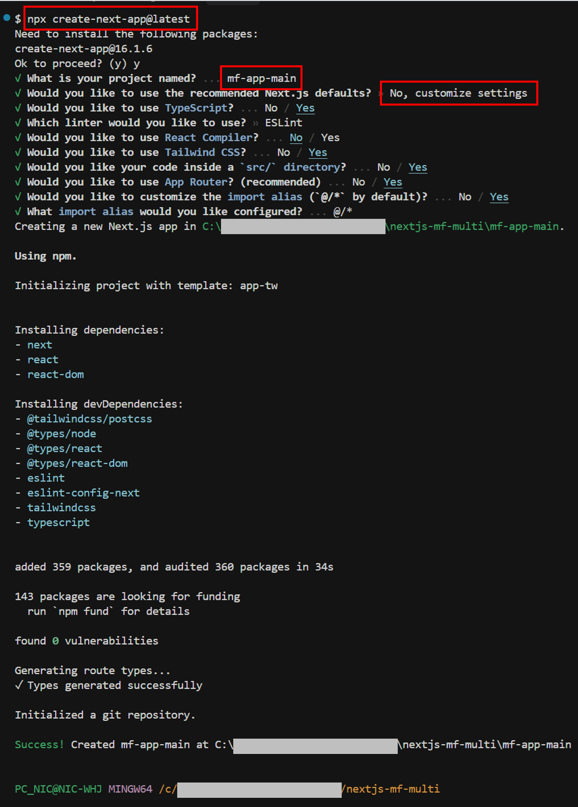
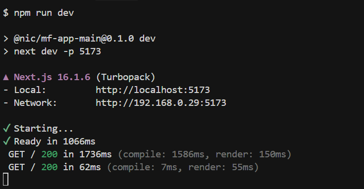
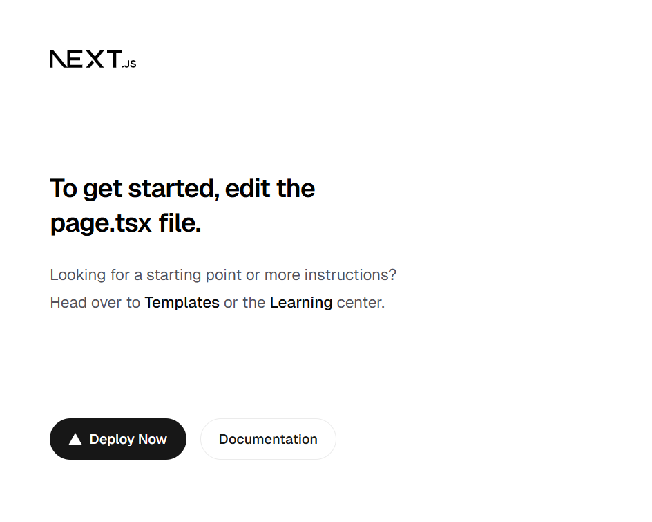

# mfe-app-main(Host 앱) 환경구성


## create-next-app 실행
---
:::info <span class="admonition-title">Next(CLI)</span>를 이용한 프로젝트 생성
* 새로운 Next.js 앱을 만드는 방법으로 `create-next-app`을 사용합니다.
* [Next공식문서: https://nextjs.org/docs/app/getting-started/installation#create-with-the-cli](https://nextjs.org/docs/app/getting-started/installation#create-with-the-cli)
* [Next.js Multi Zones 공식문서: https://nextjs.org/docs/14/pages/building-your-application/deploying/multi-zones](https://nextjs.org/docs/14/pages/building-your-application/deploying/multi-zones)
:::
**작업위치**: 작업하고자하는 마이크로 프론트엔드 전체 작업 폴더에서 아래 명령어를 실행합니다.
```sh
npx create-next-app@latest
```

- [1] Project name 셋팅.
  - 프로젝트 이름은 **mf-app-main**로 정하고 다음 과정을 진행합니다. 

- [2] Next.js 팀이 권장하는 기본 설정값들을 일일이 선택하지 않고 한 번에 적용할 것인지에 대한 물음에는 **No**를 선택하여 **모든 옵션을 사용자가 선택**합니다.
- [3] 선택 옵션
  - TypeScript 선택 여부 : 'Yes'
  - ESLint linter 선택 여부 : 'Yes'
  - React Compiler 사용 여부 : 'No' (일단 비활성화 후 추 후 상황에 따라 활성화 예정)
  - Tailwind CSS 사용 여부 : 'Yes'
  - src 디렉토리 생성 여부 : 'Yes'
  - App Router 사용 여부 : 'Yes'
  - import alias default '@/*'(다른 별칭 사용을 원하는지?)  : 'No'
- `package.json` 파일에 **프로젝트 명**과 공유 라이브러리 패키지 `@nic/mf-lib-shared` **의존성을 연결**합니다.
    ```json
    {
        "name": "@nic/mf-app-main",
        "dependencies": {
            "@nic/mf-lib-shared": "file:../mf-lib-shared" // 공유 라이브러리 패키지 경로
        }
    }
    ```


- 최종 설치 완료된 프로젝트를 띄우기 위해 `npm run dev`명령어를 실행하여 로컬 서버를 띄웁니다.
    - **port**를 변경하려면 `package.json`파일에서 포트 설정을 합니다.
        ```json
        {
            "scripts": {
                "dev": "next dev -p 5173"
            }
        }
        ```
    - 또는 **cross-env** 패키지를 사용하여 포트 설정, 다음 명령어로 설치 후 `package.json`파일에 설정합니다.
        ```sh
        # cross-env 패키지 설치
        npm install cross-env --save-dev
        ```
        ```json
        {
            "scripts": {
                "dev": "cross-env PORT=5173 next dev"
            }
        }
        ```
        
        


## VSCode(Visual Studio Code) 설정
---

### settings.json 셋팅 (VSCode 설정)

<span class="react-color">Frontend (React)</span> 개발을 위해 **VSCode**를 활용할 것입니다. 따라서 개발자의 통일된 코드 작성을 위하여 **VSCode**의 환경설정을 **settings.json**파일에 적용합니다.

#### settings.json 설정

> - **settings.json 파일열기** : f1 ⤍ settings 입력 ⤍ Preferences: Open Workspace Settings (JSON) 클릭.  
>   위와같이 열면 프로젝트 루트에 **.vscode** 디렉토리가 생성되고 **settings.json**파일이 생성됩니다.
> - **settings(설정)가 적용되는 우선 순위** : .vscode settings.json ⤇ settings.json ⤇ defaultSetting.json(<span class="text-color-red">수정하지 않는 파일.</span>)  
>   <span class="text-color-red">defaultSetting.json은 모든 설정내용이 다 들어있는 기본 설정 파일입니다. 수정은 하지 않는 파일입니다.</span>
> - **.vscode** 디렉토리에 생성된 **settings.json** 파일에 아래 내용 입력합니다.

```json
{
  "editor.formatOnSave": true,
  "editor.codeActionsOnSave": {
    "source.fixAll.eslint": "explicit"
  },
  "editor.tabSize": 2,
  "editor.detectIndentation": false,
  "editor.insertSpaces": false,
  "editor.renderWhitespace": "all",
  "editor.comments.insertSpace": false,
  "files.associations": {
    "*.json": "jsonc"
  },
  "eslint.validate": [
    "javascript",
    "javascriptreact",
    "typescript",
    "typescriptreact"
  ],
  "eslint.workingDirectories": [{ "mode": "auto" }],
  "editor.defaultFormatter": "esbenp.prettier-vscode",
  "eslint.useFlatConfig": true,
  "css.lint.unknownAtRules": "ignore",
  "scss.lint.unknownAtRules": "ignore",
  "less.lint.unknownAtRules": "ignore"
}
```

:star: 이렇게 `settings.json` 파일로 **VSCode** 설정을 하면 **메뉴(File ⤍ Preferences ⤍ Settings)** 로 설정한것 보다 우선순위가 높게 적용됩니다.

:::info 설명
- **"editor.formatOnSave"** : 파일 저장 시 자동으로 코드 서식을 정리합니다.
- **"editor.codeActionsOnSave" ⤍ "source.fixAll.eslint"** : 파일 저장 시 ESLint가 감지한 모든 문제를 자동으로 수정합니다.
- **"editor.tabSize"** : 탭 크기를 몇칸으로 설정할지 지정합니다.
- **"editor.detectIndentation"** : VSCode가 파일의 들여쓰기를 자동으로 감지하는 기능을 활용할지 여부 입니다.
- **"editor.insertSpaces"** : 탭 키를 누를 때 공백 대신 탭 문자를 삽입합니다.
- **"editor.renderWhitespace"** : 공백 문자를 시각적으로 표시합니다.
- **"editor.comments.insertSpace"** : 주석 기호(//, /\*) 뒤에 자동으로 공백을 삽입할지 여부 입니다.
- **"files.associations" ⤍ "\*.json": "jsonc"** : .json 파일을 jsonc(주석이 있는 JSON) 형식으로 인식하도록 설정합니다.
- **"eslint.validate": \["javascript", "javascriptreact", "typescript", "typescriptreact"\]** : ESLint가 TypeScript, React, JavaScript 파일을 검사하도록 설정합니다.
- **"eslint.workingDirectories"** : \[\{"mode":"auto"\}\] : ESLint 작업 디렉토리를 자동으로 감지하도록 설정합니다.
- **"editor.defaultFormatter": "esbenp.prettier-vscode"** : VSCode의 기본 코드 포맷터로 Prettier를 사용합니다.
- **"eslint.useFlatConfig"** : ESLint의 설정방식이 `v8.21.0` 부터 **Flat Config**를 지원하면서, 구성 형식을 **Flat Config**으로 할지 여부 설정.

- **"css.lint.unknownAtRules": "ignore"** : VSCode에서 CSS의 "Unknown At Rules" 경고를 무시하도록 설정.
- **"scss.lint.unknownAtRules": "ignore"** : VSCode에서 scss의 "Unknown At Rules" 경고를 무시하도록 설정.
- **"less.lint.unknownAtRules": "ignore"** : VSCode에서 less의 "Unknown At Rules" 경고를 무시하도록 설정.
:::

:::tip <span class="admonition-title">Tailwind CSS</span>사용 시 다음 설정 적용.
* **Tailwind CSS**의 @apply, @layer 등으로 인한 경고라면 위 설정(**css.lint.unknownAtRules : "ignore"**)으로 해결됩니다. 그리고 **Tailwind CSS IntelliSense** VSCode 확장(Extensions)을 설치하면 더 나은 지원을 받을 수 있습니다.
:::

:::tip <span class="admonition-title">ESLint</span> 설정방식에 대하여

- **ESLint**가 `v8.21.0` 부터 새로운 구성방식인 플랫 구성(Flat Config) 시스템을 지원합니다. 기존 방식은 `.eslintrc` 파일을 이용한 구성 방식이었습니다.
- `v9.0.0`부터는 기본 구성방식이 플랫 구성(Flat Config) 시스템으로 바뀌게 됩니다.
:::


## 환경 변수 파일 구성
---
Remote 앱 URL을 환경 변수로 관리한다.
* `.env.local` — 로컬 개발용
* `.env.development` — 개발 서버용
* `.env.production` — 프로덕션용
```env
# .env.local 예시
NEXT_PUBLIC_REMOTE_REMOTE1_URL=http://localhost:5174
NEXT_PUBLIC_REMOTE_REMOTE2_URL=http://localhost:5175
```


## next.config.ts - Multi Zones rewrites 설정
---
Host 앱이 Remote 앱들의 요청을 프록시하도록 rewrites를 설정한다.  
Remote 앱 각각은 basePath: '/blog'처럼 독립적인 basePath를 가져야 충돌이 없다.
```tsx
import type { NextConfig } from "next";

const nextConfig: NextConfig = {
  async rewrites() {
    return [
      {
        source: "/blog",
        destination: `${process.env.NEXT_PUBLIC_REMOTE_REMOTE1_URL}/blog`,
      },
      {
        source: "/blog/:path*",
        destination: `${process.env.NEXT_PUBLIC_REMOTE_REMOTE1_URL}/blog/:path*`,
      },
      // 다른 remote 앱 경로 추가...
    ];
  },
};

export default nextConfig;
```


## 공유 라이브러리(`@nic/mf-lib-shared`) 연동
---
* 공유 라이브러리를 GitHub/GitLab 등에 올린 경우 npm install을 통해 공유 라이브러리 git을 설치할 수 있습니다.  
  ```sh
  npm install git+https://github.com/nic-company/mf-lib-shared.git
  ```
  ```json
  // package.json
  "dependencies": {
    "@nic/mf-lib-shared": "git+https://github.com/nic-company/mf-lib-shared.git"
  }
  ```
  - host 앱과 remote 앱이 각자 배포 시점에 다른 커밋을 참조할 수 있으므로 좀 더 안정적인 설치 배포 방식은 커밋 해시로 버전 고정하는 것이 권장됩니다.
    ```json
    "dependencies": {
      "@nic/mf-lib-shared": "git+https://github.com/nic-company/mf-lib-shared.git#commit-hash"
      // 또는 "@nic/mf-lib-shared": "git+https://github.com/nic-company/mf-lib-shared.git#v1.0.0"
    }
    ```
* 공유 라이브러리가 아직 npm에 배포되기 전이면, `file:` 경로 또는 git 링크로 연결할 수 있습니다.
  ```json
  "dependencies": {
    "@nic/mf-lib-shared": "file:../mf-lib-shared"
  }
  ```

  :::tip <span class="admonition-title">공유 라이브러리 배포 방식</span> (중장기 권장 방식)
  * 중장기적으로는 GitHub Package Registry를 사용하는 것이 권장됩니다.
  ```sh
  # mf-lib-shared에서 배포
  npm publish --registry https://npm.pkg.github.com

  # 각 앱 .npmrc에 추가
  @nic:registry=https://npm.pkg.github.com
  //npm.pkg.github.com/:_authToken=${NPM_TOKEN}
  ```
  ```json
  // package.json
  "@nic/mf-lib-shared": "^1.0.0"  // 진짜 semver 사용 가능
  ```
  &#8251; 인터넷 연결 없는 폐쇄망 환경이라면
  사내 Verdaccio 프라이빗 레지스트리 운영(완전 독립)
  :::

* 공유 라이브러리의 UI 컴포넌트 파일에 Tailwind 클래스가 포함되어 있으므로, Tailwind v4가 해당 소스를 스캔하도록 `src/assets/styles/app.css`에 **@source** 지시어를 추가한다.
  ```css
  @import "tailwindcss";
  /* 공유 라이브러리의 빌드 결과물로 가져오려면 src를 dist로 변경해야한다. */
  @source "../../node_modules/@nic/mf-lib-shared/src/**/*.{ts,tsx}";
  ```


## tsconfig.json 경로 alias 추가
---
공유 라이브러리 import 경로를 명확하게 하기 위하여 `tsconfig.json`에 **path**를 추가한다.  
@nic/mf-lib-shared path alias는 로컬 file 링크 개발 시 타입 추론을 돕기 위한 설정이다. npm 배포 후에는 제거한다.
* <span class="text-color-red">현재는 `git+저장소url` 방식으로 설치 했기 때문에 아래 alias를 적용하지 않는다.</span>
```json
{
  "compilerOptions": {
    "paths": {
      "@/*": ["./src/*"],
      "@nic/mf-lib-shared": ["../../mf-lib-shared/src/index.ts"] // 로컬 개발용
    }
  }
}
```


## layout.tsx - 공통 레이아웃 구성
---
Multi Zones에서 Host 앱의 레이아웃은 Host 앱에서 직접 렌더링되는 페이지에만 적용된다. Remote 앱의 페이지에는 Remote 앱 자체 레이아웃이 적용되므로, 공통 네비게이션/헤더가 필요하다면 공유 라이브러리에 Shell 컴포넌트를 두고 Host/Remote 앱 모두에서 import하는 방식을 권장한다.

