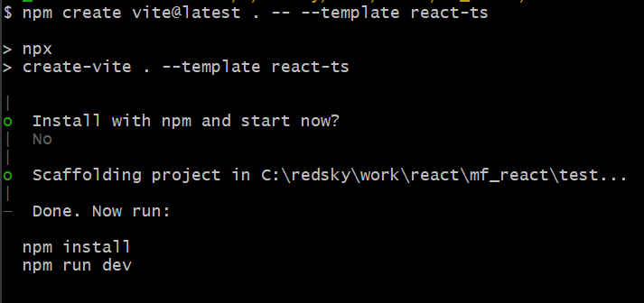
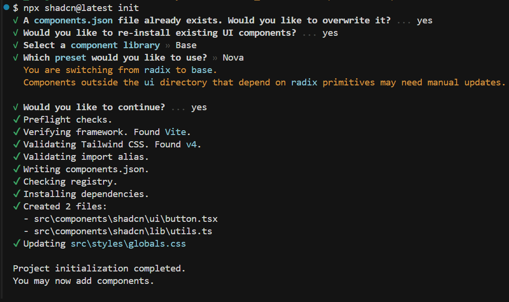
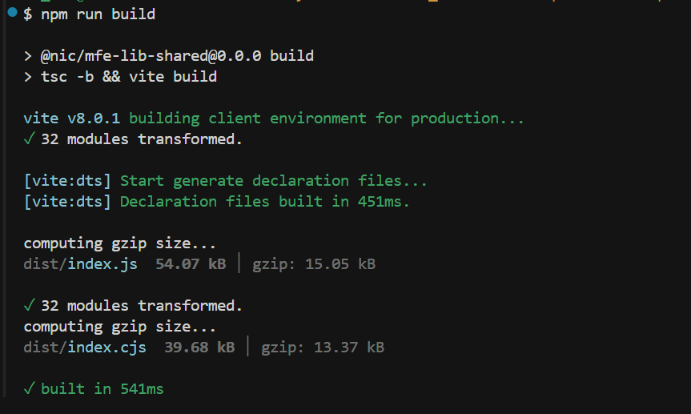
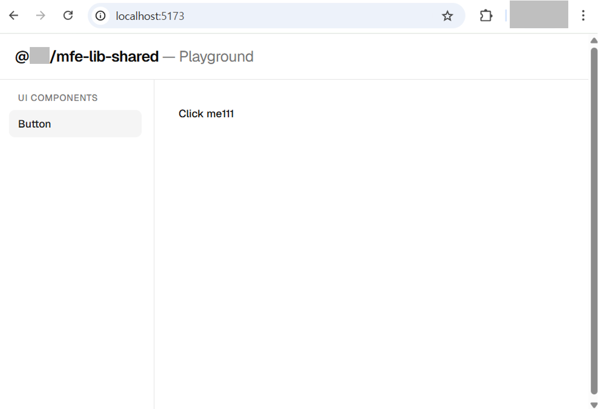

# mfe-lib-shared 환경구성
**@nic/mfe-lib-shared** 는 Micro Frontend 프로젝트에서 공통으로 사용되는 라이브러리를 제공하는 **공유 라이브러리 패키지** 입니다.  
**공유 라이브러리 패키지**를 최초 생성하기 위한 과정과 가이드 내용입니다.

:::info 공통 라이브러리의 역할
* 공통 라이브러리는 다음과 같은 공유 자산을 모든 마이크로 프론트엔드(Host 및 Remote 앱)에 제공합니다:
  - **UI 컴포넌트**: 디자인 시스템, 공통 UI 요소 (Button, Input, Modal 등)
  - **유틸리티 함수**: 날짜 포맷팅, 데이터 변환, 검증 로직 등
  - **타입 정의**: 공통 인터페이스, 타입, Enum 등
  - **설정 파일**: ESLint, Prettier, TypeScript 공통 설정
  - **상수**: API 엔드포인트, 환경 변수, 설정 값 등
  - **훅(Hooks)**: 커스텀 React 훅
  - **스타일**: 공통 스타일, 테마, CSS 변수

* 마이크로 프론트엔드에서 공통 라이브러리가 필요한 이유
  1. **코드 중복 방지**
    - 여러 마이크로 프론트엔드에서 동일한 코드를 반복 작성하지 않음
    - Single Source of Truth 원칙 구현

  2. **일관성 유지**
    - 모든 앱에서 동일한 UI/UX 제공
    - 디자인 시스템의 중앙 관리
    - 브랜드 아이덴티티 통일

  3. **유지보수성 향상**
    - 한 곳에서 수정하면 모든 앱에 반영
    - 버그 수정 및 개선 사항의 빠른 전파

  4. **개발 생산성 증대**
    - 검증된 컴포넌트/함수 재사용
    - 개발 시간 단축
    - 표준화된 개발 패턴 제공

  5. **타입 안정성**
    - 공통 타입 정의로 타입 불일치 방지
    - TypeScript의 강력한 타입 체킹 활용

* 공통 라이브러리 사용 방식
  - 멀티레포 환경에서는 npm 레지스트리(또는 사설 레지스트리)에 패키지를 배포한 뒤, 각 레포지토리에서 패키지를 설치하여 참조합니다:

```json
// Host 또는 Remote 앱의 package.json
{ "dependencies": { "@nic/mfe-lib-shared": "^1.0.0" } }
// npm install @nic/mfe-lib-shared 명령으로 설치하여 사용.
```

```tsx
// 실제 사용 예시
import { Button, Card, Input, Badge, cn } from '@nic/mfe-lib-shared/components';
import { formatDate, validateEmail } from '@nic/mfe-lib-shared/utils';
import type { User, ApiResponse } from '@nic/mfe-lib-shared/types';

function UserProfile() {
  const user: User = { /* ... */ };
  
  return (
    <Card>
      <h1>{user.name}</h1>
      <p>{formatDate(user.createdAt)}</p>
      <Button>프로필 수정</Button>
    </Card>
  );
}
```
:::


## 1. 패키지 생성
---
* `mfe-lib-shared` 공유 라이브러리 패키지 프로젝트를 **Vite** 프로젝트로 생성합니다.
* 개인 pc에 작업할 폴더를 생성하고 명령어를 실행합니다. 아래 예제는 `mfe-lib-shared` 폴더 안에서 실행한다는 가정하에 작성되었습니다.
```sh
# mfe-lib-shared 폴더 안에서 실행
# 현재 폴더에 바로 생성하려면 . 사용
npm create vite@latest . -- --template react-ts
```


* 생성된 프로젝트에서 `package.json` 파일의 패키지 이름을 변경합니다.
```json
{
  "name": "@nic/mfe-lib-shared",
  ...

```

* 생성된 폴더구조
  ```sh
  @nic/mfe-lib-shared/
  ├─public              # 정적 파일 (favicon 등)
  ├─src                 # 소스 코드 루트
  ├─.gitignore          # Git 추적 제외 파일 목록
  ├─eslint.config.js    # ESLint 설정 파일
  ├─index.html          # Vite 진입점 HTML
  ├─package.json        # 패키지 메타데이터 및 의존성 정의
  ├─README.md           # 프로젝트 설명 문서
  ├─tsconfig.app.json   # 앱 소스 코드용 TypeScript 설정
  ├─tsconfig.json       # TypeScript 기본 설정 (루트)
  ├─tsconfig.node.json  # Node.js 환경(vite.config 등)용 TypeScript 설정
  └─vite.config.ts      # Vite 빌드 및 개발 서버 설정
  ```
* 불필요한 앱 파일 정리
Vite가 만든 파일 중 라이브러리에 불필요한 것들을 제거합니다.
  ```sh
  삭제: index.html
  삭제: src/App.tsx
  삭제: src/App.css
  삭제: src/main.tsx
  삭제: src/index.css
  삭제: src/assets/
  삭제: public/
  ```
* `npm install` 명령어를 실행하여 의존성 라이브러리를 설치합니다.
  ```sh
  # npm install 을 실행하면 node_modules 폴더가 생성됩니다.
  npm install
  ```


## 2. Shadcn UI 컴포넌트 설치를 위한 세팅
---
* **mfe-lib-shared** 패키지는 **기본 UI 컴포넌트** 제공용으로 [Shadcn UI](https://ui.shadcn.com/)를 사용합니다.  
* Shadcn UI 컴포넌트를 설치하고 하나의 폴더에서 관리하기 위하여 다음과 같은 순서로 세팅을 진행합니다.
  - Shadcn UI 관련 파일은 모두 `src/components/shadcn` 폴더에서 관리합니다.


### Tailwind CSS 설치
```sh
# Tailwind CSS 설치
npm install -D tailwindcss @tailwindcss/vite
```


### vite.config.ts 수정
* Tailwind CSS 플러그인을 추가하고, alias를 설정합니다.
  ```ts
  import { defineConfig } from 'vite'
  import react from '@vitejs/plugin-react'
  // highlight-start
  import tailwindcss from '@tailwindcss/vite'
  import { resolve } from 'path'
  // highlight-end

  // https://vite.dev/config/
  export default defineConfig({
    // highlight-start
    plugins: [react(), tailwindcss(),],
    resolve: {
      alias: {
        '@': resolve(__dirname, 'src'),
      },
    },
    // highlight-end
  })
  ```


### `tsconfig.json`, `tsconfig.app.json`에 alias 추가
* compilerOptions 안에 두 줄 추가:
  ```json
  // tsconfig.json
  {
    // highlight-start
    "compilerOptions": {
      "baseUrl": ".",
      "paths": {
        "@/*": ["./src/*"]
      }
    },
    // highlight-end
    "files": [],
    "references": [
      { "path": "./tsconfig.app.json" },
      { "path": "./tsconfig.node.json" }
    ]
  }
  ```
  ```json
  // tsconfig.app.json
  {
    "compilerOptions": {
      // highlight-start
      "baseUrl": ".",
      "paths": {
        "@/*": ["./src/*"]
      }
      // highlight-end
      // ... 기존 설정들 그대로 유지
    }
  }
  ```


### `src/styles/globals.css` 생성
```css
@import "tailwindcss";
```


### 프로젝트 루트에 `components.json` 수동 생성 (shadcn 경로 커스터마이징)
```json
{
  "$schema": "https://ui.shadcn.com/schema.json",
  "style": "new-york",
  "rsc": false,
  "tsx": true,
  "tailwind": {
    "config": "",
    "css": "src/styles/globals.css",
    "baseColor": "zinc",
    "cssVariables": true
  },
  "aliases": {
    "components": "@/components/shadcn/ui",
    "utils": "@/components/shadcn/lib/utils",
    "ui": "@/components/shadcn/ui",
    "lib": "@/components/shadcn/lib",
    "hooks": "@/components/shadcn/hooks"
  }
}
```


### shadcn 설치 실행
```sh
npx shadcn@latest init
```



### UI 컴포넌트 설치
* 이제부터 각 UI 컴포넌트를 다음과 같이 설치하여 사용할 수 있습니다.
```sh
# shadcn ui 컴포넌트 설치 예시 코드
npx shadcn@latest add button   // button 컴포넌트 설치
npx shadcn@latest add input    // input 컴포넌트 설치
npx shadcn@latest add dialog   // dialog 컴포넌트 설치
npx shadcn@latest add dropdown // dropdown 컴포넌트 설치
npx shadcn@latest add menu     // menu 컴포넌트 설치
npx shadcn@latest add popover  // popover 컴포넌트 설치
npx shadcn@latest add tooltip  // tooltip 컴포넌트 설치
npx shadcn@latest add dropdown-menu // dropdown-menu 컴포넌트 설치
npx shadcn@latest add dropdown-item // dropdown-item 컴포넌트 설치
npx shadcn@latest add dropdown-menu-item // dropdown-menu-item 컴포넌트 설치
```


### 최종 디렉토리 구조 예시
```sh
@nic/mfe-lib-shared/src/
├─components          # 공통 컴포넌트
│  ├─shadcn              # Shadcn UI 컴포넌트
│  │  ├─ui               # Shadcn UI 컴포넌트 목록            
│  │  │  ├─button
│  │  │  └─...             
│  │  └─lib
│  │     └─utils.ts      # shadcn utils       
│  ├─providers
│  └─...
├─config              # 공통 설정
│  ├─eslint
│  └─prettier
├─design-system       # 공통 디자인 시스템
├─hooks               # 공통 훅
├─types               # 공통 타입
└─utils               # 공통 유틸리티 함수
```
:::info 설명
* 상황에 따라 필요한 컴포넌트, 유틸리티 함수, 타입 정의, 설정 파일 등을 제공하기 위한 디렉토리 구조를 생성하면 됩니다.
:::


## 3. 라이브러리 배포를 위한 설정
---
* `vite.config.ts` 파일을 수정하여 라이브러리 배포를 위한 설정을 합니다.
  ```ts
  // highlight-start
  import dts from 'vite-plugin-dts' // 타입선언파일(.d.ts)을 자동으로 생성
  // highlight-end
  // npm install -D vite-plugin-dts 먼저 설치
  export default defineConfig({
    plugins: [
      react(),
      tailwindcss(),
      // highlight-start
      dts({ include: ['src'], insertTypesEntry: true }),
      // highlight-end
    ],
    // highlight-start
    build: {
      lib: {
        entry: resolve(__dirname, 'src/index.ts'),
        formats: ['es', 'cjs'],
        fileName: (format) => `index.${format === 'es' ? 'js' : 'cjs'}`,
      },
      rollupOptions: {
        external: ['react', 'react-dom', 'react/jsx-runtime'],
      },
      cssCodeSplit: false,
    },
    // highlight-end
  })
  ```
* `package.json` 파일을 수정하여 라이브러리 배포를 위한 설정을 합니다.
  ```json
  {
    "main": "./dist/index.cjs",
    "module": "./dist/index.js",
    "types": "./dist/index.d.ts",
    "exports": {
      ".": {
        "import": "./dist/index.js",
        "require": "./dist/index.cjs",
        "types": "./dist/index.d.ts"
      },
      "./styles": "./dist/style.css"
    }
  }
  ```
* 외부에 노출하는 진입점 파일(src/index.ts)을을 직접 만들어야 합니다.
  - `src/index.ts` 파일 생성
  ```ts
  // ── Shadcn 컴포넌트 ──
  export { Button, buttonVariants } from './components/shadcn/ui/button'
  // ── 유틸리티 ──
  export { cn } from './components/shadcn/lib/utils'
  // ── 직접 만든 공통 컴포넌트 (추후 추가) ──
  // export { CustomModal } from './components/Modal'
  ```
* 실제 빌드해보기
  `npm run build` 명령어를 통해 빌드를 실행해 봅니다. 빌드 결과물은 `dist` 폴더에 생성됩니다.
  ```sh
  npm run build
  ```
  


## 4. 최종
---
* 현재까지 진행한 내용은 공유 라이브러리용 기본 패키지 구성 세팅 내용입니다.
* 프로젝트의 공유 라이브러리 요구사항에 따라 추가적인 세팅이 필요할 수 있고 구조 또한 변경이 될 수도 있습니다.


## `package.json`에 대해
---
* 라이브러리 제공 시 사용되는 `package.json` 파일 구성 내용입니다.
```json
{
  "name": "@nic/mfe-lib-shared",
  "private": true,
  "version": "0.0.0",
  "type": "module",
  "main": "./dist/index.cjs",
  "module": "./dist/index.js",
  "types": "./dist/index.d.ts",
  "exports": {
    ".": {
      "import": "./dist/index.js",
      "require": "./dist/index.cjs",
      "types": "./dist/index.d.ts"
    },
    "./styles": "./dist/style.css"
  },
  "scripts": {
    "dev": "vite",
    "build": "tsc -b && vite build",
    "lint": "eslint .",
    "preview": "vite preview"
  },
  "dependencies": {
    "@base-ui/react": "^1.3.0",
    "@fontsource-variable/geist": "^5.2.8",
    "class-variance-authority": "^0.7.1",
    "clsx": "^2.1.1",
    "lucide-react": "^0.577.0",
    "react": "^19.2.4",
    "react-dom": "^19.2.4",
    "shadcn": "^4.1.0",
    "tailwind-merge": "^3.5.0",
    "tw-animate-css": "^1.4.0"
  },
  "devDependencies": {
    "@eslint/js": "^9.39.4",
    "@tailwindcss/vite": "^4.2.2",
    "@types/node": "^24.12.0",
    "@types/react": "^19.2.14",
    "@types/react-dom": "^19.2.3",
    "@vitejs/plugin-react": "^6.0.1",
    "eslint": "^9.39.4",
    "eslint-plugin-react-hooks": "^7.0.1",
    "eslint-plugin-react-refresh": "^0.5.2",
    "globals": "^17.4.0",
    "tailwindcss": "^4.2.2",
    "typescript": "~5.9.3",
    "typescript-eslint": "^8.57.0",
    "vite": "^8.0.1",
    "vite-plugin-dts": "^4.5.4",
    "vite-plugin-static-copy": "^4.0.0"
  }
}
```
:::info 설명
**주요 필드:**
* `name`: 패키지의 기본 엔트리 포인트 (레거시 방식, 단일 엔트리)
* `types`: TypeScript 타입 정의 파일의 위치
* `exports`: Node.js 12+에서 도입된 최신 엔트리 포인트 정의 방식

**exports 필드 구조**:
```json
"exports": {
  ".": {
    "types": "./dist/index.d.ts",
    "import": "./dist/index.mjs",
    "require": "./dist/index.js"
  },
  "./dist/globals.css": "./dist/globals.css",
  "./tailwind.config": "./tailwind.config.ts",
  "./config/eslint": {
    "types": "./dist/config/eslint/index.d.ts",
    "import": "./dist/config/eslint/index.mjs",
    "require": "./dist/config/eslint/index.js"
  },
  "./config/prettier": {
    "types": "./dist/config/prettier/index.d.ts",
    "import": "./dist/config/prettier/index.mjs",
    "require": "./dist/config/prettier/index.js"
  },
  "./config/eslint/base": "./dist/config/eslint/base.js",
  "./config/eslint/react": "./dist/config/eslint/react.js"
},
```


**중요**: 
- `exports`는 **빌드된 파일** (`./dist/`)을 참조해야 합니다
- 소스 파일(`./src/`)이 아닌 컴파일된 결과물을 참조
- `types`와 `default`또는 `import, require`를 함께 지정하여 타입과 런타임 코드를 명확히 구분
- `default`는 모든 모듈 시스템(CommonJS, ESM)에서 사용 가능한 fallback 옵션입니다.
- `import`는 ESM(ECMAScript Module) 방식으로 import될 때 사용되는 엔트리 포인트를 정의합니다.
- `require`는 CommonJS 방식(`require()`)으로 import될 때 사용되는 엔트리 포인트를 정의합니다.

- **exports 조건 목록**
  - **공식 Node.js 조건**
    | 조건 | 설명 |
    | --- | --- |
    | **import** | import / import() (ESM) 방식으로 불러올 때 사용되는 엔트리포인트 |
    | **require** | require() (CommonJS) 방식으로 불러올 때 사용되는 엔트리포인트 |
    | **default** | 위 조건들에 매칭되지 않을 때 사용되는 fallback. ESM/CJS 모두에서 동작 |
    | **node** | Node.js 환경에서 실행될 때 적용 |
    | **node-addons** | Node.js native addon (*.node) 사용 시 적용 |
    | **browser** | 브라우저 환경에서 실행될 때 적용 (번들러가 인식) |
    | **worker** | Web Worker / Node.js Worker Thread 환경에서 적용 |
    | **deno** | Deno 런타임에서 실행될 때 적용 |
    | **development** | 개발 환경 (NODE_ENV=development)에서 적용 |
    | **production** | 프로덕션 환경 (NODE_ENV=production)에서 적용 |
  - **TypeScript / 빌드 툴 관련 조건**
    | 조건 | 설명 |
    | --- | --- |
    | **types** | TypeScript가 타입 정의(.d.ts)를 찾을 때 사용하는 엔트리포인트 |
    | **source** | 번들러가 원본 소스 파일(.ts 등)을 직접 참조할 때 사용 (Vite, Rollup 등) |
    | **module** | 번들러용 ESM 엔트리포인트. Webpack/Rollup이 인식하는 비공식 조건 |
    | **bundle** | 이미 번들된 버전을 가리킬 때 사용하는 관례적 조건 |

  - **중요한 조건**
    - 순서가 중요 - 위에서부터 매칭되는 첫 번째 조건이 사용됩니다. default는 반드시 마지막에 위치해야 합니다.
    - types는 항상 첫 번째 - TypeScript 공식 권고사항으로, types를 가장 먼저 배치해야 타입 추론이 올바르게 동작합니다.
    - 커스텀 조건도 가능 - 번들러나 런타임이 --conditions 플래그로 임의 조건을 추가할 수 있습니다.

**장점**: 
- **명시적인 API 관리**: exports에 정의하지 않은 파일은 외부에서 접근 불가
- **서브패스 Export**: 각 기능별로 독립적인 import 경로 제공
- **Tree-shaking 최적화**: 필요한 모듈만 import하여 번들 크기 감소
- **타입 안정성**: types 필드로 TypeScript 지원 강화
- **개발 경험 향상**: IDE 자동완성, 명확한 import 경로

**실제 사용 예시**:
```tsx
// 각 서브패스로 필요한 것만 import
import { Button, Card } from '@rm/monorepo-mf-shared-library/components';
import { formatDate } from '@rm/monorepo-mf-shared-library/utils';
import type { User } from '@rm/monorepo-mf-shared-library/types';

// config 파일도 export 경로를 통해 사용
import eslintConfig from '@rm/monorepo-mf-shared-library/config/eslint';
import prettierConfig from '@rm/monorepo-mf-shared-library/config/prettier';
```

**config 파일도 빌드 대상**:
- ESLint, Prettier 설정 파일도 TypeScript로 작성되므로 `./dist/config/`에서 빌드된 파일을 참조
- `files: ["dist"]` 설정으로 배포 시 dist 폴더만 포함되도록 관리
  - ESLint, Prettier 설정 파일을 처음부터 JS 파일로 만들어 두면, 빌드 과정 없이도 `files` 설정을 통해 해당 JS 파일을 바로 배포할 수 있습니다. 그러나 이 방법은 권장되지 않습니다.

**styles 파일은 dist 대신 src 사용(workspace 패키지이므로 소스 직접 참조)**:
```json
"styles": "./lib/styles/index.css",
"styles/tokens": "./lib/styles/tokens.css",
"styles/base": "./lib/styles/base.css"
```
:::


## ESLint, Prettier 설정, 공유 적용 
---
* 모든 리모트 애플리케이션에서 일관된 코드 스타일을 유지하기 위해, 공유 라이브러리 패키지에 ESLint와 Prettier 설정 파일을 제공합니다.  
* (ESLint와 Prettier를 공유 라이브러리에서 제공하면, 각 프로젝트에서 별도의 설정 없이 동일한 코드 규칙을 쉽게 적용할 수 있습니다.)
  - `package.json` 파일의 **ESLint, Prettier** 부분
  ```json
  {
    "exports": {
      //...
      // highlight-start
      "./config/eslint": {
        "types": "./dist/config/eslint/index.d.ts",
        "import": "./dist/config/eslint/index.js",
        "require": "./dist/config/eslint/index.cjs"
      },
      "./config/prettier": {
        "types": "./dist/config/prettier/index.d.ts",
        "import": "./dist/config/prettier/index.js",
        "require": "./dist/config/prettier/index.cjs"
      },
      "./config/eslint/base": {
        "types": "./dist/config/eslint/base.d.ts",
        "import": "./dist/config/eslint/base.js",
        "require": "./dist/config/eslint/base.cjs"
      },
      "./config/eslint/react": {
        "types": "./dist/config/eslint/react.d.ts",
        "import": "./dist/config/eslint/react.js",
        "require": "./dist/config/eslint/react.cjs"
      }
      // highlight-end
    },
  }
  ```
* `package.json` 에 다음과 같이 관련 패키지가 설치 되어야합니다.
  - `eslint-plugin-react` 패키지는 `eslint` 버전 10.x 에서는 사용할 수 없습니다. 따라서 9.x 버전을 사용합니다.
  - `dependencies` 필드에 설치하는 이유는 remote 앱이 npm install @nic/mf-lib-shared 하면 플러그인도 자동 설치되도록 하기 위해서입니다. `devDependencies` 필드에 설치하면 플러그인이 설치되지 않습니다.
  ```json
  "dependencies": {
    "@eslint/js": "^9.39.4",
    "eslint": "^9.39.4",
    "eslint-config-prettier": "^10.1.8",
    "eslint-plugin-import-x": "^4.16.2",
    "eslint-plugin-react": "^7.37.5",
    "eslint-plugin-react-hooks": "^7.0.1",
    "eslint-plugin-react-refresh": "^0.5.2",
    "globals": "^17.4.0",
    "prettier": "^3.8.1",
    "typescript-eslint": "^8.57.2",
    ...기존 의존성
  }
  ```
* `vite.config.ts` 파일에 다음과 같이 ESLint, Prettier 관련 설정을 추가합니다.
  ```ts
  export default defineConfig({
    plugins: [react(), tailwindcss(),dts({ include: ['src'], insertTypesEntry: true }),],
    build: {
      lib: {
        entry: {
          index: resolve(__dirname, 'src/index.ts'),
          // highlight-start
          'config/eslint/index': resolve(__dirname, 'src/config/eslint/index.ts'),
          'config/eslint/base': resolve(__dirname, 'src/config/eslint/base.ts'),
          'config/eslint/react': resolve(__dirname, 'src/config/eslint/react.ts'),
          'config/prettier/index': resolve(__dirname, 'src/config/prettier/index.ts'),
          // highlight-end
        },
        formats: ['es', 'cjs'],
        // highlight-start
        fileName: (format, entryName) => `${entryName}.${format === 'es' ? 'js' : 'cjs'}`,
        // highlight-end
      },
      rollupOptions: {
        external: [
          'react', 'react-dom', 'react/jsx-runtime',
          // ESLint
          // highlight-start
          'eslint', '@eslint/js', 'globals', 'typescript-eslint',
          'eslint-config-prettier',
          'eslint-plugin-react', 'eslint-plugin-react-hooks',
          'eslint-plugin-react-refresh', 'eslint-plugin-import-x',
          // Prettier
          'prettier',
          // highlight-end
        ],
      },
      cssCodeSplit: false,
    },
    resolve: {
      alias: {
        '@': resolve(__dirname, 'src'),
      },
    },
  })
  ```
  :::info 설명
  * `build.lib.entry`: 라이브러리의 다중 진입점(multiple entry points) 을 정의하는 부분입니다.
    | 항목                   |	소스 파일 |	빌드 결과물 |
    | :-------------------- | :-------- | :--------- |
    | 'config/eslint/index' | src/config/eslint/index.ts | dist/config/eslint/index.js / .cjs |
    | 'config/eslint/base'  | src/config/eslint/base.ts | dist/config/eslint/base.js / .cjs |
    | 'config/eslint/react' | src/config/eslint/react.ts | dist/config/eslint/react.js / .cjs |
    | 'config/prettier/index' | src/config/prettier/index.ts | dist/config/prettier/index.js / .cjs |
  * `rollupOptions.external`: 라이브러리 외부 의존성을 설정하는 부분입니다. `external`에 명시된 패키지들은 빌드 시 번들 파일 안에 코드가 포함되지 않고, 런타임에 해당 패키지를 직접 참조(import)하도록 남겨둡니다.
    - `react, react-dom, react/jsx-runtime`
      - 라이브러리를 사용하는 앱마다 React가 이미 설치되어 있습니다.
      - 번들에 포함시키면 React 인스턴스가 중복되어 훅(Hook) 오류 등이 발생합니다.
    - `eslint, prettier 관련 패키지들`
      - `mfe-lib-shared`가 ESLint/Prettier 설정(config)을 제공하는 라이브러리이기 때문입니다.
      - 설정만 제공하고, 실제 ESLint/Prettier 실행 엔진은 사용하는 앱 측에서 설치합니다.
      - 번들에 포함시키면 패키지 크기가 불필요하게 커집니다.
  :::

* 실제 ESLint, Prettier설정 파일 생성
  ```sh
  src/
  ├── config
  │   ├── eslint
  │   │   ├── base.ts     # ESLint 기본 설정
  │   │   ├── react.ts    # React 관련 설정
  │   │   └── index.ts    # ESLint 설정 진입점
  │   └── prettier
  │       └── index.ts    # Prettier 설정 진입점
  ```

* 각 리포트 앱에서 사용할 때는 다음과 같이 사용합니다.(수정필요)
  ```tsx
  // eslint.config.ts
  import { defineConfig, globalIgnores } from "eslint/config";
  import nextVitals from "eslint-config-next/core-web-vitals";
  import nextTs from "eslint-config-next/typescript";
  // highlight-start
  import { react } from "@nic/mfe-lib-shared/eslint";
  // highlight-end

  const eslintConfig = defineConfig([
    ...nextVitals,
    ...nextTs,
    // Override default ignores of eslint-config-next.
    globalIgnores([
      // Default ignores of eslint-config-next:
      ".next/**",
      "out/**",
      "build/**",
      "next-env.d.ts",
    ]),
    // highlight-start
    ...react,
    // highlight-end
  ]);

  export default eslintConfig;
  ```
  ```tsx
  // prettier.config.mjs
  import sharedConfig from "@nic/mf-lib-shared/config/prettier";

  /**
  * Prettier 설정
  * 공통 라이브러리의 Prettier 설정을 가져와 사용
  *
  * @type {import('prettier').Config}
  */
  export default {
    ...sharedConfig,
    // 필요시 이 앱에만 적용할 추가 설정
    // printWidth: 100,
  };
  ```


## 현재 공유라이브러리 자체 ESLint, Prettier 설정 적용
---
* 현재 공유라이브러리 자체도 코드 작업 시 ESLint, Prettier 설정을 적용할 수 있도록 적용합니다.

#### 1. 프로젝트 루트에 `.vscode/settings.json` 파일 생성
```json
{
  "editor.formatOnSave": true,
  "editor.codeActionsOnSave": {
    "source.fixAll.eslint": "explicit"
  },
  "editor.tabSize": 2,
  "editor.detectIndentation": false,
  "editor.insertSpaces": false,
  "editor.renderWhitespace": "boundary",
  "editor.quickSuggestions": {
    "comments": "off",
    "strings": "off",
    "other": "off"
  },
  "editor.comments.insertSpace": false,
  "files.associations": {
    "*.json": "jsonc"
  },
  "eslint.validate": [
    "javascript",
    "javascriptreact",
    "typescript",
    "typescriptreact"
  ],
  "eslint.workingDirectories": [{ "mode": "auto" }],
  "editor.defaultFormatter": "esbenp.prettier-vscode",
  "eslint.useFlatConfig": true,
  // 특정 모노레포 폴더를 숨길 수 있다.
  //"files.exclude": {
  //  "packages/monorepo-mf-example": true
  //}
  "css.lint.unknownAtRules": "ignore",
  "scss.lint.unknownAtRules": "ignore",
  "less.lint.unknownAtRules": "ignore",
  "[markdown]": {
    "editor.formatOnSave": false,
    "editor.codeActionsOnSave": {
      "source.fixAll.eslint": "never"
    }
  },
  "[mdx]": {
    "editor.formatOnSave": false,
    "editor.defaultFormatter": null
  }
}
```


#### 2. ESLint, Prettier 설정 파일 생성
* `prettier.config.js` 파일 생성 (빌드 후 결과물로 생성되는 파일을 사용)
  ```ts
  // highlight-start
  import sharedConfig from './dist/config/prettier/index.js';
  // highlight-end

  /**
   * Prettier 설정
   * 공유 라이브러리 자체 코드에 대한 포맷팅 설정
   * 
   * @type {import('prettier').Config}
   */
  export default {
    // highlight-start
    ...sharedConfig,
    // highlight-end
    // 필요시 이 패키지에만 적용할 추가 설정
  };
  ```
* `eslint.config.js` 파일 코드 수정 (빌드 후 결과물로 생성되는 파일을 사용)
  ```js
  import js from '@eslint/js';
  import globals from 'globals';
  import reactHooks from 'eslint-plugin-react-hooks';
  import reactRefresh from 'eslint-plugin-react-refresh';
  import tseslint from 'typescript-eslint';
  import { defineConfig, globalIgnores } from 'eslint/config';

  // 빌드 후 dist에서 import 방법으로 적용
  // highlight-start
  import reactConfig from './dist/config/eslint/react.js';
  // highlight-end

  export default defineConfig([
    globalIgnores(['dist']),
    // highlight-start
    ...reactConfig,
    // highlight-end
    {
      files: ['**/*.{ts,tsx}'],
      extends: [
        js.configs.recommended,
        tseslint.configs.recommended,
        reactHooks.configs.flat.recommended,
        reactRefresh.configs.vite,
      ],
      languageOptions: {
        ecmaVersion: 2020,
        globals: globals.browser,
      },
    },
  ]);
  ```
* <span class="text-green-bold">&#8251; 상황에 따라 모든 설정을 완료 했으나 적용이 되지 않는 경우에는 VSCode 창을 다시 리로드 해보세요.</span>


## `dist` 폴더 배포를 위한 설정 수정
---
* `@nic/mf-lib-shared` 패키지를 사용하는 앱에서 설치할 때 npm은 해당 레포지토리를 그대로 다운로드합니다. 그리고 package.json의 main, exports 필드가 모두 dist/를 가리키고 있기 때문에 `dist/`가 git에 없으면 리모트 앱에서 `npm install` 시 패키지를 찾을 수 없어 에러가 납니다. 따라서 `dist/` 폴더를 git에 추가하여 배포할 수 있도록 합니다.
* `.gitignore` 파일에 `dist/` 폴더 부분에 주석처리하여 dist폴더도 배포 되게 적용.


## 공유 스타일 제공, Tailwind CSS 스캐닝 포함
---
* 공유 라이브러리(mfe-lib-shared)에서 공통으로 적용하는 스타일(css) 파일을 제공하기 위하여 다음과 같이 세팅을 진행합니다.


### 1. `src/styles/index.css` 생성
```css
@import './tokens.css';
/*@import './base.css';*/
@import './layout/layout.css';

/* host앱에있는 화면은 다음 코드를 적용할 bridge.tsx파일이 없으므로 여기에 추가하였다.(shadcn 컴포넌트 스타일을 스캔하기 위하여) */
@source "../components";
```


### 2. `src/styles/base.css` 생성
```css
@layer base {
	* {
		@apply border-border outline-ring/50;
	}
	body {
		@apply font-sans bg-background text-foreground;
	}
	html {
		@apply font-sans;
	}
}
```


### 3. `src/styles/micro-frontend.css` 생성
* host 앱에서 각 remote 앱을 런타임에 로드할 때 공유 라이브러리 스타일을 적용하기 위하여 사용되는 css파일입니다.
```css
/* MF bridge 컨텍스트 전용 CSS */
/* tailwindcss 엔진을 여기서도 선언하여, bridge.tsx가 이 파일을 
   import할 때 remote1의 Vite/Tailwind가 컴포넌트 트리를 스캔하고 
   필요한 유틸리티 클래스를 생성하도록 한다 */
	 @import 'tailwindcss';

	 /* 공유 라이브러리 디자인 토큰 + 레이아웃 유틸리티 */
	 @import './tokens.css';
	 @import './layout/layout.css';

/* 공유 라이브러리 UI 컴포넌트(shadcn) Tailwind 스캔 */
/* 각 리모트앱에서 shadcn 컴포넌트를 사용할 때 사용하는 shadcn class을 읽지 못하므로 다음 경로에서 스캔하도록 설정정 */
@source "../components";
```


### 4. `src/styles/tokens.css` 생성
```css
@custom-variant dark (&:is(.dark *));

:root {
	--background: oklch(1 0 0);
	--foreground: oklch(0.145 0 0);
	--card: oklch(1 0 0);
	--card-foreground: oklch(0.145 0 0);
	--popover: oklch(1 0 0);
	--popover-foreground: oklch(0.145 0 0);
	--primary: oklch(0.205 0 0);
	--primary-foreground: oklch(0.985 0 0);
	--secondary: oklch(0.97 0 0);
	--secondary-foreground: oklch(0.205 0 0);
	--muted: oklch(0.97 0 0);
	--muted-foreground: oklch(0.556 0 0);
	--accent: oklch(0.97 0 0);
	--accent-foreground: oklch(0.205 0 0);
	--destructive: oklch(0.58 0.22 27);
	--border: oklch(0.922 0 0);
	--input: oklch(0.922 0 0);
	--ring: oklch(0.708 0 0);
	--chart-1: oklch(0.809 0.105 251.813);
	--chart-2: oklch(0.623 0.214 259.815);
	--chart-3: oklch(0.546 0.245 262.881);
	--chart-4: oklch(0.488 0.243 264.376);
	--chart-5: oklch(0.424 0.199 265.638);
	--radius: 0.625rem;
	--sidebar: oklch(0.985 0 0);
	--sidebar-foreground: oklch(0.145 0 0);
	--sidebar-primary: oklch(0.205 0 0);
	--sidebar-primary-foreground: oklch(0.985 0 0);
	--sidebar-accent: oklch(0.97 0 0);
	--sidebar-accent-foreground: oklch(0.205 0 0);
	--sidebar-border: oklch(0.922 0 0);
	--sidebar-ring: oklch(0.708 0 0);
}

.dark {
	--background: oklch(0.145 0 0);
	--foreground: oklch(0.985 0 0);
	--card: oklch(0.205 0 0);
	--card-foreground: oklch(0.985 0 0);
	--popover: oklch(0.205 0 0);
	--popover-foreground: oklch(0.985 0 0);
	--primary: oklch(0.87 0 0);
	--primary-foreground: oklch(0.205 0 0);
	--secondary: oklch(0.269 0 0);
	--secondary-foreground: oklch(0.985 0 0);
	--muted: oklch(0.269 0 0);
	--muted-foreground: oklch(0.708 0 0);
	--accent: oklch(0.371 0 0);
	--accent-foreground: oklch(0.985 0 0);
	--destructive: oklch(0.704 0.191 22.216);
	--border: oklch(1 0 0 / 10%);
	--input: oklch(1 0 0 / 15%);
	--ring: oklch(0.556 0 0);
	--chart-1: oklch(0.809 0.105 251.813);
	--chart-2: oklch(0.623 0.214 259.815);
	--chart-3: oklch(0.546 0.245 262.881);
	--chart-4: oklch(0.488 0.243 264.376);
	--chart-5: oklch(0.424 0.199 265.638);
	--sidebar: oklch(0.205 0 0);
	--sidebar-foreground: oklch(0.985 0 0);
	--sidebar-primary: oklch(0.488 0.243 264.376);
	--sidebar-primary-foreground: oklch(0.985 0 0);
	--sidebar-accent: oklch(0.269 0 0);
	--sidebar-accent-foreground: oklch(0.985 0 0);
	--sidebar-border: oklch(1 0 0 / 10%);
	--sidebar-ring: oklch(0.556 0 0);
}

@theme inline {
	--font-sans: 'Inter Variable', sans-serif;
	--color-sidebar-ring: var(--sidebar-ring);
	--color-sidebar-border: var(--sidebar-border);
	--color-sidebar-accent-foreground: var(--sidebar-accent-foreground);
	--color-sidebar-accent: var(--sidebar-accent);
	--color-sidebar-primary-foreground: var(--sidebar-primary-foreground);
	--color-sidebar-primary: var(--sidebar-primary);
	--color-sidebar-foreground: var(--sidebar-foreground);
	--color-sidebar: var(--sidebar);
	--color-chart-5: var(--chart-5);
	--color-chart-4: var(--chart-4);
	--color-chart-3: var(--chart-3);
	--color-chart-2: var(--chart-2);
	--color-chart-1: var(--chart-1);
	--color-ring: var(--ring);
	--color-input: var(--input);
	--color-border: var(--border);
	--color-destructive: var(--destructive);
	--color-accent-foreground: var(--accent-foreground);
	--color-accent: var(--accent);
	--color-muted-foreground: var(--muted-foreground);
	--color-muted: var(--muted);
	--color-secondary-foreground: var(--secondary-foreground);
	--color-secondary: var(--secondary);
	--color-primary-foreground: var(--primary-foreground);
	--color-primary: var(--primary);
	--color-popover-foreground: var(--popover-foreground);
	--color-popover: var(--popover);
	--color-card-foreground: var(--card-foreground);
	--color-card: var(--card);
	--color-foreground: var(--foreground);
	--color-background: var(--background);
	--radius-sm: calc(var(--radius) - 4px);
	--radius-md: calc(var(--radius) - 2px);
	--radius-lg: var(--radius);
	--radius-xl: calc(var(--radius) + 4px);
	--radius-2xl: calc(var(--radius) + 8px);
	--radius-3xl: calc(var(--radius) + 12px);
	--radius-4xl: calc(var(--radius) + 16px);
}

/* 레이아웃 적용을 위하여 새롭게 추가한 토큰 */
@theme {
	--font-*: initial;
	--font-outfit: Outfit, sans-serif;

	--breakpoint-*: initial;
	--breakpoint-2xsm: 375px;
	--breakpoint-xsm: 425px;
	--breakpoint-3xl: 2000px;
	--breakpoint-sm: 640px;
	--breakpoint-md: 768px;
	--breakpoint-lg: 1024px;
	--breakpoint-xl: 1280px;
	--breakpoint-2xl: 1536px;

	--text-title-2xl: 72px;
	--text-title-2xl--line-height: 90px;
	--text-title-xl: 60px;
	--text-title-xl--line-height: 72px;
	--text-title-lg: 48px;
	--text-title-lg--line-height: 60px;
	--text-title-md: 36px;
	--text-title-md--line-height: 44px;
	--text-title-sm: 30px;
	--text-title-sm--line-height: 38px;
	--text-theme-xl: 20px;
	--text-theme-xl--line-height: 30px;
	--text-theme-sm: 14px;
	--text-theme-sm--line-height: 20px;
	--text-theme-xs: 12px;
	--text-theme-xs--line-height: 18px;

	--color-current: currentColor;
	--color-transparent: transparent;
	--color-white: #ffffff;
	--color-black: #101828;

	--color-brand-25: #f2f7ff;
	--color-brand-50: #ecf3ff;
	--color-brand-100: #dde9ff;
	--color-brand-200: #c2d6ff;
	--color-brand-300: #9cb9ff;
	--color-brand-400: #7592ff;
	--color-brand-500: #465fff;
	--color-brand-600: #3641f5;
	--color-brand-700: #2a31d8;
	--color-brand-800: #252dae;
	--color-brand-900: #262e89;
	--color-brand-950: #161950;

	--color-blue-light-25: #f5fbff;
	--color-blue-light-50: #f0f9ff;
	--color-blue-light-100: #e0f2fe;
	--color-blue-light-200: #b9e6fe;
	--color-blue-light-300: #7cd4fd;
	--color-blue-light-400: #36bffa;
	--color-blue-light-500: #0ba5ec;
	--color-blue-light-600: #0086c9;
	--color-blue-light-700: #026aa2;
	--color-blue-light-800: #065986;
	--color-blue-light-900: #0b4a6f;
	--color-blue-light-950: #062c41;

	--color-gray-25: #fcfcfd;
	--color-gray-50: #f9fafb;
	--color-gray-100: #f2f4f7;
	--color-gray-200: #e4e7ec;
	--color-gray-300: #d0d5dd;
	--color-gray-400: #98a2b3;
	--color-gray-500: #667085;
	--color-gray-600: #475467;
	--color-gray-700: #344054;
	--color-gray-800: #1d2939;
	--color-gray-900: #101828;
	--color-gray-950: #0c111d;
	--color-gray-dark: #1a2231;

	--color-orange-25: #fffaf5;
	--color-orange-50: #fff6ed;
	--color-orange-100: #ffead5;
	--color-orange-200: #fddcab;
	--color-orange-300: #feb273;
	--color-orange-400: #fd853a;
	--color-orange-500: #fb6514;
	--color-orange-600: #ec4a0a;
	--color-orange-700: #c4320a;
	--color-orange-800: #9c2a10;
	--color-orange-900: #7e2410;
	--color-orange-950: #511c10;

	--color-success-25: #f6fef9;
	--color-success-50: #ecfdf3;
	--color-success-100: #d1fadf;
	--color-success-200: #a6f4c5;
	--color-success-300: #6ce9a6;
	--color-success-400: #32d583;
	--color-success-500: #12b76a;
	--color-success-600: #039855;
	--color-success-700: #027a48;
	--color-success-800: #05603a;
	--color-success-900: #054f31;
	--color-success-950: #053321;

	--color-error-25: #fffbfa;
	--color-error-50: #fef3f2;
	--color-error-100: #fee4e2;
	--color-error-200: #fecdca;
	--color-error-300: #fda29b;
	--color-error-400: #f97066;
	--color-error-500: #f04438;
	--color-error-600: #d92d20;
	--color-error-700: #b42318;
	--color-error-800: #912018;
	--color-error-900: #7a271a;
	--color-error-950: #55160c;

	--color-warning-25: #fffcf5;
	--color-warning-50: #fffaeb;
	--color-warning-100: #fef0c7;
	--color-warning-200: #fedf89;
	--color-warning-300: #fec84b;
	--color-warning-400: #fdb022;
	--color-warning-500: #f79009;
	--color-warning-600: #dc6803;
	--color-warning-700: #b54708;
	--color-warning-800: #93370d;
	--color-warning-900: #7a2e0e;
	--color-warning-950: #4e1d09;

	--color-theme-pink-500: #ee46bc;

	--color-theme-purple-500: #7a5af8;

	--shadow-theme-md: 0px 4px 8px -2px rgba(16, 24, 40, 0.1), 0px 2px 4px -2px rgba(16, 24, 40, 0.06);
	--shadow-theme-lg: 0px 12px 16px -4px rgba(16, 24, 40, 0.08), 0px 4px 6px -2px rgba(16, 24, 40, 0.03);
	--shadow-theme-sm: 0px 1px 3px 0px rgba(16, 24, 40, 0.1), 0px 1px 2px 0px rgba(16, 24, 40, 0.06);
	--shadow-theme-xs: 0px 1px 2px 0px rgba(16, 24, 40, 0.05);
	--shadow-theme-xl: 0px 20px 24px -4px rgba(16, 24, 40, 0.08), 0px 8px 8px -4px rgba(16, 24, 40, 0.03);
	--shadow-datepicker: -5px 0 0 #262d3c, 5px 0 0 #262d3c;
	--shadow-focus-ring: 0px 0px 0px 4px rgba(70, 95, 255, 0.12);
	--shadow-slider-navigation: 0px 1px 2px 0px rgba(16, 24, 40, 0.1), 0px 1px 3px 0px rgba(16, 24, 40, 0.1);
	--shadow-tooltip: 0px 4px 6px -2px rgba(16, 24, 40, 0.05), -8px 0px 20px 8px rgba(16, 24, 40, 0.05);

	--drop-shadow-4xl: 0 35px 35px rgba(0, 0, 0, 0.25), 0 45px 65px rgba(0, 0, 0, 0.15);

	--z-index-1: 1;
	--z-index-9: 9;
	--z-index-99: 99;
	--z-index-999: 999;
	--z-index-9999: 9999;
	--z-index-99999: 99999;
	--z-index-999999: 999999;
}
```

### 5. `src/styles/layout/layout.css` 생성
```css
/* 현재 레이아웃 스타일에는 토큰, theme, utility 등이 섞여있다. 따라서 추 후에는 각 영역별로 분리하는게 좋다. */

/*@import 'tailwindcss';*/

/*@custom-variant dark (&:is(.dark *));*/

@theme {
	--font-*: initial;
	--font-outfit: Outfit, sans-serif;

	--breakpoint-*: initial;
	--breakpoint-2xsm: 375px;
	--breakpoint-xsm: 425px;
	--breakpoint-3xl: 2000px;
	--breakpoint-sm: 640px;
	--breakpoint-md: 768px;
	--breakpoint-lg: 1024px;
	--breakpoint-xl: 1280px;
	--breakpoint-2xl: 1536px;

	--text-title-2xl: 72px;
	--text-title-2xl--line-height: 90px;
	--text-title-xl: 60px;
	--text-title-xl--line-height: 72px;
	--text-title-lg: 48px;
	--text-title-lg--line-height: 60px;
	--text-title-md: 36px;
	--text-title-md--line-height: 44px;
	--text-title-sm: 30px;
	--text-title-sm--line-height: 38px;
	--text-theme-xl: 20px;
	--text-theme-xl--line-height: 30px;
	--text-theme-sm: 14px;
	--text-theme-sm--line-height: 20px;
	--text-theme-xs: 12px;
	--text-theme-xs--line-height: 18px;

	--color-current: currentColor;
	--color-transparent: transparent;
	--color-white: #ffffff;
	--color-black: #101828;

	--color-brand-25: #f2f7ff;
	--color-brand-50: #ecf3ff;
	--color-brand-100: #dde9ff;
	--color-brand-200: #c2d6ff;
	--color-brand-300: #9cb9ff;
	--color-brand-400: #7592ff;
	--color-brand-500: #465fff;
	--color-brand-600: #3641f5;
	--color-brand-700: #2a31d8;
	--color-brand-800: #252dae;
	--color-brand-900: #262e89;
	--color-brand-950: #161950;

	--color-blue-light-25: #f5fbff;
	--color-blue-light-50: #f0f9ff;
	--color-blue-light-100: #e0f2fe;
	--color-blue-light-200: #b9e6fe;
	--color-blue-light-300: #7cd4fd;
	--color-blue-light-400: #36bffa;
	--color-blue-light-500: #0ba5ec;
	--color-blue-light-600: #0086c9;
	--color-blue-light-700: #026aa2;
	--color-blue-light-800: #065986;
	--color-blue-light-900: #0b4a6f;
	--color-blue-light-950: #062c41;

	--color-gray-25: #fcfcfd;
	--color-gray-50: #f9fafb;
	--color-gray-100: #f2f4f7;
	--color-gray-200: #e4e7ec;
	--color-gray-300: #d0d5dd;
	--color-gray-400: #98a2b3;
	--color-gray-500: #667085;
	--color-gray-600: #475467;
	--color-gray-700: #344054;
	--color-gray-800: #1d2939;
	--color-gray-900: #101828;
	--color-gray-950: #0c111d;
	--color-gray-dark: #1a2231;

	--color-orange-25: #fffaf5;
	--color-orange-50: #fff6ed;
	--color-orange-100: #ffead5;
	--color-orange-200: #fddcab;
	--color-orange-300: #feb273;
	--color-orange-400: #fd853a;
	--color-orange-500: #fb6514;
	--color-orange-600: #ec4a0a;
	--color-orange-700: #c4320a;
	--color-orange-800: #9c2a10;
	--color-orange-900: #7e2410;
	--color-orange-950: #511c10;

	--color-success-25: #f6fef9;
	--color-success-50: #ecfdf3;
	--color-success-100: #d1fadf;
	--color-success-200: #a6f4c5;
	--color-success-300: #6ce9a6;
	--color-success-400: #32d583;
	--color-success-500: #12b76a;
	--color-success-600: #039855;
	--color-success-700: #027a48;
	--color-success-800: #05603a;
	--color-success-900: #054f31;
	--color-success-950: #053321;

	--color-error-25: #fffbfa;
	--color-error-50: #fef3f2;
	--color-error-100: #fee4e2;
	--color-error-200: #fecdca;
	--color-error-300: #fda29b;
	--color-error-400: #f97066;
	--color-error-500: #f04438;
	--color-error-600: #d92d20;
	--color-error-700: #b42318;
	--color-error-800: #912018;
	--color-error-900: #7a271a;
	--color-error-950: #55160c;

	--color-warning-25: #fffcf5;
	--color-warning-50: #fffaeb;
	--color-warning-100: #fef0c7;
	--color-warning-200: #fedf89;
	--color-warning-300: #fec84b;
	--color-warning-400: #fdb022;
	--color-warning-500: #f79009;
	--color-warning-600: #dc6803;
	--color-warning-700: #b54708;
	--color-warning-800: #93370d;
	--color-warning-900: #7a2e0e;
	--color-warning-950: #4e1d09;

	--color-theme-pink-500: #ee46bc;

	--color-theme-purple-500: #7a5af8;

	--shadow-theme-md: 0px 4px 8px -2px rgba(16, 24, 40, 0.1), 0px 2px 4px -2px rgba(16, 24, 40, 0.06);
	--shadow-theme-lg: 0px 12px 16px -4px rgba(16, 24, 40, 0.08), 0px 4px 6px -2px rgba(16, 24, 40, 0.03);
	--shadow-theme-sm: 0px 1px 3px 0px rgba(16, 24, 40, 0.1), 0px 1px 2px 0px rgba(16, 24, 40, 0.06);
	--shadow-theme-xs: 0px 1px 2px 0px rgba(16, 24, 40, 0.05);
	--shadow-theme-xl: 0px 20px 24px -4px rgba(16, 24, 40, 0.08), 0px 8px 8px -4px rgba(16, 24, 40, 0.03);
	--shadow-datepicker: -5px 0 0 #262d3c, 5px 0 0 #262d3c;
	--shadow-focus-ring: 0px 0px 0px 4px rgba(70, 95, 255, 0.12);
	--shadow-slider-navigation: 0px 1px 2px 0px rgba(16, 24, 40, 0.1), 0px 1px 3px 0px rgba(16, 24, 40, 0.1);
	--shadow-tooltip: 0px 4px 6px -2px rgba(16, 24, 40, 0.05), -8px 0px 20px 8px rgba(16, 24, 40, 0.05);

	--drop-shadow-4xl: 0 35px 35px rgba(0, 0, 0, 0.25), 0 45px 65px rgba(0, 0, 0, 0.15);

	--z-index-1: 1;
	--z-index-9: 9;
	--z-index-99: 99;
	--z-index-999: 999;
	--z-index-9999: 9999;
	--z-index-99999: 99999;
	--z-index-999999: 999999;
}

/*
  The default border color has changed to `currentColor` in Tailwind CSS v4,
  so we've added these compatibility styles to make sure everything still
  looks the same as it did with Tailwind CSS v3.

  If we ever want to remove these styles, we need to add an explicit border
  color utility to any element that depends on these defaults.
*/
@layer base {
	*,
	::after,
	::before,
	::backdrop,
	::file-selector-button {
		border-color: var(--color-gray-200, currentColor);
	}
	button:not(:disabled),
	[role='button']:not(:disabled) {
		cursor: pointer;
	}
	body {
		@apply relative font-normal font-outfit z-1 bg-gray-50;
	}
}

@utility menu-item {
	@apply relative flex items-center w-full gap-3 px-3 py-2 font-medium rounded-lg text-theme-sm;
}

@utility menu-item-active {
	@apply bg-brand-50 text-brand-500 dark:bg-brand-500/[0.12] dark:text-brand-400;
}

@utility menu-item-inactive {
	@apply text-gray-700 hover:bg-gray-100 group-hover:text-gray-700 dark:text-gray-300 dark:hover:bg-white/5 dark:hover:text-gray-300;
}

@utility menu-item-icon {
	@apply text-gray-500 group-hover:text-gray-700 dark:text-gray-400;
}

@utility menu-item-icon-active {
	@apply text-brand-500 dark:text-brand-400;
}

@utility menu-item-icon-size {
	& svg {
		@apply !size-6;
	}
}

@utility menu-item-icon-inactive {
	@apply text-gray-500 group-hover:text-gray-700 dark:text-gray-400 dark:group-hover:text-gray-300;
}

@utility menu-item-arrow {
	@apply relative;
}

@utility menu-item-arrow-active {
	@apply rotate-180 text-brand-500 dark:text-brand-400;
}

@utility menu-item-arrow-inactive {
	@apply text-gray-500 group-hover:text-gray-700 dark:text-gray-400 dark:group-hover:text-gray-300;
}

@utility menu-dropdown-item {
	/*@apply relative flex items-center gap-3 rounded-lg px-3 py-2.5 text-theme-sm font-medium;*/
	@apply relative flex items-center gap-3 rounded-lg px-3 py-2 text-theme-sm font-medium;
}

@utility menu-dropdown-item-active {
	@apply bg-brand-50 text-brand-500 dark:bg-brand-500/[0.12] dark:text-brand-400;
}

@utility menu-dropdown-item-inactive {
	@apply text-gray-700 hover:bg-gray-100 dark:text-gray-300 dark:hover:bg-white/5;
}

@utility menu-dropdown-badge {
	@apply block rounded-full px-2.5 py-0.5 text-xs font-medium uppercase text-brand-500 dark:text-brand-400;
}

@utility menu-dropdown-badge-active {
	@apply bg-brand-100 dark:bg-brand-500/20;
}

@utility menu-dropdown-badge-inactive {
	@apply bg-brand-50 group-hover:bg-brand-100 dark:bg-brand-500/15 dark:group-hover:bg-brand-500/20;
}
@utility no-scrollbar {
	/* Chrome, Safari and Opera */
	&::-webkit-scrollbar {
		display: none;
	}
	-ms-overflow-style: none; /* IE and Edge */
	scrollbar-width: none; /* Firefox */
}
@utility custom-scrollbar {
	&::-webkit-scrollbar {
		@apply size-1.5;
	}

	&::-webkit-scrollbar-track {
		@apply rounded-full;
	}

	&::-webkit-scrollbar-thumb {
		@apply bg-gray-200 rounded-full dark:bg-gray-700;
	}
}
.dark .custom-scrollbar::-webkit-scrollbar-thumb {
	background-color: #344054;
}

@layer utilities {
	/* For Remove Date Icon */
	input[type='date']::-webkit-inner-spin-button,
	input[type='time']::-webkit-inner-spin-button,
	input[type='date']::-webkit-calendar-picker-indicator,
	input[type='time']::-webkit-calendar-picker-indicator {
		display: none;
		-webkit-appearance: none;
	}
}

.tableCheckbox:checked ~ span span {
	@apply opacity-100;
}
.tableCheckbox:checked ~ span {
	@apply border-brand-500 bg-brand-500;
}

/* third-party libraries CSS */
.apexcharts-legend-text {
	@apply !text-gray-700 dark:!text-gray-400;
}

.apexcharts-text {
	@apply !fill-gray-700 dark:!fill-gray-400;
}

.apexcharts-tooltip.apexcharts-theme-light {
	@apply gap-1 !rounded-lg !border-gray-200 p-3 !shadow-theme-sm dark:!border-gray-800 dark:!bg-gray-900;
}

.apexcharts-tooltip-marker {
	margin-right: 6px;
	height: 6px;
	width: 6px;
}
.apexcharts-legend-text {
	@apply !pl-5 !text-gray-700 dark:!text-gray-400;
}
.apexcharts-tooltip-series-group {
	@apply !p-0;
}
.apexcharts-tooltip-y-group {
	@apply !p-0;
}
.apexcharts-tooltip-title {
	@apply !mb-0 !border-b-0 !bg-transparent !p-0 !text-[10px] !leading-4 !text-gray-800 dark:!text-white/90;
}
.apexcharts-tooltip-text {
	@apply !text-theme-xs !text-gray-700 dark:!text-white/90;
}
.apexcharts-tooltip-text-y-value {
	@apply !font-medium;
}

.apexcharts-gridline {
	@apply !stroke-gray-100 dark:!stroke-gray-800;
}
#chartTwo .apexcharts-datalabels-group {
	@apply !-translate-y-24;
}
#chartTwo .apexcharts-datalabels-group .apexcharts-text {
	@apply !fill-gray-800 !font-semibold dark:!fill-white/90;
}

#chartDarkStyle .apexcharts-datalabels-group .apexcharts-text {
	@apply !fill-gray-800 !font-semibold dark:!fill-white/90;
}

#chartSixteen .apexcharts-legend {
	@apply !p-0 !pl-6;
}

.jvectormap-container {
	@apply !bg-gray-50 dark:!bg-gray-900;
}
.jvectormap-region.jvectormap-element {
	@apply !fill-gray-300 hover:!fill-brand-500 dark:!fill-gray-700 dark:hover:!fill-brand-500;
}
.jvectormap-marker.jvectormap-element {
	@apply !stroke-gray-200 dark:!stroke-gray-800;
}
.jvectormap-tip {
	@apply !bg-brand-500 !border-none !px-2 !py-1;
}
.jvectormap-zoomin,
.jvectormap-zoomout {
	@apply !hidden;
}

.stocks-slider-outer .swiper-button-next:after,
.stocks-slider-outer .swiper-button-prev:after {
	@apply hidden;
}

.stocks-slider-outer .swiper-button-next,
.stocks-slider-outer .swiper-button-prev {
	@apply static! mt-0 h-8 w-9 rounded-full border dark:hover:bg-white/[0.05] border-gray-200 !text-gray-700 transition hover:bg-gray-100 dark:border-white/[0.03] dark:bg-gray-800 dark:!text-gray-400  dark:hover:!text-white/90;
}

.stocks-slider-outer .swiper-button-next.swiper-button-disabled,
.stocks-slider-outer .swiper-button-prev.swiper-button-disabled {
	@apply bg-white opacity-50 dark:bg-gray-900;
}

.stocks-slider-outer .swiper-button-next svg,
.stocks-slider-outer .swiper-button-prev svg {
	@apply !h-auto !w-auto;
}

.flatpickr-wrapper {
	@apply w-full;
}
.flatpickr-calendar {
	@apply mt-2 !bg-white !rounded-xl !p-5 !border !border-gray-200 !shadow-theme-md dark:!border-white/5 !text-gray-500 dark:!bg-gray-dark dark:!text-gray-400 dark:!shadow-theme-xl 2xsm:!w-auto;
	box-shadow:
		0px 4px 8px -2px rgba(16, 24, 40, 0.1),
		0px 2px 4px -2px rgba(16, 24, 40, 0.06) !important;
}
.dark .flatpickr-calendar {
	box-shadow:
		0px 12px 16px -4px rgba(16, 24, 40, 0.08),
		0px 4px 6px -2px rgba(16, 24, 40, 0.03) !important;
}

.flatpickr-months .flatpickr-prev-month:hover svg,
.flatpickr-months .flatpickr-next-month:hover svg {
	@apply stroke-brand-500;
}
.flatpickr-calendar.arrowTop:before,
.flatpickr-calendar.arrowTop:after {
	@apply hidden;
}

.flatpickr-current-month {
	@apply !p-0;
}
.flatpickr-current-month .cur-month,
.flatpickr-current-month input.cur-year {
	@apply !h-auto !pt-0 !text-lg !font-medium !text-gray-800 dark:!text-white/90;
}

.flatpickr-prev-month,
.flatpickr-next-month {
	@apply !p-0;
}

.flatpickr-weekdays {
	@apply h-auto mt-6 mb-4 !bg-transparent;
}

.flatpickr-weekday {
	@apply !text-theme-sm !font-medium !text-gray-500 dark:!text-gray-400 !bg-transparent;
}

.flatpickr-day {
	@apply !flex !items-center !text-theme-sm !font-medium !text-gray-800 dark:!text-white/90 dark:hover:!border-gray-300 dark:hover:!bg-gray-900;
}
.flatpickr-day.nextMonthDay,
.flatpickr-day.prevMonthDay {
	@apply !text-gray-400;
}

.flatpickr-months > .flatpickr-month {
	background: none !important;
}
.flatpickr-month .flatpickr-current-month .flatpickr-monthDropdown-months {
	background: none !important;
	appearance: none;
	background-image: none !important;
	font-weight: 500;
}
.flatpickr-month .flatpickr-current-month .flatpickr-monthDropdown-months:focus {
	outline: none !important;
	border: 0 !important;
}
.flatpickr-months .flatpickr-prev-month,
.flatpickr-months .flatpickr-next-month {
	@apply !top-7 dark:!fill-white dark:!text-white !bg-transparent;
}
.flatpickr-months .flatpickr-prev-month.flatpickr-prev-month,
.flatpickr-months .flatpickr-next-month.flatpickr-prev-month {
	@apply !left-7;
}
.flatpickr-months .flatpickr-prev-month.flatpickr-next-month,
.flatpickr-months .flatpickr-next-month.flatpickr-next-month {
	@apply !right-7;
}
.flatpickr-days {
	@apply !border-0;
}
span.flatpickr-weekday,
.flatpickr-months .flatpickr-month {
	@apply dark:!fill-white dark:!text-white !bg-none;
}
.flatpickr-innerContainer {
	@apply !border-b-0;
}
.flatpickr-months .flatpickr-month {
	@apply !bg-none;
}
.flatpickr-day.inRange {
	box-shadow:
		-5px 0 0 #f9fafb,
		5px 0 0 #f9fafb !important;
	@apply dark:!shadow-datepicker;
}
.flatpickr-day.inRange,
.flatpickr-day.prevMonthDay.inRange,
.flatpickr-day.nextMonthDay.inRange,
.flatpickr-day.today.inRange,
.flatpickr-day.prevMonthDay.today.inRange,
.flatpickr-day.nextMonthDay.today.inRange,
.flatpickr-day:hover,
.flatpickr-day.prevMonthDay:hover,
.flatpickr-day.nextMonthDay:hover,
.flatpickr-day:focus,
.flatpickr-day.prevMonthDay:focus,
.flatpickr-day.nextMonthDay:focus {
	@apply !border-gray-50 !bg-gray-50 dark:!border-0 dark:!border-white/5 dark:!bg-white/5;
}
.flatpickr-day.selected,
.flatpickr-day.startRange,
.flatpickr-day.selected,
.flatpickr-day.endRange {
	@apply !text-white dark:!text-white;
}
.flatpickr-day.selected,
.flatpickr-day.startRange,
.flatpickr-day.endRange,
.flatpickr-day.selected.inRange,
.flatpickr-day.startRange.inRange,
.flatpickr-day.endRange.inRange,
.flatpickr-day.selected:focus,
.flatpickr-day.startRange:focus,
.flatpickr-day.endRange:focus,
.flatpickr-day.selected:hover,
.flatpickr-day.startRange:hover,
.flatpickr-day.endRange:hover,
.flatpickr-day.selected.prevMonthDay,
.flatpickr-day.startRange.prevMonthDay,
.flatpickr-day.endRange.prevMonthDay,
.flatpickr-day.selected.nextMonthDay,
.flatpickr-day.startRange.nextMonthDay,
.flatpickr-day.endRange.nextMonthDay {
	background: #465fff;
	@apply !border-brand-500 !bg-brand-500 hover:!border-brand-500 hover:!bg-brand-500;
}
.flatpickr-day.selected.startRange + .endRange:not(:nth-child(7n + 1)),
.flatpickr-day.startRange.startRange + .endRange:not(:nth-child(7n + 1)),
.flatpickr-day.endRange.startRange + .endRange:not(:nth-child(7n + 1)) {
	box-shadow: -10px 0 0 #465fff;
}

.flatpickr-months .flatpickr-prev-month svg,
.flatpickr-months .flatpickr-next-month svg,
.flatpickr-months .flatpickr-prev-month,
.flatpickr-months .flatpickr-next-month {
	@apply hover:!fill-none;
}
.flatpickr-months .flatpickr-prev-month:hover svg,
.flatpickr-months .flatpickr-next-month:hover svg {
	fill: none !important;
}

.flatpickr-calendar.static {
	@apply right-0;
}

@media (max-width: 639px) {
	.flatpickr-calendar.static {
		left: auto !important;
		right: 0 !important;
		margin-right: -70px;
	}
}

.fc .fc-view-harness {
	@apply max-w-full overflow-x-auto custom-scrollbar;
}
.fc-dayGridMonth-view.fc-view.fc-daygrid {
	@apply min-w-[718px];
}
.fc .fc-scrollgrid-section > * {
	border-right-width: 0;
	border-bottom-width: 0;
}
.fc .fc-scrollgrid {
	border-left-width: 0;
}
.fc .fc-toolbar.fc-header-toolbar {
	@apply flex-col gap-4 px-6 pt-6 sm:flex-row;
}
.fc-button-group {
	@apply gap-2;
}
.fc-button-group .fc-button {
	@apply flex h-10 w-10 items-center justify-center !rounded-lg border border-gray-200 bg-transparent hover:border-gray-200 hover:bg-gray-50 focus:shadow-none active:!border-gray-200 active:!bg-transparent active:!shadow-none dark:border-gray-800 dark:hover:border-gray-800 dark:hover:bg-gray-900 dark:active:border-gray-800!;
}

.fc-button-group .fc-button.fc-prev-button:before {
	@apply inline-block mt-1;
	content: url("data:image/svg+xml,%3Csvg width='25' height='24' viewBox='0 0 25 24' fill='none' xmlns='http://www.w3.org/2000/svg'%3E%3Cpath d='M16.0068 6L9.75684 12.25L16.0068 18.5' stroke='%23344054' stroke-width='1.5' stroke-linecap='round' stroke-linejoin='round'/%3E%3C/svg%3E%0A");
}
.fc-button-group .fc-button.fc-next-button:before {
	@apply inline-block mt-1;
	content: url("data:image/svg+xml,%3Csvg width='25' height='24' viewBox='0 0 25 24' fill='none' xmlns='http://www.w3.org/2000/svg'%3E%3Cpath d='M9.50684 19L15.7568 12.75L9.50684 6.5' stroke='%23344054' stroke-width='1.5' stroke-linecap='round' stroke-linejoin='round'/%3E%3C/svg%3E%0A");
}
.dark .fc-button-group .fc-button.fc-prev-button:before {
	content: url("data:image/svg+xml,%3Csvg width='25' height='24' viewBox='0 0 25 24' fill='none' xmlns='http://www.w3.org/2000/svg'%3E%3Cpath d='M16.0068 6L9.75684 12.25L16.0068 18.5' stroke='%2398A2B3' stroke-width='1.5' stroke-linecap='round' stroke-linejoin='round'/%3E%3C/svg%3E%0A");
}
.dark .fc-button-group .fc-button.fc-next-button:before {
	content: url("data:image/svg+xml,%3Csvg width='25' height='24' viewBox='0 0 25 24' fill='none' xmlns='http://www.w3.org/2000/svg'%3E%3Cpath d='M9.50684 19L15.7568 12.75L9.50684 6.5' stroke='%2398A2B3' stroke-width='1.5' stroke-linecap='round' stroke-linejoin='round'/%3E%3C/svg%3E%0A");
}
.fc-button-group .fc-button .fc-icon {
	@apply hidden;
}
.fc-addEventButton-button {
	@apply !rounded-lg !border-0 !bg-brand-500 !px-4 !py-2.5 !text-sm !font-medium hover:!bg-brand-600 focus:!shadow-none;
}
.fc-toolbar-title {
	@apply !text-lg !font-medium text-gray-800 dark:text-white/90;
}
.fc-header-toolbar.fc-toolbar .fc-toolbar-chunk:last-child {
	@apply rounded-lg bg-gray-100 p-0.5 dark:bg-gray-900;
}
.fc-header-toolbar.fc-toolbar .fc-toolbar-chunk:last-child .fc-button {
	@apply !h-auto !w-auto rounded-md !border-0 bg-transparent !px-5 !py-2 text-sm font-medium text-gray-500 hover:text-gray-700 focus:!shadow-none dark:text-gray-400;
}
.fc-header-toolbar.fc-toolbar .fc-toolbar-chunk:last-child .fc-button.fc-button-active {
	@apply text-gray-900 bg-white dark:bg-gray-800 dark:text-white;
}
.fc-theme-standard th {
	@apply !border-x-0 border-t !border-gray-200 bg-gray-50 !text-left dark:!border-gray-800 dark:bg-gray-900;
}
.fc-theme-standard td,
.fc-theme-standard .fc-scrollgrid {
	@apply !border-gray-200 dark:!border-gray-800;
}
.fc .fc-col-header-cell-cushion {
	@apply !px-5 !py-4 text-sm font-medium uppercase text-gray-400;
}
.fc .fc-daygrid-day.fc-day-today {
	@apply bg-transparent;
}
.fc .fc-daygrid-day {
	@apply p-2;
}
.fc .fc-daygrid-day.fc-day-today .fc-scrollgrid-sync-inner {
	@apply rounded-sm bg-gray-100 dark:bg-white/[0.03];
}
.fc .fc-daygrid-day-number {
	@apply !p-3 text-sm font-medium text-gray-700 dark:text-gray-400;
}
.fc .fc-daygrid-day-top {
	@apply !flex-row;
}
.fc .fc-day-other .fc-daygrid-day-top {
	opacity: 1;
}
.fc .fc-day-other .fc-daygrid-day-top .fc-daygrid-day-number {
	@apply text-gray-400 dark:text-white/30;
}
.event-fc-color {
	@apply rounded-lg py-2.5 pl-4 pr-3;
}
.event-fc-color .fc-event-title {
	@apply p-0 text-sm font-normal text-gray-700;
}
.fc-daygrid-event-dot {
	@apply w-1 h-5 ml-0 mr-3 border-none rounded-sm;
}
.fc-event {
	@apply focus:shadow-none;
}
.fc-daygrid-event.fc-event-start {
	@apply !ml-3;
}
.event-fc-color.fc-bg-success {
	@apply border-success-50 bg-success-50;
}
.event-fc-color.fc-bg-danger {
	@apply border-error-50 bg-error-50;
}
.event-fc-color.fc-bg-primary {
	@apply border-brand-50 bg-brand-50;
}
.event-fc-color.fc-bg-warning {
	@apply border-orange-50 bg-orange-50;
}
.event-fc-color.fc-bg-success .fc-daygrid-event-dot {
	@apply bg-success-500;
}
.event-fc-color.fc-bg-danger .fc-daygrid-event-dot {
	@apply bg-error-500;
}
.event-fc-color.fc-bg-primary .fc-daygrid-event-dot {
	@apply bg-brand-500;
}
.event-fc-color.fc-bg-warning .fc-daygrid-event-dot {
	@apply bg-orange-500;
}
.fc-direction-ltr .fc-timegrid-slot-label-frame {
	@apply px-3 py-1.5 text-left text-sm font-medium text-gray-500 dark:text-gray-400;
}
.fc .fc-timegrid-axis-cushion {
	@apply text-sm font-medium text-gray-500 dark:text-gray-400;
}

.input-date-icon::-webkit-inner-spin-button,
.input-date-icon::-webkit-calendar-picker-indicator {
	opacity: 0;
	-webkit-appearance: none;
}

.swiper-button-prev svg,
.swiper-button-next svg {
	@apply !h-auto !w-auto;
}

.carouselTwo .swiper-button-next:after,
.carouselTwo .swiper-button-prev:after,
.carouselFour .swiper-button-next:after,
.carouselFour .swiper-button-prev:after {
	@apply hidden;
}
.carouselTwo .swiper-button-next.swiper-button-disabled,
.carouselTwo .swiper-button-prev.swiper-button-disabled,
.carouselFour .swiper-button-next.swiper-button-disabled,
.carouselFour .swiper-button-prev.swiper-button-disabled {
	@apply bg-white/60 !opacity-100;
}
.carouselTwo .swiper-button-next,
.carouselTwo .swiper-button-prev,
.carouselFour .swiper-button-next,
.carouselFour .swiper-button-prev {
	@apply h-10 w-10 rounded-full border-[0.5px] border-white/10 bg-white/90 !text-gray-700 shadow-slider-navigation backdrop-blur-[10px];
}

.carouselTwo .swiper-button-prev,
.carouselFour .swiper-button-prev {
	@apply !left-3 sm:!left-4;
}

.carouselTwo .swiper-button-next,
.carouselFour .swiper-button-next {
	@apply !right-3 sm:!right-4;
}

.carouselThree .swiper-pagination,
.carouselFour .swiper-pagination {
	@apply !bottom-3 !left-1/2 inline-flex !w-auto -translate-x-1/2 items-center gap-1.5 rounded-[40px] border-[0.5px] border-white/10 bg-white/60 px-2 py-1.5 shadow-slider-navigation backdrop-blur-[10px] sm:!bottom-5;
}

.carouselThree .swiper-pagination-bullet,
.carouselFour .swiper-pagination-bullet {
	@apply !m-0 h-2.5 w-2.5 bg-white opacity-100 shadow-theme-xs duration-200 ease-in-out;
}

.carouselThree .swiper-pagination-bullet-active,
.carouselFour .swiper-pagination-bullet-active {
	@apply w-6.5 rounded-xl;
}

.form-check-input:checked ~ span {
	@apply border-[6px] border-brand-500 bg-brand-500 dark:border-brand-500;
}

.taskCheckbox:checked ~ .box span {
	@apply opacity-100 bg-brand-500;
}
.taskCheckbox:checked ~ p {
	@apply text-gray-400 line-through;
}
.taskCheckbox:checked ~ .box {
	@apply border-brand-500 bg-brand-500 dark:border-brand-500;
}

.task {
	transition: all 0.2s ease; /* Smooth transition for visual effects */
}

.task {
	border-radius: 0.75rem;
	box-shadow:
		0px 1px 3px 0px rgba(16, 24, 40, 0.1),
		0px 1px 2px 0px rgba(16, 24, 40, 0.06);
	opacity: 0.8;
	cursor: grabbing; /* Changes the cursor to indicate dragging */
}

.custom-calendar .fc-h-event {
	background-color: transparent;
	border: none;
	color: black;
}
.fc.fc-media-screen {
	@apply min-h-screen;
}

.simplebar-scrollbar::before {
	@apply !bg-gray-200 !rounded-full dark:!bg-gray-700 !opacity-100;
}

.dark .simplebar-scrollbar::before {
	@apply !bg-gray-700;
}

.simplebar-scrollbar.simplebar-visible:before {
	@apply opacity-100;
}
```


### 6. `vite.config.ts` — vite-plugin-static-copy 추가
* `src/styles` 폴더의 스타일 파일들을 파일 자체 그대로 배포하기 위한 세팅 작업입니다.
* `npm install -D vite-plugin-static-copy` 설치 필요
```ts
import { defineConfig } from 'vite';
import react from '@vitejs/plugin-react';
import tailwindcss from '@tailwindcss/vite';
import { resolve } from 'path';
import dts from 'vite-plugin-dts';
// highlight-start
import { viteStaticCopy } from 'vite-plugin-static-copy'; // 추가
// highlight-end
export default defineConfig({
  plugins: [
    react(),
    tailwindcss(),
    dts({ include: ['src'], insertTypesEntry: true }),
    // highlight-start
    viteStaticCopy({                                       // 추가
      targets: [
        {
          src: 'src/styles/**/*.css',
          dest: 'styles',
        },
      ],
    }),
    // highlight-end
  ],
  build: {
    // ... 기존과 동일
  },
});
```
:::tip 스타일 빌드 결과
* src/styles/tokens.css → dist/styles/tokens.css
* src/styles/base.css → dist/styles/base.css
* src/styles/index.css → dist/styles/index.css
* src/styles/layout/layout.css → dist/styles/layout/layout.css
* src/styles/micro-frontend.css → dist/styles/micro-frontend.css
:::


### 7. `package.json`에 스타일 경로 추가
```json
"exports": {
  // ...
  // highlight-start
  "./styles": "./dist/styles/index.css",
  "./styles/base": "./dist/styles/base.css",
  "./styles/tokens": "./dist/styles/tokens.css",
  "./styles/micro-frontend": "./dist/styles/micro-frontend.css",
  "./styles/layout": "./dist/styles/layout/layout.css"
  // highlight-end
}
```
:::tip 리모트 앱에서 사용하는 방법
```ts
// 전체 스타일
import "@nic/mfe-lib-shared/styles";
// 개별 파일
import "@nic/mfe-lib-shared/styles/tokens";
import "@nic/mfe-lib-shared/styles/base";
```
:::


## playground 세팅
---
* **mfe-lib-shared** 패키지에서 제공하는 UI 컴포넌트, 유틸리티 함수 등을 바로 테스트 해서 최종 배포 전에 확인할 수 있도록 playground 세팅을 합니다.
* 공유라이브러리를 개발하는 공통개발자가 사용하는 용도로 사용합니다.

### 1. `playground` 폴더 생성
```sh
mfe-lib-shared/                      ← 라이브러리 루트 
├── packages/
│   └── playground/                  ← 완전 독립 패키지
│       ├── package.json
│       ├── vite.config.ts
│       ├── tsconfig.json
│       ├── index.html
│       └── src/
│           ├── main.tsx
│           ├── App.tsx
│           └── pages/
│               └── ui-component/
│                   └── ButtonPage.tsx
├── ...                             ← 기존 라이브러리 소스
```


### 2. 루트 `package.json` 수정
```json
{
  // highlight-start
  "workspaces": ["packages/*"],
  // highlight-end
  "scripts": {
    // highlight-start
    "dev": "npm run dev -w packages/playground",
    // highlight-end
    "build": "tsc -b && vite build",
    "lint": "eslint ."
  }
}
```

### 3. `packages/playground/package.json` 생성성
```json
{
  "name": "@nic/mfe-lib-playground",
  "private": true,
  "version": "0.0.0",
  "type": "module",
  "scripts": {
    "dev": "vite",
    "build": "vite build",
    "preview": "vite preview"
  },
  "dependencies": {
    "@nic/mfe-lib-shared": "file:../..", // 공유 라이브러리 직접 참조
    "react": "^19.2.4",
    "react-dom": "^19.2.4"
  },
  "devDependencies": {
    "@tailwindcss/vite": "^4.2.2",
    "@types/node": "^24.12.0",
    "@types/react": "^19.2.14",
    "@types/react-dom": "^19.2.3",
    "@vitejs/plugin-react": "^6.0.1",
    "tailwindcss": "^4.2.2",
    "typescript": "~5.9.3",
    "vite": "^8.0.1"
  }
}
```

### 4. `packages/playground/vite.config.ts` 생성
```ts
import { defineConfig } from 'vite';
import react from '@vitejs/plugin-react';
import tailwindcss from '@tailwindcss/vite';
import path from 'path';

export default defineConfig({
  plugins: [react(), tailwindcss()],
  resolve: {
    alias: {
      // 순서가 중요. 더 구체적인 경로가 더 높은 우선순위를 가짐
      '@nic/mfe-lib-shared/components/ui': path.resolve(__dirname, '../../src/components/shadcn/ui/index.ts'),
      '@nic/mfe-lib-shared/components': path.resolve(__dirname, '../../src/components/index.ts'),
      '@nic/mfe-lib-shared/styles': path.resolve(__dirname, '../../src/styles/index.css'), // CSS 서브패스 전용
      // HMR을 위해 빌드된 dist가 아닌 라이브러리 src를 직접 참조
      '@nic/mfe-lib-shared': path.resolve(__dirname, '../../src/index.ts'),
      '@': path.resolve(__dirname, '../../src'),
    },
  },
});
```

### 5. `packages/playground/tsconfig.json` 생성
```json
{
  "compilerOptions": {
    "target": "ES2023",
    "lib": ["ES2023", "DOM", "DOM.Iterable"],
    "module": "ESNext",
    "moduleResolution": "bundler",
    "jsx": "react-jsx",
    "strict": true,
    "baseUrl": ".",
    "paths": {
      "@nic/mfe-lib-shared": ["../../src/index.ts"],
      "@nic/mfe-lib-shared/components": ["../../src/components/index.ts"],
      "@nic/mfe-lib-shared/components/ui": ["../../src/components/shadcn/ui/index.ts"],
      "@nic/mfe-lib-shared/styles": ["../../src/styles/index.css"],
      "@/*": ["../../src/*"] 
    }
  },
  "include": ["src"]
}
```

### 6. `packages/playground/src/main.tsx` 생성
```tsx
import React from 'react';
import ReactDOM from 'react-dom/client';
import './styles/app.css';
import App from './App';

ReactDOM.createRoot(document.getElementById('root')!).render(
  <React.StrictMode>
    <App />
  </React.StrictMode>,
);
```

### 7. `packages/playground/src/App.tsx` 생성
```tsx
import { useState } from 'react';
import ButtonPage from './pages/ui-component/ButtonPage';
type PageKey = 'button';
const navItems: { key: PageKey; label: string; group: string }[] = [
  { key: 'button', label: 'Button', group: 'UI Components' },
];
const pageMap: Record<PageKey, React.ReactNode> = {
  button: <ButtonPage />,
};
export default function App() {
  const [currentPage, setCurrentPage] = useState<PageKey>('button');
  return (
    <div className="min-h-screen bg-background text-foreground">
      <header className="border-b px-6 py-4">
        <h1 className="text-xl font-semibold tracking-tight">
          @nic/mfe-lib-shared <span className="text-muted-foreground font-normal">— Playground</span>
        </h1>
      </header>
      <div className="flex">
        <aside className="w-52 shrink-0 border-r min-h-[calc(100vh-57px)] p-4">
          <nav className="space-y-1">
            <p className="text-xs font-medium text-muted-foreground uppercase tracking-wider px-3 mb-2">
              UI Components
            </p>
            {navItems.map((item) => (
              <button
                key={item.key}
                onClick={() => setCurrentPage(item.key)}
                className={`w-full text-left px-3 py-2 rounded-md text-sm transition-colors ${
                  currentPage === item.key ? 'bg-accent text-accent-foreground font-medium' : 'hover:bg-accent/50'
                }`}
              >
                {item.label}
              </button>
            ))}
          </nav>
        </aside>
        <main className="flex-1 p-8">{pageMap[currentPage]}</main>
      </div>
    </div>
  );
}
```

### 8. `packages/playground/src/pages/ui-component/ButtonPage.tsx` 생성
```tsx
import type { ReactNode } from 'react';
import { Button } from '@nic/mfe-lib-shared/components';
// 리모트 앱에서 사용하는 실제 import 경로와 동일

export default function ButtonPage(): ReactNode {
  return <Button variant="outline">Click me111</Button>;
}
```

### 9. `packages/playground/index.html` 생성
```html
<!doctype html>
<html lang="ko">
  <head>
    <meta charset="UTF-8" />
    <meta
      name="viewport"
      content="width=device-width, initial-scale=1.0"
    />
    <title>Playground | @nic/mfe-lib-shared</title>
  </head>
  <body>
    <div id="root"></div>
    <script
      type="module"
      src="/src/main.tsx"
    ></script>
  </body>
</html>
```


### 10. 루트 스타일 `packages/playground/src/styles/app.css` 생성
```css
/* 레이아웃 폰트 추가(다른 CSS규칙보다 더 앞에 위치해야 함) */
/*@import url('https://fonts.googleapis.com/css2?family=Outfit:wght@100..900&display=swap') layer(base);*/
/* Tailwind 엔진 - 각 앱의 빌드 파이프라인에 속하므로 여기에 유지 */
@import 'tailwindcss';
@import 'tw-animate-css';
@import 'shadcn/tailwind.css';

/* 폰트 - 공유 라이브러리로 옮겨도 되지만 앱에 두는 것도 무방 */
/*@import '@fontsource-variable/inter';*/

/* 공유 라이브러리에서 디자인 토큰 + 베이스 스타일 */
@import '@nic/mfe-lib-shared/styles';
```


### 11. playground 실행
  ```sh
  npm run dev
  ```
* `npm run dev` 명령어를 실행하면 **scripts**에 설정되어있는 `"dev": "npm run dev -w packages/playground"`가  실행됩니다. (워크스페이스 packages/playground의 `npm run dev`를 실행한다는 의미)
* 만약 오류가 발생하면 프로젝트 루트에서 `npm install`을 실행하고 다시 실행해보세요.



### 12. playground에 특정 라이브러리 패키지 설치하는 법
* 프로젝트 루트에서 
  ```sh
  npm install -D @types/node -w packages/playground
  ```


## 라우터 설치
---
* **mfe-lib-shared**에서 **peerDependencies**로 관리
* **mfe-lib-shared**가 **Link**, **useNavigate** 등 **react-router** 기능을 포함한 컴포넌트를 export한다면 반드시 **peerDependencies**로 선언해야 합니다.
  ```sh
  npm install react-router --save-dev
  ```

```json
// mfe-lib-shared/package.json
{
  "peerDependencies": {
    "react": ">=19.0.0",
    "react-dom": ">=19.0.0",
    "react-router": ">=7.0.0"  // ← peerDependencies 수동 입력
  },
  "devDependencies": {
    "react-router": "^7.13.2",   // ← 개발/테스트용으로만 직접 설치
  }
}
```
* **이유**: dependencies에 넣으면 mfe-lib-shared와 각 앱이 react-router를 각각 번들해 인스턴스가 두 개가 됩니다. peerDependencies는 "나는 이 패키지가 필요하지만, 실제 설치는 소비자(각 앱)가 해라"는 의미입니다.


## `$router` 등록 유틸 구현
* **react-router** 라이브러리를 사용하여 각 애플리케이션에서 사용할 `$router` 객체를 공유 라이브러리에 구현합니다.
---
* **`$router` 객체 타입 선언**
  - `mfe-lib-shared/src/types/router/app-router-types.ts` 아래 내용 타입 추가.
  ```ts
  import type { RouteObject, To, NavigateOptions } from 'react-router';

  export interface IRouter {
    push(to: To, options?: NavigateOptions): void;
    replace(to: To, options?: NavigateOptions): void;
    back(): void;
  }
  ```

* **`$router` 객체 전역 타입 선언**
  - `mfe-lib-shared/src/types/global.d.ts` 이 파일은 라이브러리 빌드 산출물(dist)에 포함되어, 사용하는 앱에서 별도 선언 없이 선언언 타입이 자동으로 인식된다.
  ```ts
  import type { IRouter } from './router/app-router-types';

  declare global {
    interface Window {
      $router: IRouter;
    }
  }

  export {};
  ```

* **`$router` 객체 생성 유틸 함수 구현**
  - `mfe-lib-shared/src/utils/router/index.ts` 파일에 각 애플리케이션에서 사용할 `$router` 객체 생성하는 유틸 함수를 구현합니다.
  ```ts
  import type { DataRouter, To, NavigateOptions } from 'react-router';
  import type { IRouter } from '@/types/router/app-router-types';

  export function createWindowRouter(router: DataRouter): IRouter {
    return {
      push(to: To, options?: NavigateOptions) {
        router.navigate(to, options);
      },
      replace(to: To, options?: NavigateOptions) {
        router.navigate(to, { ...options, replace: true });
      },
      back() {
        router.navigate(-1);
      },
    };
  }

  export function registerWindowRouter(router: DataRouter): void {
    window.$router = createWindowRouter(router);
  }
  ```

* **`$router` 공유 메인 엔트리에 export 추가**
  - `mfe-lib-shared/src/index.ts` 파일에 각 애플리케이션에서 사용할 `$router` 객체를 등록합니다. (사용예시: `import { createWindowRouter, registerWindowRouter } from '@company/mfe-lib-shared';`)
  ```ts
  // ── 라우터 ──
  export { createWindowRouter, registerWindowRouter } from './utils/router'; // ← export 추가
  ```
* **`mfe-lib-shared/src/utils/index.ts` 파일에 utils 서브패스 진입점 추가**
  - `mfe-lib-shared/src/utils/index.ts` 파일에 utils 서브패스 진입점으로 모든 함수를 여기에 계속 등록합니다.(사용예시: `import { createWindowRouter, registerWindowRouter } from '@company/mfe-lib-shared/utils';`)
  ```ts
  export { createWindowRouter, registerWindowRouter } from './router';
  // 향후 추가 예시
  // export { formatDate } from './date';
  // export { storage } from './storage';
  ```

* **`package.json` 파일에 utils 서브패스 추가**
  - `mfe-lib-shared/package.json` 파일에 utils 서브패스를 추가합니다.
  ```json
  {
    "exports": {
      "./utils": {
        "import": "./dist/utils/index.js",
        "require": "./dist/utils/index.cjs",
        "types": "./dist/utils/index.d.ts"
      }
    }
  }
  ```

* **`vite.config.ts` 파일에 빌드 엔트리 추가**
  - `mfe-lib-shared/vite.config.ts` 파일에 utils 서브패스를 추가합니다.
  ```ts
  export default defineConfig({
    // ...
    build: {
      lib: {
        entry: {
          // ...
          'utils/index': resolve(__dirname, 'src/utils/index.ts'),
        },
      },
      // ...
    },
    // ...
  });
  ```
* 각 애플리케이션에서는 다음과 같이 `$router` 객체를 각각 등록합니다.
  ```ts
  import { registerWindowRouter } from '@company/mfe-lib-shared/utils';

  // 각 애플리케이션션이 window.$router를 등록 (모든 remote 앱은 개발 시에만 사용할 수 있도록 등록)
  registerWindowRouter(router);
  ```


## react, react-dom 패키지를 devDependencies로 이동
---
* **react**, **react-dom** 패키지는 **peerDependencies**에 등록 되어있기 때문에 **dependencies**에 등록되어 있으면 중복 설치가 됩니다. 따라서 **react**, **react-dom** 패키지는 현재 공유 라이브러리에서는 개발에서만 사용하므로 **devDependencies**로 이동합니다.

```json
// mfe-lib-shared/package.json
{
  "devDependencies": {
    "react": "^19.2.4",
    "react-dom": "^19.2.4"
  }
}
```


## 빌드 시 타입 선언 파일 생성
---
* **vite-plugin-dts** 패키지를 통해 타입 선언 파일 내용을 **d.ts** 파일로 생성 되어야 하는데 되지 않는 경우가 있다. 이럴 때는 다음과 같이 `tsconfig.json` 파일 **path**가 제대로 설정되어 있는지 확인해야 합니다. 
* 현재 프로젝트에서는 `tsconfig.app.json` 파일에 모든 설정이 들어있기 때문에 `tsconfig.app.json` 파일을 직접 연결해야 합니다.
```ts
export default defineConfig({
  plugins: [
    react(),
    tailwindcss(),
    dts({
      include: ['src'],
      insertTypesEntry: true,
      tsconfigPath: './tsconfig.app.json', // 직접 tsconfig.json 옵션파일을 연결해야함
    }),
    // ...
  ],
  // ...
});
```